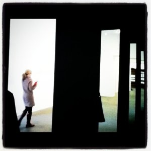

Forgive my ignorance, but I´ve heard little of the artist Douglas Gordon until I saw an ad on the Art Newspaper website:******

***Wanted: Editorial Intern based in Vauxhall, London Office***  
*** Salary: Paid internship***  
*** Three month-fixed internship***

Woah! **A paid internship for a monthly London newspaper on visual arts!** First, paid internships are really hard to come by  so whoever gets this would already be like winning the lottery.  I can picture a sort of bloody  gladiator scene among  art graduates and art enthusiasts killing their way for the prize.  Already bruised even before I started, I sent my application to **Belinda Seppings**, HR Director of **[The Art Newspaper](http://www.theartnewspaper.com/ "The Art Newspaper")**. She replied and sent me the requirements. One of them is a 250-word essay on a forthcoming or present exhibition in London. Hmmm,  I searched thru the list and didn´t know what to write about.

Tsk tsk. I had to take one big gulp on my water flask before even brainstorming for an idea.

I had no time to visit any exhibit because I wanted to send the essay right away. Early bird catches the worm! Seriously, I wanted to get it off my hands as soon as possible so I can just have a good night´s sleep. I was too excited with the prospect of working at The Art Newspaper and if I have to wait one more day I would get pent up emotions and maybe not enjoy the little sunshine that London has and which had been peeking at my library desk all afternoon and begging me to please just get cracking . Thank God for **Jonathan Jones**´ [blog post](http://http://www.guardian.co.uk/artanddesign/jonathanjonesblog/2011/mar/07/douglas-gordon-portrait-artist-k364-gagosian "Jonathan Jones on Douglas Gordon") at **the Guardian** about Douglas Gordon, I was set on writing about him.  Leafing thru the books in the reference library, I saw Douglas Gordon´s book and realised how important this artist is. And so after reading, I managed to collate enough information and wrote:

Douglas Gordon at the Gagosian Gallery in London by Tuesday Gutierrez

***Critics call him the most exciting British artist working today.** Best known for his video projection of **24 hour Psycho** in which he slowed down Alfred Hitchcock´s 1960 film, Douglas Gordon explores themes of memory in his art and renders the familiar in a new strange context. Over the years, Douglas Gordon has weaved and stretched common material into a new boundless space opening up an open-ended dialogue between artist and viewer………  
*

I just typed away then I ended the essay with this.

*K.364 tries to present a modern-day portrait of man in the context of history. It is a testament to Douglas Gordon´s continued deliberation on what art is and its purpose. Douglas Gordon says, “Everything is coded, nothing is really explained, that is why you have to watch it a second time. But the underlying theme is the battle between history and the fleeting beauty of music.”  
*

I honestly didn´t know how solid the writing was. I just sent all the requirements over to Belinda and prayed it was good enough. Believe me, waiting is pure torture. For several days, I was itching my way to receive some news. Then, I received this:******

***Dear Tuesday,***

***Our editors have reviewed your application and although your CV is impressive, unfortunately you have not been shortlisted for interviews owing to the large quantities of high-level applicants.Thank you so much for taking the time to apply- we would like to wish you every success in your future career.***

***With very best wishes,***

***Belinda  
***

What´s the worse thing that can happen? Damn, I had been so focused on receiving news from The Art Newspaper that I realise I  forgot to visit  Douglas´ exhibit at the Gagosian that was ending today. Boohoo.

(Below) Video: Meet the Artist – Douglas Gordon in two parts

<iframe allowfullscreen="" class="youtube-player" frameborder="0" height="505" src="//www.youtube.com/embed/DXY99WS-Byo?wmode=transparent&fs=1&hl=en&modestbranding=1&iv_load_policy=3&showsearch=0&rel=0&theme=dark" title="YouTube video player" type="text/html" width="640"></iframe>

<iframe allowfullscreen="" class="youtube-player" frameborder="0" height="505" src="//www.youtube.com/embed/SjYb6EN0v8w?wmode=transparent&fs=1&hl=en&modestbranding=1&iv_load_policy=3&showsearch=0&rel=0&theme=dark" title="YouTube video player" type="text/html" width="640"></iframe>

Photography by[ Tony Hall](http://www.flickr.com/photos/anotherphotograph/5456327946/ "Douglas Gordon ")

