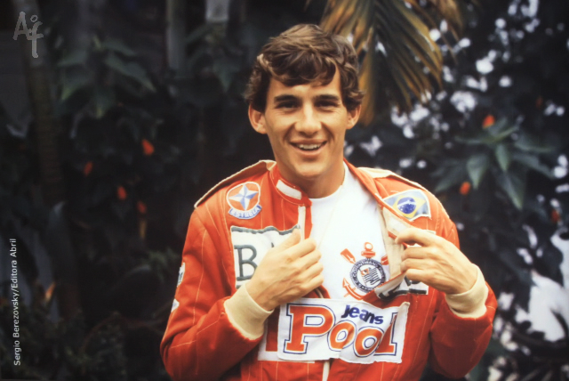
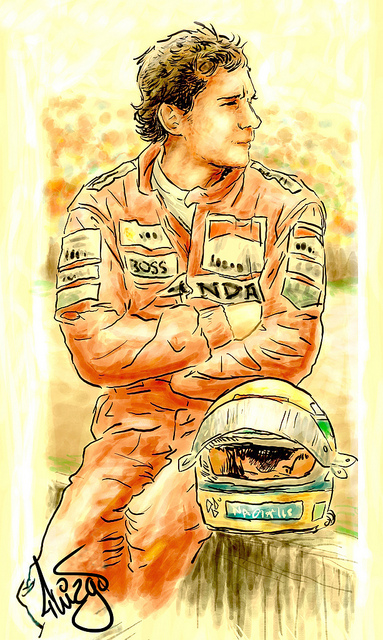
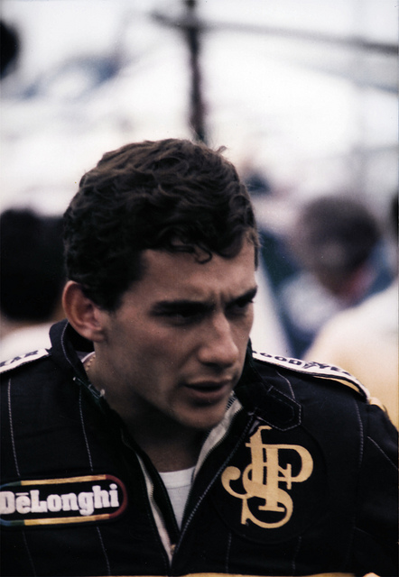

I never understood people´s fascination with car racing. My primal girl-self cannot grasp what type of adrenaline one gets from hearing the sound of screeching tires and the humming of machines for what I would plainly categorise as a man sport. Since being involved in a minor accident years ago, I had sworn never to drive again. But lo and behold! **Seeing the documentary on Ayrton Senna had made me change my mind. Aside from becoming a fan of the legendary driver and having a newfound respect for Formula One**, I´m no longer afraid to take up driving once again.

**Who would have thought that a film about racing would touch my soul to the core?** But that´s what exactly this film did.  Directed by [Asif Kapadia](http://www.imdb.com/name/nm0438090/ "Asif Kapadia"), **the film is in itself a breakthrough in documentary filmmaking as it tells the story of Senna through archival footage**, giving us a blow by blow account of the events as if we are breathing it live. No fancy special effects, multiple cameras and fast cuts that would dizzy us into space. Just plain storytelling through the mouth of Senna himself as if he was still with us today.

<iframe allowfullscreen="" class="youtube-player" frameborder="0" height="505" src="//www.youtube.com/embed/sfosF-ZAbR4?wmode=transparent&fs=1&hl=en&modestbranding=1&iv_load_policy=3&showsearch=0&rel=0&theme=dark&feature=channel_video_title" title="YouTube video player" type="text/html" width="640"></iframe>  
*Official Trailer of Senna*

The  film  on Senna brings light to the life of the three-time world champion driver from his humble karting days until his unfortunate death in San Marino in 1994. Enriched by narrations and interviews of Senna´s colleagues and his sister Viviene, **what this film reveals is a portrait of a man whose profound faith in God, self-belief and love for his fellow Brazilians** fundamentally steered his destiny to become the world´s best racing driver, a title which few will contest.

***“He thinks he can’t kill himself because he believes in God. … I think that’s very dangerous — for the other drivers.”  
 –Alain Prost***

*Ayrton Senna in a photo exhibit at the Memorial do Corinthians. Original photo by  Sergio Berezovsky. Photo taken by [Ale Frata](http://www.flickr.com/photos/alefrata/3372815154/ "Ale Freta") in the exhibit.*

<iframe allowfullscreen="" class="youtube-player" frameborder="0" height="505" src="//www.youtube.com/embed/aNmqn3heGgE?wmode=transparent&fs=1&hl=en&modestbranding=1&iv_load_policy=3&showsearch=0&rel=0&theme=dark" title="YouTube video player" type="text/html" width="640"></iframe>  
*Ayrton Senna Top Gear Tribute*

***“Pure driving, pure racing, that´s what makes me happy.”***  
***–Ayrton Senna***

Ayrton Senna was born into a well-off family and yet coming into a **European-dominated sport with his Brazilian lineage makes this a story about an underdog which we all can relate to.**  All F1 drivers enter the sport not to seek fame and fortune, but hearing Ayrton talk about himself and discussing his disgust over F1 politics, he came across to me as someone whose intentions were much more pure and honest.

Even the backdrop of his rivalry with Frenchman Alain Prost paled in comparison to Ayrton´s enigmatic presence on screen.  **Handsome and soft-spoken, millions of Brazilians pinned their hopes up on him as if he was their saviour from poverty**. A crying fan said that everything in Brazil was hopeless, but Ayrton was the source of their  little joy.

***“Sometimes a documentary will unexpectedly grab you by the throat, not giving you a second to breathe. such is the power of this man, and this film.” –Kenneth Turan, Los Angeles Times***

<iframe allowfullscreen="" class="youtube-player" frameborder="0" height="505" src="//www.youtube.com/embed/Tto-MI689yQ?wmode=transparent&fs=1&hl=en&modestbranding=1&iv_load_policy=3&showsearch=0&rel=0&theme=dark" title="YouTube video player" type="text/html" width="640"></iframe>  
*Asif Kapadia talks about Senna the movie*

The last time I had been touched by the story of an athlete was during Zinedine Zidane´s state of grace playing during the World Cup 2006 eventhough it was marred by the head-butting incident in the finals. **But Ayrton Senn was much bigger than [the Great Zidane](http://english.ohmynews.com/articleview/article_view.asp?menu=c10400&no=302940&rel_no=1 "Great Zidane") simply because he took racing to a philosophical and spiritual dimension**. Deeply religious, Ayrton even mentioned of a time when he knew that he was no longer driving but he was doing it unconsciously – as if he was a spiritual being in tune with his calling.

I knew what the ending of the movie would be but** it still doesn´t count how much my heart still aches** from remembering this part of the movie where Ayrton hesitated to race, and looked as if he subconsciously knew that he would die. **I read in one of the [forums](http://www.boards.ie/vbulletin/showthread.php?t=2056023007&page=10 "Forum on Senna"), how a cinema full of lads were swallowing hard and crying at this moment in the film.**

*Ayrton Senna by Brazilian artist [Thiago Dal Bello](http://www.flickr.com/photos/thiagodalbello/5590349380/ "Thiago dal Bello")*

Morning before the fatal accident, his sister Viviene said how he read a passage from the Bible to spiritually prepare himself for not only the competition, but ultimately for the end of his life. **Eerily, the passage said he would be given an ultimate gift which is God himself.**

After his death, it was discovered how much millions of fortune he gave away to help, in his own little way, alleviate Brazil´s poverty.

*Photo by [ninenineone](http://www.flickr.com/photos/ninenineone/5222708099/ "ninenineone")*

<iframe allowfullscreen="" class="youtube-player" frameborder="0" height="505" src="//www.youtube.com/embed/oR6ODE15gRo?wmode=transparent&fs=1&hl=en&modestbranding=1&iv_load_policy=3&showsearch=0&rel=0&theme=dark&feature=related" title="YouTube video player" type="text/html" width="640"></iframe>  
*Documentary on Senna Part 1*

<iframe allowfullscreen="" class="youtube-player" frameborder="0" height="505" src="//www.youtube.com/embed/fwcejd3NveE?wmode=transparent&fs=1&hl=en&modestbranding=1&iv_load_policy=3&showsearch=0&rel=0&theme=dark&feature=related" title="YouTube video player" type="text/html" width="640"></iframe>  
*Documentary on Senna Part 2*

Related Links:  
[Review: Senna the movie by Brisbane Times](http://brisbanetimes.drive.com.au/motor-news/reviewed-senna-the-movie-20110503-1e5m2.html "Brisbane Times") [  
 In Senna, a new formula on documentaries by The Washington Post](http://www.washingtonpost.com/lifestyle/style/in-senna-a-new-formula-for-documentaries/2011/08/12/gIQAdzvQQJ_story.html "Washington Post") [  
 F1 driver Ayrton Senna focus on new doc by the San Francisco Chronicle](http://www.sfgate.com/cgi-bin/article.cgi?f=/c/a/2011/08/21/PK9M1KLTAP.DTL "San Francisco Chronicle") [  
 Movie Heaven: Ayrton Senna Meets Gator and the Bandit at Belcourt](http://www.nashvillescene.com/pitw/archives/2011/08/19/car-movie-heaven-ayrton-senna-meets-gator-and-the-bandit-at-belcourt "Nashville Scene") [  
 Ayrton Senna: The Movie. Posiblemente la mejor película biográfica de la historia by Motor Pasion](http://www.motorpasionf1.com/formula-1/ayrton-senna-the-movie-posiblemente-la-mejor-pelicula-biografica-de-la-historia "Motor Pasion") [  
 Mr Senna goes to New York City by the New York Times](http://formulaone.blogs.nytimes.com/2011/08/14/mr-senna-goes-to-new-york-city/ "New York Times") [  
 Senna’ rekindles personal memories of an intriguing athlete by the Los Angeles Times](http://latimesblogs.latimes.com/movies/2011/08/senna-documentary-formula-one-movie-film.html "Los Angeles Times") [  
 Ayrton Senna revealed like never before by ESPN](http://espn.go.com/racing/story/_/id/6851411/formula-one-ayrton-senna-revealed-never-film-senna "ESPN") [  
 Senna the driver who lit up Formula One by the Telegraph](http://www.telegraph.co.uk/culture/film/8524259/Senna-the-driver-who-lit-up-Formula-One.html "Telegraph")  
[Senna is the best movie you never heard of by MSNBC](http://today.msnbc.msn.com/id/44289414/ns/today-entertainment/#.TldvV12yKuI "MSNBC")  
[Senna: an enigma in life as in death by Wheels.ca](http://www.wheels.ca/Columns/article/799557 "wheels.ca")  
[Movie review: Senna by Sandiego.com](http://www.sandiego.com/articles/2011-08-26/movie-review-senna "Sandiego.com")  
[Movie review: Senna by Pleasanton](http://www.pleasantonweekly.com/movies/reviews/Senna?review_id=2612 "Pleasanton")  
[Senna: Meet the Elvis of racing drivers by Andrew O’ Hehir of the Salon](http://www.salon.com/entertainment/movies/andrew_ohehir/2011/08/11/senna_review/index.html "Salon")

