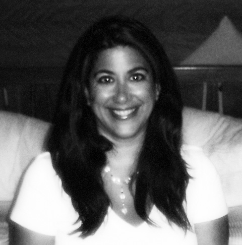
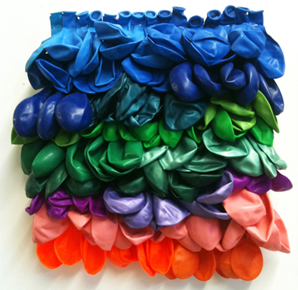

It is interesting how the blogosphere can bring like-minded individuals together. **Stephanie and I connected in the World Wide Web because of each other’s art blogs**. She runs her own website at [Artsmacked.com](http://artsmacked.com/exhibitions/) where she features her own exhibition reviews and opinion pieces. Aside from the grueling demands of art blogging, Stephanie is also a  freelance curator who gives lectures on art history and guided tours.

This Feb 2, she has a curated a show called **Painting without Paint** at the **Apiary Gallery, a group exhibition from young and emerging artists who come from some of London’s most prestigious art schools**.  In this exhibition, Stephanie and the artists hope to stretch the boundaries of the medium of painting. I am excited to see how these artists would be able to maintain the language of painting by abandoning paint, the very material that defines the genre. (It is interesting to note that some of the more established artists like Angela de la Cruz had translated painting into a sculptural language ). In my interview with Stephanie, she talks about her experience curating her first show.

*Stephanie Cotela Tanner*

**Just for the benefit of our readers, can you let us know a little bit about your background and how you became a curator?**  
I took the traditional path to curating as my background is in art history. I graduated with a BA in art history from San Diego State University and obtained an MA from Birkbeck College, University of London. I’ve worked in a few museums and cultural organisations and now I work as a freelancer. As a freelancer, I do a bit of writing, editing and teaching. So, curating seemed like the next logical step. Although, putting together an exhibition without the support of an organisation is no easy task, as an independent curator I have the opportunity to be more creative and more selective regarding the projects and the artists that I choose to work with.  

**What is the concept of this exhibit? What do you hope to achieve in this show?**  
The concept of *Painting without Paint* is****two-fold. On one hand the show is an attempt to answer the age old question, ‘What is painting?’ and on the other it aims to expose the work of emerging contemporary artists who push the boundaries of traditionally accepted ‘painting’ practices by experimenting with a wide range of media both including and excluding paint. By aligning emerging artists with art historical figures, *Painting without Paint *seeks to legitimise its hypothesis – that ‘painting’ can be expressed through a variety of different media- and considers traditional art-making practices with regard to current art school curriculum.

I hope to broaden traditionally-held perspectives regarding the process of painting and what that represents to contemporary artists. I also hope to open up a dialogue surrounding current art school practices – as most of the artists in the show have recently graduated from some of London’s most prestigious art schools, such as Goldsmith’s, Slade, Chelsea & Central St. Martins.

*Sarah Kate Wilson, Friskleesque, 2011*

**Can you tell us a little bit about your experience organising this exhibit? How did you get the collaboration of these artists?**  
It’s been quite an eye-opening experience. As this is my first curatorial project, I’m kind of learning as I go along. I approached this project with all guns blazing in that I gave myself an outrageous workload and an incredible range of tasks – everything from PR & fundraising to negotiating sales, but I think my overly ambitious approach enabled me to determine what is most important and what could have been avoided. Next time, I will have the knowledge & experience necessary to streamline the whole process. Getting the artists on board was the easy part. Most emerging artists are happy to show their work and the team that I’m collaborating with are extremely excited about the show so it’s been a real pleasure dealing with them.

The concept of the show was sparked by the work of Sarah Kate Wilson. She’s a painter who recently graduated from the Slade School of Art, UCL. Initially, I had in mind a show about painting and I was interested in featuring her work. When I visited her studio to talk about a potential project, I discovered that she had temporarily abandoned paint altogether and that changed everything. Thus the concept of the show was born.

[")](./images/The-Past-Shimmers-in-its-Decomposition1_f7b4pl.jpg)*Masaki Yada, The Past Shimmers in its Decomposition, 2011*

**Can you give us a rundown of the artists who will participate in this show and what works they will feature?**  
We have 10 artists in the show, most of which are London-based and a few from the UK but the rest have quite an international range of training and experience. For instance, we have artists from Brazil, India, Canada, America, Japan and the Ukraine.  The works on display are equally diverse, including mixed media, photography, installation, video, painting, sculpture and design.

******Any upcoming shows in the future?**  
Yes, I’m thinking of doing another show – not quite as big but just as ambitious. I’m hoping to get a couple of American painters over to London. The artists that I have in mind have recently graduated from Philadelphia Academy of Fine Arts, one of the first art schools in America and one of the most prestigious. Aside from a few select works in Tate Modern London is really lacking in American art collections and I think it’s important to try and fill this gap by exhibiting contemporary American art in the UK.

[")](./images/Wall-Art-close-up1_xkaran.jpg)*Sujata Sengupta, Rhuthmos, January 2012*

Artists participating in the show:

1. Lewis John Brooks  
2. Bel Lefosse  
3. Christabel Lidner  
4. Bill Millett  
5. Sujata Sengupta  
6. Emily Spence  
7. Sorcha-Mae Stott-Strzala  
8. Nataliia Taranukha  
9. Sarah Kate Wilson  
10. Masaki Yada

*Kindly visit the [We Fund](http://www.wefund.com/project/painting-without-paint) page to donate. Let’s support young artists, young curators and young galleries!   
*

