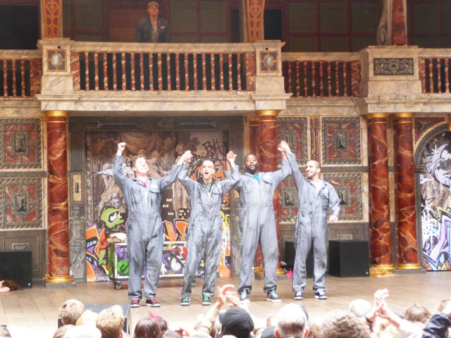

**Othello in hip-hop**? There are so many Shakespearean interpretations these days so why not? At the Shakespeare’s Globe last Saturday, I had the privilege to see the [Q brothers](https://www.facebook.com/QBrothers) pay homage to Shakespeare in rap and yes in jumpsuits. The Q brothers narrated the tragedy of Othello, **giving it a fresh urban vibe to the point of turning it into something comic and light**. I know even Shakespeare die-hard aficionados would definitely enjoy this and I believe as long as the crowd digs it (and we did!) and if this adaptation can attract a younger audience, then let’s welcome more of these urban twists. 

**The adaptation used a lot of modern references from videogames, He-man and nerds** – the intent of course is to reach as much audience as possible.

<iframe allowfullscreen="" class="youtube-player" frameborder="0" height="505" src="//www.youtube.com/embed/erQ8zJpuWVo?wmode=transparent&fs=1&hl=en&modestbranding=1&iv_load_policy=3&showsearch=0&rel=0&theme=dark" title="YouTube video player" type="text/html" width="640"></iframe>

Here the eclectic crowd at Shakespeare’s Globe also seemed to appreciate the efforts.  The crowd was definitely mixed of all ages and everyone seemed to have a good time. At one point the crowd was even throwing their arms in the air. My colleagues loved it so much they queued for tickets to watch the Q brothers the next day. **As for me, it would be nice to read the original Othello with a background of beats.**

 

Links:[  
Othello – review by The Guardian](http://www.guardian.co.uk/stage/2012/may/07/othello-review?newsfeed=true)

