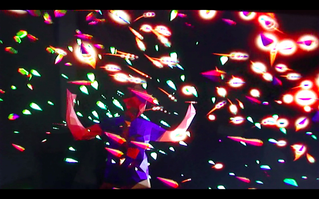

Intel has teamed up with design duo Hellicar and Lewis to launch their latest version of Ultrabooks. I’ve been having a lot of theatre activities due to work so I wanted to see a free art installation. I was curious about Triptych and wanted to find out how the collaboration between Intel and [**Hellicar and Lewis**](www.hellicarandlewis.com/) would come about.

The design duo – [**Pete Hellicar and Joel Gethin Lewis**](http://www.hellicarandlewis.com/) – are known for merging art, design and technology to create audience experience and have exhibited their work in galleries like the Turbine Hall in Tate Modern and as far as Hongkong and Canada.

At the launch at the Vinyl studio in Soho, there were three big screens showing multimedia  art installations.

Connected to motion sensors and laptops created from **3rd Generation Intel Core** processors, the three screen installations project graphics and visuals  react to visitor’s movements. The result are three very interactive art pieces that mirror your movements. I felt playful and tried it myself and did have fun creating simulations but would have liked if the whole crowd did it altogether – Can you imagine how MTVish that would be?

I am looking forward for **Hellicar and Duo** to try this with kids rather than adults – I am very sure it would be a hit ask kids are more experimental with their movements. I also realised that this type of work would be great for museums or for educational organisations. I also read in one blog that the design can help people with autism.

Not sure if it was a mirage or maybe I just had a few drinks, I think  I also saw **Pete Hellicar** sitting before one of the big **Triptych** screens and shooing away one kid who was messing about one of the Ultrabooks and thought he was allowed to play the keyboards. The screen went off for awhile but was restored right away.

<iframe allowfullscreen="" class="youtube-player" frameborder="0" height="505" src="//www.youtube.com/embed/h1zM5fs2Fnk?wmode=transparent&fs=1&hl=en&modestbranding=1&iv_load_policy=3&showsearch=0&rel=0&theme=dark" title="YouTube video player" type="text/html" width="640"></iframe>

