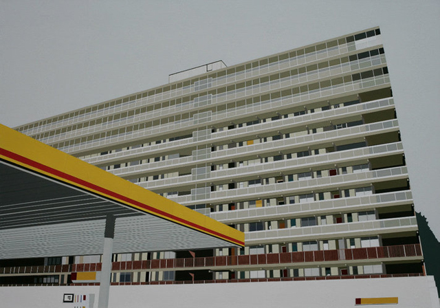
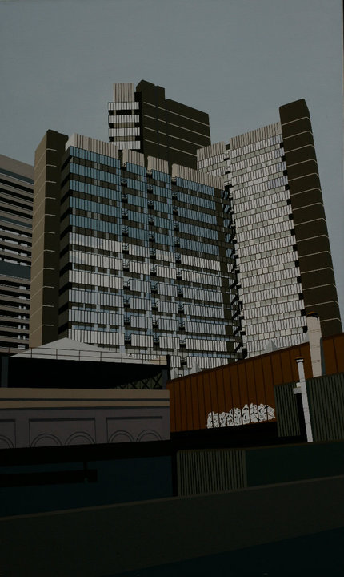
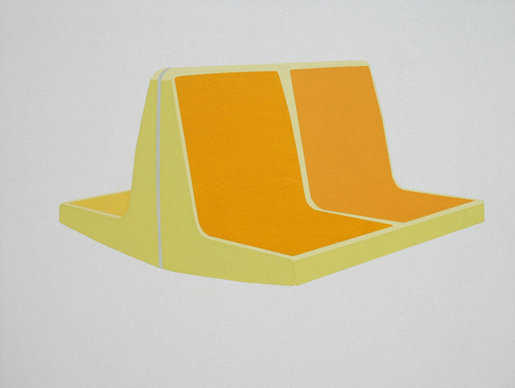
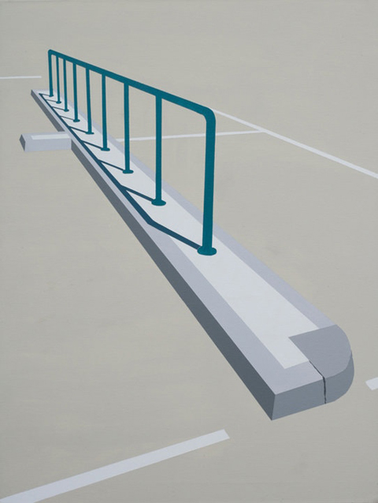
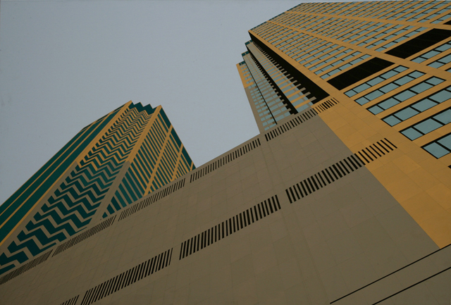
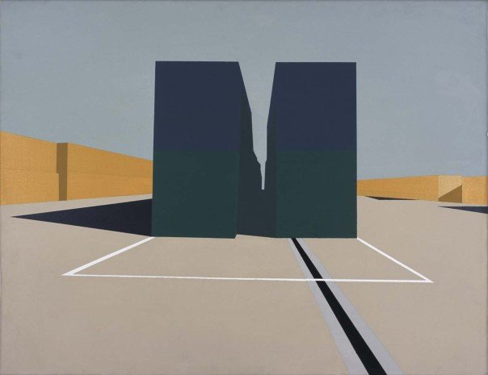
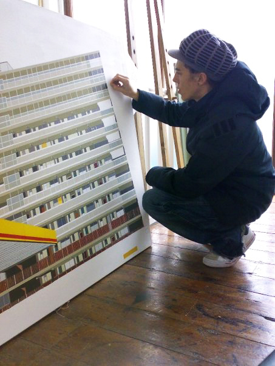

Artist [Louise Champion](http://www.louisechampion.com/)**regards the mundane as beautiful**. Her first solo show ‘Turning a Corner’ was inspired by the everyday and she is most attracted by the common things that are most often overlooked in the urban world. In Louise’s world, architectural elements that are often ignored become her centre piece; **boxed buildings, staircases, cranes, subway seats and all the ordinary are bestowed a rightful and significant place**. Perhaps this connection with the mundane comes from the fact that she both treads the reality of working in a different industry while also living to create her art; or perhaps she does it as a reminder that it only takes a change in perspective to see beauty even in the simplest of things.

Surprisingly, **her regard for the mundane is more of a quiet reverence** – she avoids breaking them apart unlike those **artists who go the distance and deconstruct the hierarchies of art and common things **just to prove a point**.** Louise’s art is still deeply rooted in the tradition of photography and painting – to the point that even if she has the option to use modern methods, she refuses to do so. For her, there is no pleasure in taking shortcuts.  There is still that sense that the creative process is a journey that one should take from start to finish.

*Heygate by Louise Champion*

While the contemporary art world is often times about **the glitz, the hype and the glamour**, here’s an artist that’s willing to delve into the** ordinariness of things**. I hope to see more new works from Louise in the very near future! Please read my short interview with her below.

**1. Your first solo show ‘Turning a corner’ was inspired by your travels in the US. How does living in London inspire your art now or are you still craving to be somewhere else to find inspiration for your art?**

I find inspiration everywhere! Living in London is truly inspiring, especially architecturally. I find living in a city that is a constant building site truly motivating and stimulating. Currently I am fascinated by cranes, and I think they may feature in the next set of work.

*London Bridge by Louise Champion*

**2. ‘Turning a corner’ was an exploration of the mundane. Tell us what attracted you to use isolated architectural elements to interpret this. How was the creative process for these pieces?**

Most of my work is about the mundane, of which I find and hopefully translate a beauty within it. All my works start with me going out with my camera and taking photographs (on film) of things that appeal to me. It could be a whole building or maybe just an element of it, like a staircase or railing or a crane perched on the top.

I have a slightly laborious process from photo to finished canvas: I do not project the image then paint, I will draw and scale up what I will paint a few times, but this gives me a better understanding of the image and the geometry that makes it up. Its a process I could simplify now in the age of the computer but one that I get pleasure from so won’t!

*Subway by Louise Champion*

**4. Where did you get your fine art degree and how was the experience?**

I went to [Camberwell College of Arts](http://www.camberwell.arts.ac.uk/). I was fortunate to leave school at 16 and get a job with a leading graphic design consultancy (Cartlidge Levene). I spent four years there which was an education in itself. It was their encouragement that pushed me towards going to art school. I applied for a foundation course and it was on that where I started painting. I was offered a place on a joint honours degree course at Camberwell also, so I stayed on and studied both graphics and painting, although I mainly focused on painting.

I loved my time at Camberwell and think the [foundation year](http://www.camberwell.arts.ac.uk/courses/courses-by-level/foundation-art-and-design/) was one of the best times of my life. Having a free space to paint for three years on the degree course was amazing. I was slightly older than most students and had been out in the working world beforehand so I appreciated college for what it is and spent all day in my space gladly painting away!

I took a year out between the second and third year and spent a few months in Canada. That was very inspiring for work and I painted nothing but pictures of metal shipping containers for a few years on my return.

*Railing by Louise Champion*

**3.  You are also working full-time in the music industry, how do you juggle your day job and doing art?**

With difficulty sometimes – depending on workload. My last painting (Heygate) took me two years to paint as work got in the way! It’s a catch 22 that you can’t risk not working and surviving on selling art, plus I do not have the skill of self promotion! – so your time in the studio is cut down, but I am always working in my head, thinking of what the next painting could be or taking photos of possible subjects. I’m lucky to have a studio in my garden at close proximity, but unfortunately it flooded over the Christmas break with all the rain!

*Chicago Opera House by Louise Champion*

*Dartford by Louise Champion*

**5. Any upcoming shows? How different will it be from the last one?**

I do have a link with a great gallery in London ([Nancy Victor Gallery](http://www.nancyvictor.com/)). I have the opportunity to exhibit there once I am ready to but am not sure when that will be. I am hoping the next exhibition will show how I have developed as a painter. The work I do now is far more challenging than those shown at ‘Turming A Corner’ to the point where many viewers find it hard to believe that my paintings are hand made objects! They are large canvases with no visible brush marks and my lines are clean so they can look like they are screen printed.

*Artist Louise Champion creating Heygate*

