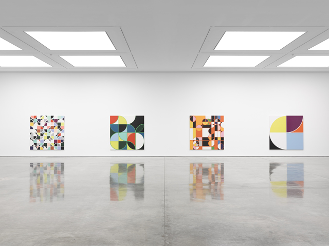
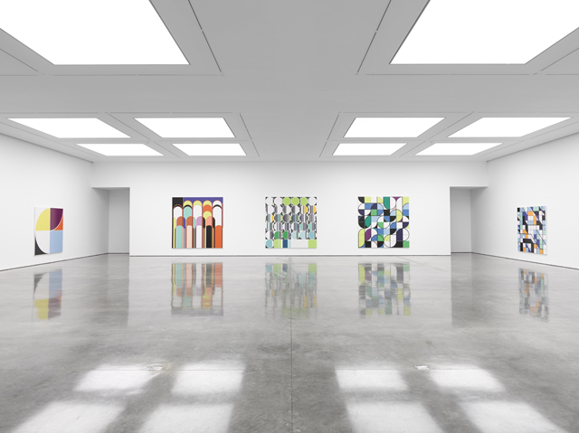
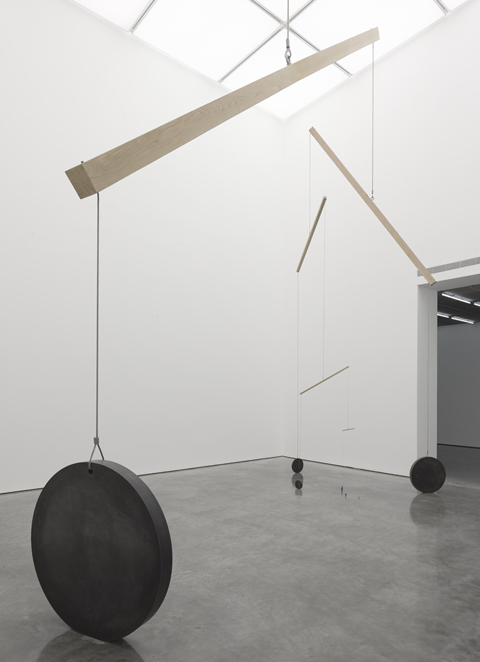
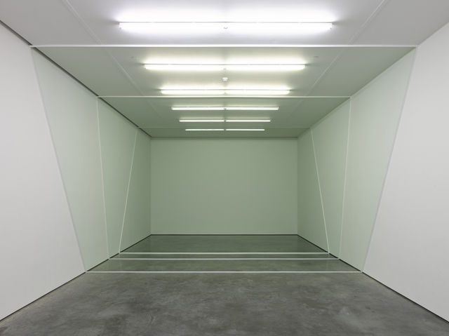
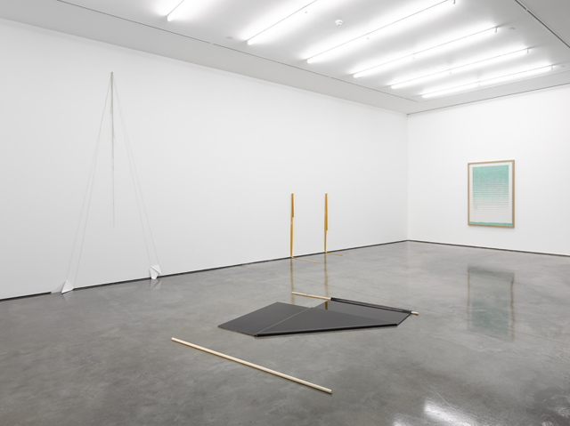

Hello, I’m back from a five month blogging hiatus. I’ve seen a lot of exhibits these past few months but never had a chance to write about them – like [Anthony Caro’s Park Avenue series at the Gagosian gallery](http://www.gagosian.com/exhibitions/anthony-caro--june-06-2013) and the amazing [Souzou: Outside Art from Japan at the Wellcome Collection](http://www.wellcomecollection.org/whats-on/exhibitions/souzou.aspxhttp://) which would literally put anybody in shame for not attempting to create art. If you haven’t seen it yet,  click the link above to watch the video. (I guarantee you’ll jump out of your seat to your nearest art shop to buy some paint.)

But now gearing up for my first blog post, (and yes I’ve had to clear the cobwebs in my mind after having not written anything in five months) my first venture was to see [Sarah Morris’ exhibition at White Cube Bermondsey](http://whitecube.com/exhibitions/sarah_morris_bye_bye_brazil_bermondsey_2013/).  This Time Out’s critics choice will not to disappoint as Sarah Morris delves deeply into the urban jungle experience of Brazil. Bright colours, interlocking spheres, diagrams abound in total abstract mode and I literally imagined strobe lights flickering as if the energy of Rio is pulsating all around me.

*Sarah Morris*  
*‘Bye Bye Brazil’, White Cube Bermondsey*  
*17 July – 29 September 2013*  
*© Sarah Morris*  
*Photo: Ben Westoby*  
*Courtesy White Cube*

*Sarah Morris*  
*‘Bye Bye Brazil’, White Cube Bermondsey*  
*17 July – 29 September 2013*  
*© Sarah Morris*  
*Photo: Ben Westoby*  
*Courtesy White Cube*

But while I enjoyed this exhibition, I had a more quiet meditation with [Marcius Galan’s Geometric Progression](http://whitecube.com/exhibitions/marcius_galan_inside_the_white_cube_2013/).  Marcius Galan’s use of minimal aesthetic with abstract geometry is both Zen-profound but laced far deeply in its complexity. In ***Immobile***, he built a quasi-looking mobile sculpture  that explores the dynamics and the functions of White Cube’s central space, but the gravity of the elements constricts any notion of movement and flips our view of what a mobile sculpture is all about.

*Marcius Galan*  
*Inside the White Cube, North Galleries and 9 x 9 x 9, White Cube Bermondsey, London*  
*17 July – 29 September 2013*  
*© Marcius Galan*  
*Photo: Ben Westoby*  
*Courtesy White Cube*

*  
Marcius Galan*  
*Inside the White Cube, North Galleries and 9 x 9 x 9, White Cube Bermondsey, London*  
*17 July – 29 September 2013*  
*© Marcius Galan*  
*Photo: Ben Westoby*  
*Courtesy White Cube*

*  
Marcius Galan*  
*Inside the White Cube, North Galleries and 9 x 9 x 9, White Cube Bermondsey, London*  
*17 July – 29 September 2013*  
*© Marcius Galan*  
*Photo: Ben Westoby*  
*Courtesy White Cube*

Galan is really interested in defying perceptions. Guess that I mistook ***Three sections*** for  glass panes but which in truth was  three coloured panes made out of floor wax, paint and light filters which all aided to create that illusion. Once I’ve traversed the panes (and yes I did it very carefully as if still afraid to shatter some glass), it really did feel like I was in another realm and I was looking at things from the other side.

 In ***Erased Composition (progression) 201****3***, he arranged aqua-coloured erasers from whole up to the shavings – through the process of really rubbing out the erasers – the real purpose for its very existence. And that’s why I love Galan’s exhibition. Sarah Morris’ Bye Bye Brazil might have provided me with the sense of the complexities and the energy of a Brazilian city through colourful abstract constructs. But in my mind and my spirit I already know this growing up in a big and dangerous city like Manila. Galan’s Geometric Progression twists, flips  and reinforces ideas and beyond. Such as, if it looks mobile but isn’t mobile, how would you call it?

Touche Calder.

