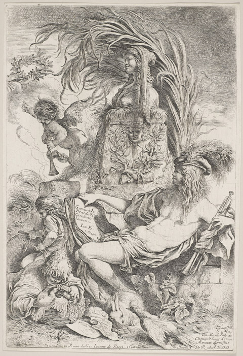
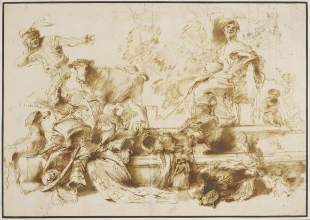
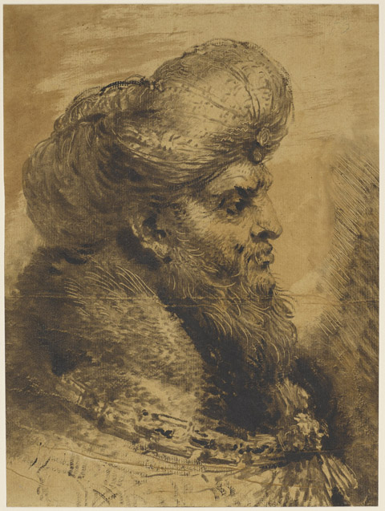
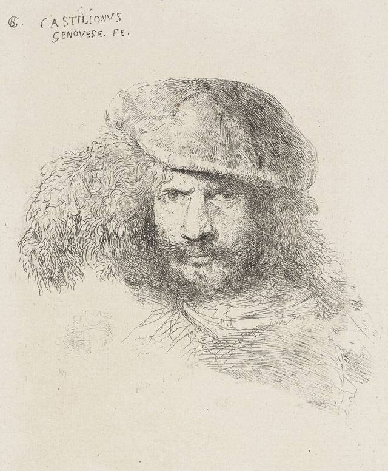

**Castiliogne? Does the name ring a bell?**

For the Blogger’s Event held at the Queen’s gallery, Buckingham Palace, Senior curator of Prints and Drawings Martin Clayton sat down and asked me whether I knew Castiliogne. I was in fact invited to this event, the first of its kind held in an institution like this, and here I was, sipping my coffee in this shiny beautiful teacup, with little knowledge about the artist. I was lost as this so-called Lost Genius. 

**Blogger’s Event**

But hang on, I am not pretending to be anything but a mere art blogger and just as I am experimenting and expanding my knowledge about art, the Queen’s gallery had hosted a Blogger’s event – something that in my past three years of art blogging has never happened before. In fact, **talking to a curator as if we are old friends** – (me suggesting some social media strategy for the Royal Collection), – ehrm, is quite astounding. 

*The Genius of Castiliogne, 1648*  
*Royal Collection Trust/© Her Majesty Queen Elizabeth II 2013*

Forgive me, if I was flexing my social media muscles, but this isn’t an ordinary day. For example, Tate Director Nicholas Serota will never talk to me. Period. He will be too impatient to talk to someone who doesn’t know her art history. But Mr Martin Clayton – who also curated the Royal Collection’s Leonardo da Vinci’s anatomical drawings last year – invited bloggers to be part of re-discovering this Lost Genius.

Frankly, it’s a bold move and this event does not only cast the limelight on Castiliogne, **it also casts a light on how you market a forgotten artist back in the public consciousness. You don’t just go big, you also go grassroots**. You reach out to the bloggers. Period.

  
*Circe with the companions of Odysseus transformed into animals,  c.1650-5*  
*Royal Collection Trust/© Her Majesty Queen Elizabeth II 2013*

**Castiliogne   
**

Martin Clayton says, ‘[Castiliogne] is an artist waiting to be discovered’. Castiliogne was riding high during the Baroque era but by 19th century, his name has been almost forgotten. Thanks to this new exhibition, Castioliogne has been resurrected from oblivion. The Royal collection is extensive, with **90 prints and drawings, the biggest collection of Castiliogne’s drawings in the world** and with the Queen’s gallery to back this up, the future of Castioliogne in the annals of art history is pretty much set.

What I learned from the curator’s talk is that not only is **Castiliogne as tempestuous and hard-headed like Caravaggio** (had his share of run-ins with the law – apparently slashed one of his works, threw his sister off a roof and more), he was also as great as an artist like Caravaggio. In fact, Caravaggio and Castiliogne (while that sounds like a rhyme) can go hand in hand in a duel for the technique of alla prima, drawing directly with oil on paper, without any underdrawings nor any preparatory drawings. Well, that shows their mastery of the medium as this requires them to paint fast and it also demonstrates their top skills as draughtsmen. 

*The Head of an Oriental, 1655 Royal Collection Trust/© Her Majesty Queen Elizabeth II 2013 *

But Castiliogne wasn’t just a bad-boy, he was also innovative.** He invented the monotype**, the only Italian to use this kind of printing technique which he used to copy Rembrandt prints. Now influenced by Rembrandt, Castioliogne also fashioned his etching projects like his idol’s and Martin says that while Rembrandt is still the best draughtsman in the entire world, Castiliogne is not trailing very far behind. 

While I really like the prints, I wish I could have seen some of his larger paintings as well. My first thought was the ‘genius’ title might be over the top, but the curator argues that this exhibition will prove that **Castiliogne deserves to be in the ranks of the Caravaggios, the Titians and the Rembrandts. **

Looking up at the blown-up self-portrait of the man at the entrance of the exhibition, the gaze is hard and full of intent. It is a gaze of a man that doesn’t want to be forgotten. That self-portrait alone inspires me to learn more about this artist. Thanks to the new exhibition at the Queen’s gallery, there is another Italian Baroque artist in my book to discover. **Lost Genius or not, the name is Castiliogne. Now that rings a bell. **

*Giovanni Benedetto Castiglione, A presumed self-portrait, late 1640s.*  
*Royal Collection Trust / (C) Her Majesty Queen Elizabeth II 2013*

*Events:  
[Exclusive Evening View of Castiliogne: Lost Genius](http://www.royalcollection.org.uk/event/exclusive-evening-view-of-castiglione-lost-genius)* – 14th November

*Read more:   
[Gifted and Castiliogne: An Art Double at Queen’s Gallery – Londonist   
](http://londonist.com/2013/11/gifted-and-castiglione-an-art-double-at-queens-gallery.php) [Castiliogne, Queen’s gallery – Telegraph](http://www.telegraph.co.uk/culture/art/art-reviews/10420401/Castiglione-Queens-Gallery-review.html)*

 

