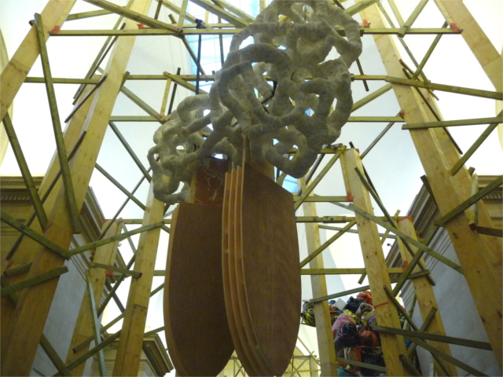
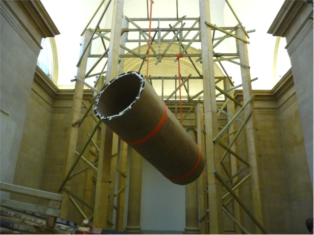
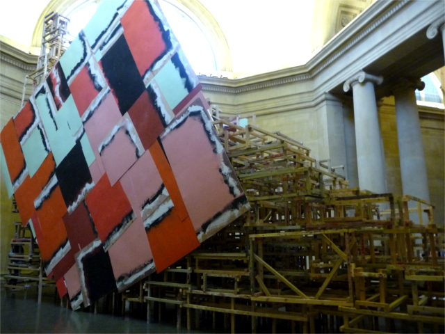
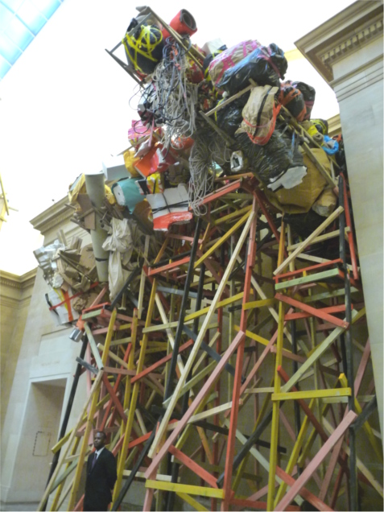
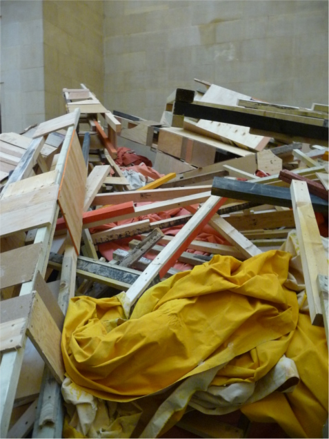

**Phyllida Barlow’s new commission at the Duveen galleries at Tate Britain **is large, messy, unstable and chaotic**.** But despite the disarray and all the cardboard, timber and rope hanging about on top of me, it gives a sense that it’s all contained chaos. The premise of it all is to address space and how I and the rest of the visitors – who are as perplexed as I was – would interact and get our heads around what’s hanging about us.

Where does one start? **There is no chronological narrative in this pandemonium and there is nothing beautiful about this monumental sculpture. It’s a miss-mash of bricolage, a factory of unfinished or abandoned collage** slapped all together in one set by pure chance and without actual intent but perhaps to provide energy and vitality to the rather conservative and bleak neoclassical surroundings. I think this visual bonanza is a statement to say that a gallery space is considered nothing unless an artist confronts the space with his or her artworks, like a painter tackling a blank canvass. I**t’s also an anti-stance reply** to what is normally perceived as monumental artworks – the making of this large-scale sculpture per se is so different from how a traditional sculptor would tackle it. Her artworks interrupts the normal rhythm of things. And that’s why it’s both fascinating and disturbing.

One thing is certain, no one can traverse the world that Phyllida Barlow built at the Duveen galleries **without looking up, down, across – not only to interact with the sculpture but to also, hmmm to mind our step, lest something falls over the top of our heads.** There is a staircase made up of crates, and a scaffold that holds a cylindrical shape, and discarded materials bound together by tape and ropes – it all looks like a construction work site or  a space befallen by a cyclic tragedy. But beneath the disorder, **I ponder and ask myself, ‘have I seen this before? **

 

 

*<iframe allowfullscreen="" class="youtube-player" frameborder="0" height="505" src="//www.youtube.com/embed/QideXdYkT_s?wmode=transparent&fs=1&hl=en&modestbranding=1&iv_load_policy=3&showsearch=0&rel=0&theme=dark" title="YouTube video player" type="text/html" width="640"></iframe>*  
*Phyllida Barlow – Tate Britain Commission 2014 *

<iframe allowfullscreen="" class="youtube-player" frameborder="0" height="505" src="//www.youtube.com/embed/Fwsp3CrQcYo?wmode=transparent&fs=1&hl=en&modestbranding=1&iv_load_policy=3&showsearch=0&rel=0&theme=dark" title="YouTube video player" type="text/html" width="640"></iframe>  
*Interview with Phyllida Barlow by WBPBT2*

Read more:  
*[Tate Britain commission 2014 – Phyllida Barlow, review – Telegraph by Alaistair Sooke  
](http://www.telegraph.co.uk/culture/art/art-reviews/10734669/Tate-Britain-Commission-2014-Phyllida-Barlow-review.html)**[Phyllida Barlow – reviews of ‘mad’ Tate commission](http://www.theweek.co.uk/art/art/57960/phyllida-barlow-reviews-mad-tate-britain-commission) – by the week.co.uk  
[Phyllida Barlow – Tate Britain – Financial Times](http://www.ft.com/cms/s/2/805f5f5c-b989-11e3-b74f-00144feabdc0.html)*

