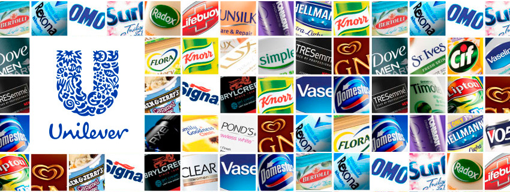
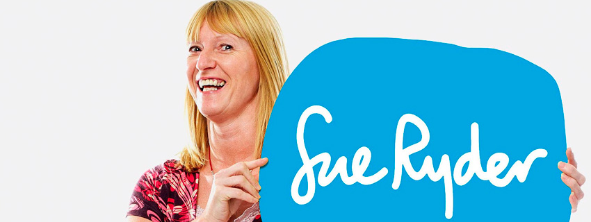
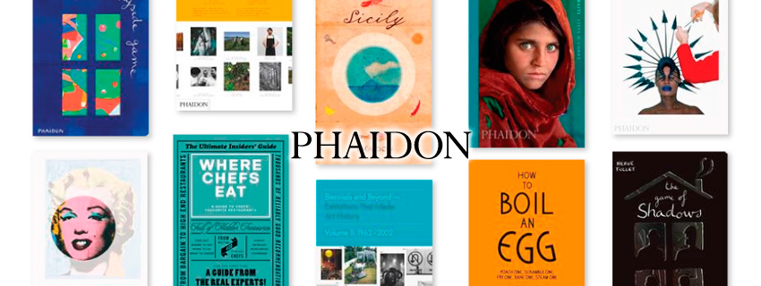
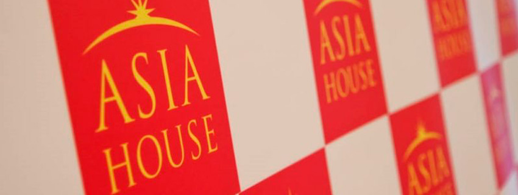
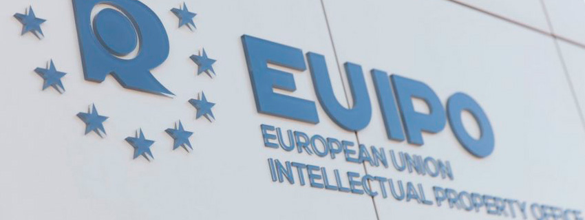
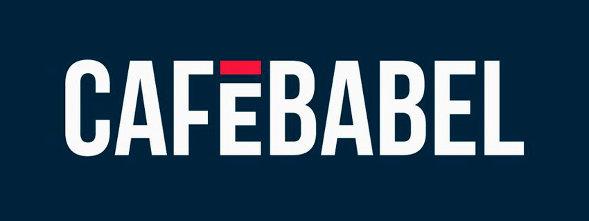

## Summary

Marketing and Communications Professional with 10 years experience. Expert in digital media, content marketing and strategic partnerships.

## Professional experience

### Content Marketing Strategist at [Volvo Ocean Race](http://volvooceanrace.com)
#### Nov 2016 – Aug 2018 ([Alicante, Spain](https://www.google.com/maps/place/Alicante)) [Read the work review](/work/volvo-ocean-race)

- Managed relationship with 12 international Host Cities to develop a marketing strategy to promote the Volvo Ocean Race as a world-class premiere event
- Supervised and advised international sport marketing companies and creative agencies to optimise all marketing activations and promotions to drive footfall to the Volvo Ocean Race Villages
- Oversaw timely delivery of branding projects (city dressing, Race village branding, PR/editorial) and Host city content production and approvals
- Key partner for cross functional teams and acts as brand manager to solve day-to-day branding issues to ensure brand consistency across platforms (owned, shared, third-party)
- Collaborated with the brand, marketing and commercial team to develop strategic ways to build a stronger Volvo Ocean Race brand

### Global People and Content Advisor at [Unilever HQ](http://unilever.com)
#### Jul 2015 – Jun 2016 ([London, UK](https://www.google.com/maps/place/London)) [Read the work review](/work/unilever)

- Responsible for driving our thought leadership strategy which contributed to an increase of 2M in LinkedIn followers and strengthened Unilever's employer brand
- Managed editorial calendar and content campaign schedule
- Liaised with global HRBP/leadership teams
- Led the global content refresh project of [unilever.com/careers](http://unilever.com/careers)
- Managed agency relationship and a team of content creators

### Social/Multimedia Content Specialist at [Unilever HQ](http://unilever.com)
#### Mar 2013 – Aug 2015 ([London, UK](https://www.google.com/maps/place/London)) [Read the work review](/work/unilever)

- Managed the creation/promotion of social media campaigns in support of Unilever's global communication and business strategy
- Produced videos to support global comms strategy & media relations campaigns, and CEO Office communications
- Managed a number of key content projects, acting as a point of contact for our stakeholders
- Worked with global cross-functional teams and key stakeholders to develop and align Unilever’s sustainability agenda across platforms
- Engaged with content partnership teams to share content best practice

### Digital Marketing Executive at [London 2012 Cultural Olympiad](https://web.archive.org/web/20110509074335/http://www.london2012.com:80/get-involved/cultural-olympiad/index.php)
#### Jan 2012 – Oct 2012 ([London, UK](https://www.google.com/maps/place/London)) [Read the work review](/work/london-2012)

- Managed all the digital channels for the cultural programme of London 2012 Olympics (London 2012 Festival) including CMS, CRM and B2B email marketing campaigns, and social media
- Acted as the content manager for the website – sourcing, curating and producing content for the homepage and the main London 2012 website (2 million visits for Festival website, 431 million for London 2012 website)
- Managed the events database for the Festival website and the London 2012 Join-in app

### PR Communications Officer at [Sue Ryder](https://www.sueryder.org/)
#### Oct 2011 – Dec 2011 ([London, UK](https://www.google.com/maps/place/London)) [Read the work review](/work/sue-ryder)

- Handled press and media enquiries
- Responsible for media monitoring and writing of daily press briefs
- Handled social media/community management as well as copywriting for newsletters and internal communications.
- Assisted the Head of Internal Communications in coordinating and curating the 2nd Sue Ryder newspaper, which was distributed to 8,000 employees across the UK.

### Digital Marketing Assistant at [Phaidon Press](http://Phaidon.co.uk)
#### May 2011 – Aug 2011 ([London, UK](https://www.google.com/maps/place/London)) [Read the work review](/work/phaidon)

- Created digital marketing and social media strategies for upcoming book titles and also managed link-building outreach with bloggers as an affiliate marketing strategy.
- Built an extensive database of bloggers with particular specialisation in
food, design and photography.
- Created social media strategies for the Art Museum book, their most ambitious project in 2011.
- Managed content on their website

### Production Assistant at [Royal Opera House](http://roh.org.uk)
#### April 2011 ([London, UK](https://www.google.com/maps/place/London)) [Read related blog post](/the-earth-moves-momardis-baby-steps)

I worked as a production assistant for the film shoot of the world-renowned opera singer Angela Gheorghiu, in line with the upcoming series of ROH summer shows for 2011.

### Digital Consultant at [Asia House](https://asiahouse.org/)
#### Sep 2010 – Jan 2011 ([London, UK](https://www.google.com/maps/place/London))

I was responsible for creating online marketing material for the Asian Business Leaders Summit. Other duties include: photo captioning, as well as copywriting and web updates/social media using Facebook, Twitter and Youtube. Volunteered for the cultural and marketing department from August to October 2010.

### Bilingual Operations Assistant at [European Union Intellectual Property Office](https://euipo.europa.eu)
#### Jun 2008 – Jun 2009 ([Alicante, Spain](https://www.google.com/maps/place/Alicante))

I handled administrative duties, communication correspondence and customer support for the Data Reception and Capture Department, Trademark and Registration office of the European Union.

### Web Writer at [Cafe Babel](http://Cafebabel.com)
#### Dec 2008 – Jan 2009 ([Paris, France](https://www.google.com/maps/place/Paris))

I contributed articles for this European online magazine. [Sample 1](http://www.cafebabel.co.uk/article/28244/young-europeans-feelings-holocaust-war-movies.html), [Sample 2](http://www.cafebabel.co.uk/article/27242/financial-crisis-sport-nba-football-formula-one.html)

### Assistant Teacher (Volunteer) for a special education class
#### 2008 ([Manila, Philippines](https://www.google.com/maps/place/Manila))

I prepared class lessons for special education at Odelco Elementary School, Manila.

### Online Citizen reporter for [Ohmynews.com](http://Ohmynews.com)
#### Jun 2006 – Oct 2008

I wrote articles about non-profit organizations and social institutions that advocate social change. I was chosen as a delegate of the Philippines in the international citizen reporters conference in Seoul, Korea in July 2007. [Samples of work](http://english.ohmynews.com/english/eng_article_diff.asp?writer_id=tuesday74&at_code=356588)

### Web writer / Blogger
#### Aug 2006 – Jun 2007

I launched a successful blog called [Saveguimaras.com](http://saveguimaras.herokuapp.com/) in response to the oil spill tragedy in Guimaras, Philippines – This became one of the premiere informative sites regarding the oil spill.

### Web writer / Blogger
#### Feb 2004 – Jun 2005

- I co-founded a web portal about NGO’s and Social Organisations called [Lasolidaridad.com](http://lasolidaridad.herokuapp.com/)

- I helped promote non-profit organisations for [Techsoup.org](http://techsoup.org) using the [Second Life](http://secondlife.com/) online tool.

### Senior Copywriter at MSI – Magic Spell Inc. Advertising
#### Jul 2001 – Sep 2002 ([Manila, Philippines](https://www.google.com/maps/place/Manila))

I was a senior copywriter handling media accounts for Print, TV, Radio and below the line campaigns. I was involved in all aspects of the campaign from conceptualization to presentation. [Samples of work](http://momardi.com/archive/Magic_Spell_Inc)

### Writer for Food and Beverage Magazine
#### Mar 2001 – Sep 2001 ([Manila, Philippines](https://www.google.com/maps/place/Manila))

I was a regular contributing writer for a monthly trade magazine which caters to the Philippine hotel and restaurant industry. [Samples of work](http://momardi.com/archive/Food_And_Beverage)

### Scriptwriter for [Allmedia.com.ph](http://www.allmedia.com.ph/)
#### Jan 2001 – Jun 2001 ([Manila, Philippines](https://www.google.com/maps/place/Manila))

I conceptualized and wrote scripts for VTR and corporate events for companies like Sunlife, Johnson and Johnson, Generali Insurance, etc.

### Media Bureau Writer for the Presidential Campaign of Renato de Villa
#### Jun 1998 – Dec 1998 ([Ilo-ilo, Philippines](https://www.google.com/maps/place/Ilo-ilo))

I wrote presidential campaign materials, liaised with the local press and assisted with event organisation.  [Renato de Villa](http://en.wikipedia.org/wiki/Renato_de_Villa).

### Editorial Assistant / Writer, Lifestyle section at [Manila Chronicle Newspaper](https://www.facebook.com/group.php?gid=57361971241)
#### Mar 1997 – Jun 1997 ([Manila, Philippines](https://www.google.com/maps/place/Manila))

I handled editorial administrative duties, proofreading, writing, research and interviews for the Lifestyle and Travel Section of the newspaper.

## Education

**Bachelor of Arts in Literature**. [De la Salle University](http://www.dlsu.edu.ph/). Manila, Philippines. (Jun 1992 – Sep 1996)

**Plastic Arts and Ceramic Art**. [Escuela Superior de Arte](http://www.easda.es/). Alicante, Spain. (2009 – 2010, One year to finish

**Master in 3D Animation (certificate)**. [Pompeu Fabra University](http://www.upf.edu/en/). Barcelona, Spain (Oct 2002 – Jun 2003)

**Web Design Course (360 hours)**. [Maga Informática](http://www.magainformatica.com/). Alicante, Spain. (May 2006 – Sep 2006)

**Photography Course (Basic)**. [Federation of Philippine Photographers](http://photoworldmanila.com/). Manila, Philippines. (2007)

**Photography Course (Advanced)**. [Philippine Center for Creative Imaging](http://pcci.com.ph/). Manila, Philippines. (2007)

**Certificate Advanced Course of Spanish**. [Instituto Cervantes de Manila](http://manila.cervantes.es/en/default.shtm). Manila, Philippines. (1998 – 2001)

**Certificate French Superior**. [Alliance Française de Manille](http://www.alliance.ph/). Manila, Philippines. (1998 – 2001)

**Japanese Language (Level 1)**. [Universidad de Alicante](http://www.ua.es/es/oriental/index.htm). Alicante, Spain. (2009)

**Certificate for English Teacher**. [Bridge-Linguatec TEFL Online](http://www.bridgetefl.com/). Manila, Philippines. (2008)

**Professional Education Diploma**. [Philippine Women University](http://pwu.edu.ph/). Manila, Philippines. (2007 – 2008)
