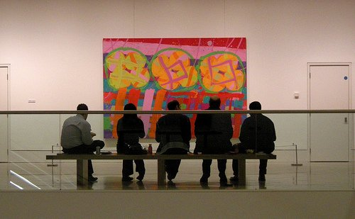

I moved to London a few months ago because I wanted to be in the center of the art action

I wanted to find a job in the arts industry (in an arts organisation or as an assistant to an artist. Wild dreams you may say!). **All I had was passion** – I had no fine arts degree except for a year of attendance in a ceramic art school in Spain. But the fact is I am ready to do anything)

Unfortunately, the art scene here is more than a battlefield.

**It is strictly a business.** What I discovered here is a vast and murky world of unpaid internships and bureaucratic madness. What rules is still sadly the who-you-know route.

**Finding a job in art is hard and many art graduates scramble their way to compete for unpaid positions**.

But eventhough, it seems like you´re going thru the eye of a needle, art does matter.

Many will question its place in society today but I am still in awe of the creative process and the capacity of humans to create something out of nothing. It is however a fact that art is composed of two worlds: the world of the artists and the world of collectors. I believe the freedom in art ceases to exist at the moment the artist puts down his drawing pencil, because right there and then, they are at the mercy of those who have buying power. I do hope that I am wrong and that the art we know today still upholds the ideal of freedom of thought.

I love to start this blog by saying I am no critic, so this is all about my learning process. Please consider me as a Tabularasa. A blank paper in the world of art. And Momardi is my way of being bold. I would love to know how great minds think! (Okay okay and also to get my foot in the door!)

Photo of London by [Samuca](http://www.flickr.com/photos/samucs/4604273326/ "London")
