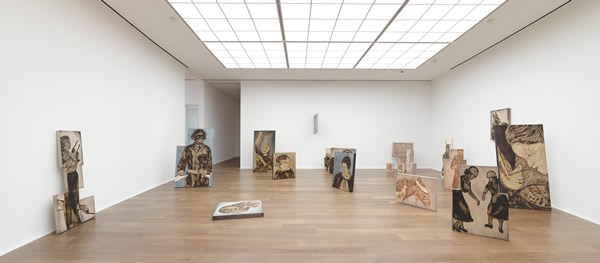
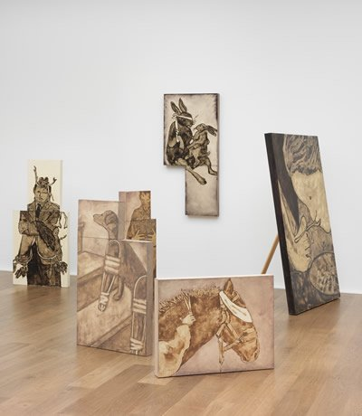
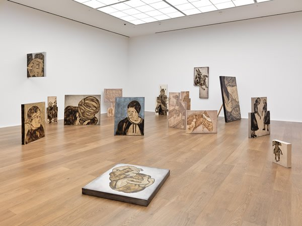
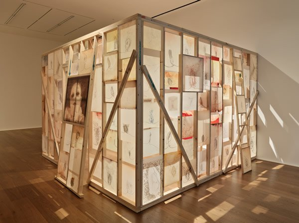
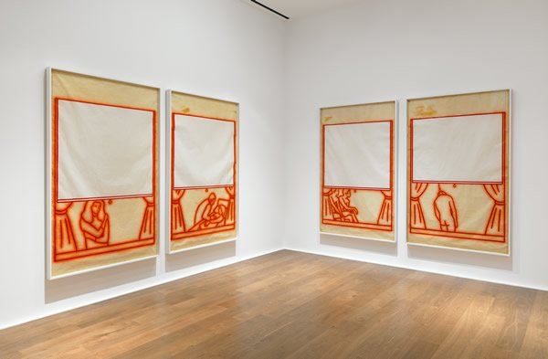

After checking out Lisson gallery, my new friend Barbara and I went to see **American artist [Ida Applebroog](http://idaapplebroog.com/ "Ida Applebroog")**´s exhibit at **[Hauser & Wirth](http://www.hauserwirth.com/ "Hauser and wirth")** in Saville Row. We were still high from meeting Angela de la Cruz and needed something as intense. **This was my second time to see Ida´s exhibit** because iIt´s just one of those works you need to see again to have a grasp of what the artist is trying to convey in her works. The exhibit is a conglomeration of Ida´s career for the past 50 years.

**The Marginalia series** was sprawled all over the main gallery room. Just like Angela de la Cruz whose paintings have broken the realm of sculpture, **Ida Applebroog´s paintings have propelled them into the dimension of room-sized installations**. Canvasses of different sizes are stacked on top of each other, adjoined together, leaning against or protruding on the wall or on the floor. In an interview with Art21, Ida said: **“When I work with canvasses, I work with three-dimensional structures. And the structure was as important as what it was I was painting.”**

Some were arranged in trios to effect a domestic dialogue which often bordered on the comical: **A text on a canvass that says “Jesus is Coming Soon” is partnered with two canvasses of two men bending butt-naked** - a scene which reminds me so much of the Philippines where I grew up and which was predominantly Catholic. Call it an act of blind faith but there is something so primitive in the way we embrace religion over there just like the way these two anonymous men have languishly bended over for.

What I liked about this exhibit was it´s fearless take on the weird. Don´t we all just sometimes want to cross-over that border despite what people would say? A set shows a woman with two guns with another set in between her legs. There was also a set of two stacked canvasses of an image of a hairy man touching his chest and another set of a man growing roots and leaves. There were also individual paintings: A woman with spoon on her mouth eating with her feet, a child with a brace head, an image of a  baby on the floor, a dog with crutches climbing up the stairs, a woman filling her glass with water from a faucet that protrudes from her head – **These all demonstrate Ida´s propensity to find dark humour on everyday scenes**.

These characters have defects – **They appear half-human or half-creature like**, to the point of being grotesque or even primitive, maybe a statement on how we humans have never really evolved past the Neanderthal age. At Art21, Ida said she does a “lot of work on murders, serial murders, rapes, ageism, sexism, AIDS and child abuse. I live in this world and this is what´s going on around me. I can´t change that.”

**In Mona Lisa, a wooden scaffold was decorated by Ida´s famous Vaginal drawings on gampi paper which formed translucent panels around the house structure**. These vaginal drawings were made since 1969 in her bathroom and I have never known an artist who has portrayed her crotch as intimately as Ida Applebroog. Back when she first created this, the word “vagina” was not even allowed to be uttered on national television. Still on so many parts of the world, it is still forbidden to explore that part of a woman´s identity. Looking at all the drawings, you get desensitized and realize the banality of gender. Hidden inside this house structure was a bloody red painting of a doll-figure with open legs and staring eyes.

**Caleb can be found reproduced several times on one wall in a technique Ida calls as “photogenics”**. The same image was digitally copied in different sizes but Caleb´s image itself was interesting – Caleb´s body was whitewashed and cloud-like and the face was also verging on the mutant. **But there was something uncanningly regal Caleb with his hat and round glasses despite the weirdness.** As a recent work, **Caleb´s intensity just shows Ida Applebroog at 81, is still as uncompromising as ever.**

Watch Ida Applebroog´Symposium at Hauser and Wirth

<iframe allowfullscreen="" class="youtube-player" frameborder="0" height="505" src="//www.youtube.com/embed/HKn5Z84pLPE?wmode=transparent&fs=1&hl=en&modestbranding=1&iv_load_policy=3&showsearch=0&rel=0&theme=dark" title="YouTube video player" type="text/html" width="640"></iframe>

<iframe allowfullscreen="" class="youtube-player" frameborder="0" height="505" src="//www.youtube.com/embed/y8DA6wkicXQ?wmode=transparent&fs=1&hl=en&modestbranding=1&iv_load_policy=3&showsearch=0&rel=0&theme=dark" title="YouTube video player" type="text/html" width="640"></iframe>
