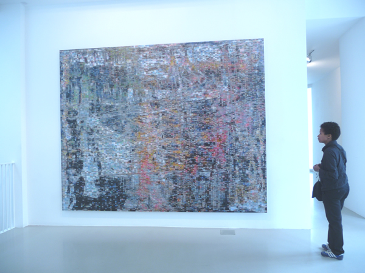
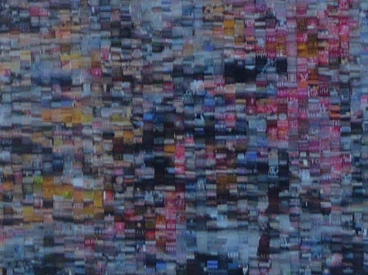
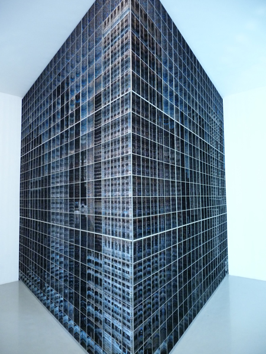
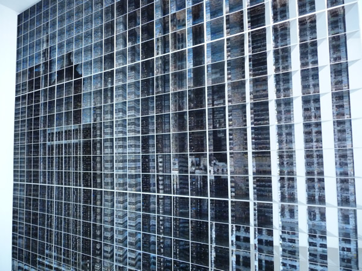
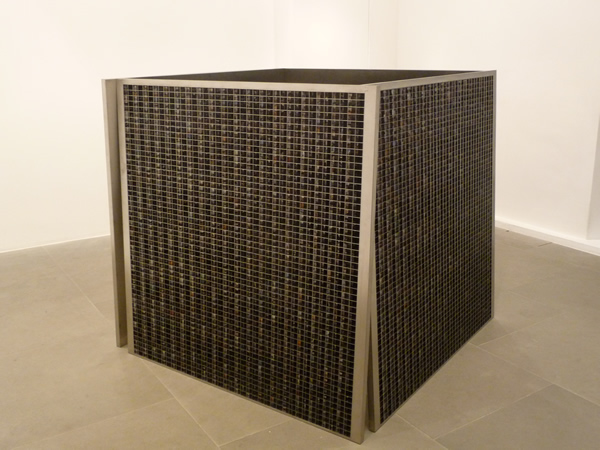
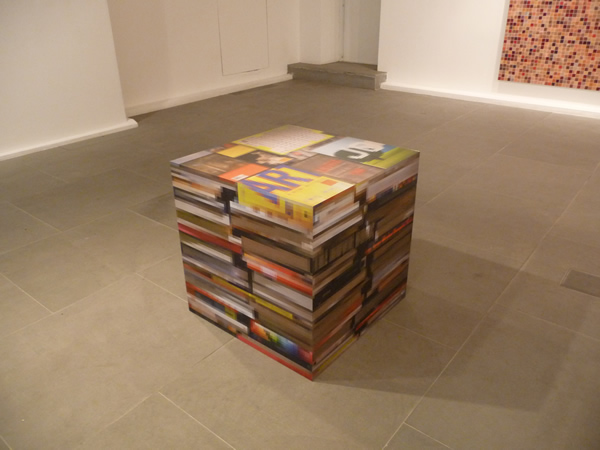

As an art form, **the rise of cheap digital cameras has put photography in a more questionable position  than ever before**. For one, taking photos nowadays do not necessarily require any creative skills whatsoever. I´ve taken hundreds of photos myself but none necessarily could be called art. **How can photography then be considered art?**

It´s worth taking a look at **Rashid Rana**´s exhibit at the **[Lisson gallery](http://www.lissongallery.com/ "lisson gallery")** (ending on April 30)to see how photography can be propelled to other dimensions. I was curious to find out about Rashid after reading a post by another blogger branding  Rashid as a boring contemporary artist.  Rashid is a Pakistani visual artist who uses pixelated constructions of photography, sculpture and installation to explore themes of cultural identity in South Asia as it struggles between tradition and modernity.Rashid had always been fascinated with how painters, photographers and filmmakers deal with two-dimensionality. This interest has manifested in his early works as drip paintings and later on as combinations of strong pixelations as a vital element in his two-dimension or three-dimension works.

<iframe allowfullscreen="" class="youtube-player" frameborder="0" height="505" src="//www.youtube.com/embed/mGCK6UvIGeA?wmode=transparent&fs=1&hl=en&modestbranding=1&iv_load_policy=3&showsearch=0&rel=0&theme=dark" title="YouTube video player" type="text/html" width="640"></iframe>

<figcaption>Patricia Patras of the Lisson gallery interviews Rashid Rana</figcaption>

**Language Series 1 and 2** for example look like large-scale paintings, from a distance but they are really composed of **small photographs of Urdu-based signs and English from shops in Lahore.** These juxtaposition of two cultural extremes provide the tension to the peaceful representation of the piece when viewed from afar. I´ve seen photographic mosaic-type representations like these in graphic design and print advertising before. It´s not really a new technique and I have a suspicion that this was the reason the blogger called Rashid boring.

However, what Rashid is doing is using photographic mosaics in the form of abstraction to provide dual meanings. As a whole, **Language series 1 and 2 do have a Monet-feel to them** at first glance but in closer inspection, the photographic parts communicate Rashid´s preoccupation with cultural identity.

In this sense, I like that viewers participate to discover the hidden meanings behind the art works. And in some way, isn´t this how we process reality in our minds? Often, we look at the big picture but struggle to see the small details. **Here Rashid confirms the dichotomy of how we understand the world and how we live in a state of duality.**

The other installation called **Desperately Seeking Paradise**, invites the viewer to explore a sculptural mirrored building structure. Every hole has a photograph reflected back on the structure. But the more time you spend on the installation, the more you realise that the pictures form an image of a cityscape. **It is the interplay between the big picture and the small pictures that make-up the tug of war between the whole and the parts.**

There are other installations downstairs that **extends the two-dimensionality of photography**: a metal cube adorned with very small photographs, a box of books that is really made of aluminum just featuring images of books. Rashid challenges us to stop glancing but to start really looking.

<iframe allowfullscreen="" class="youtube-player" frameborder="0" height="505" src="//www.youtube.com/embed/Eu948jaHZc4?wmode=transparent&fs=1&hl=en&modestbranding=1&iv_load_policy=3&showsearch=0&rel=0&theme=dark&feature=related" title="YouTube video player" type="text/html" width="640"></iframe>

<figcaption>Rashid Rana ‘In Conversation’ with Jemima Montagu and Greg Hilty Part I</figcaption>

<iframe allowfullscreen="" class="youtube-player" frameborder="0" height="505" src="//www.youtube.com/embed/1XG8elQSmlE?wmode=transparent&fs=1&hl=en&modestbranding=1&iv_load_policy=3&showsearch=0&rel=0&theme=dark&feature=related" title="YouTube video player" type="text/html" width="640"></iframe>

<figcaption>Part II</figcaption>

<iframe allowfullscreen="" class="youtube-player" frameborder="0" height="505" src="//www.youtube.com/embed/8TRmGED77c0?wmode=transparent&fs=1&hl=en&modestbranding=1&iv_load_policy=3&showsearch=0&rel=0&theme=dark&feature=related" title="YouTube video player" type="text/html" width="640"></iframe>

<figcaption>Part III</figcaption>
