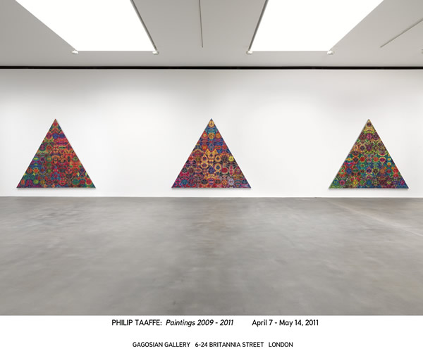
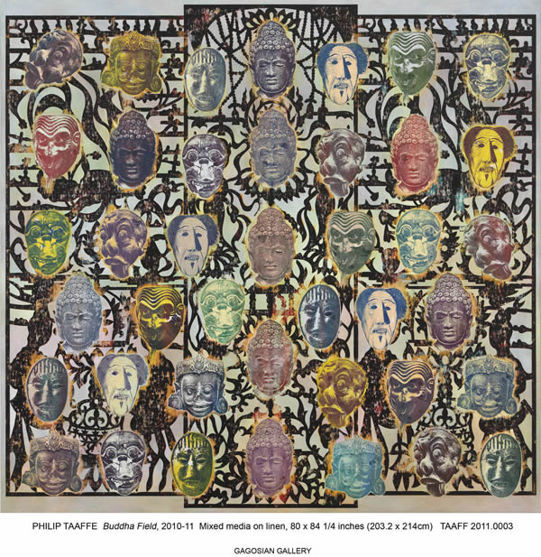
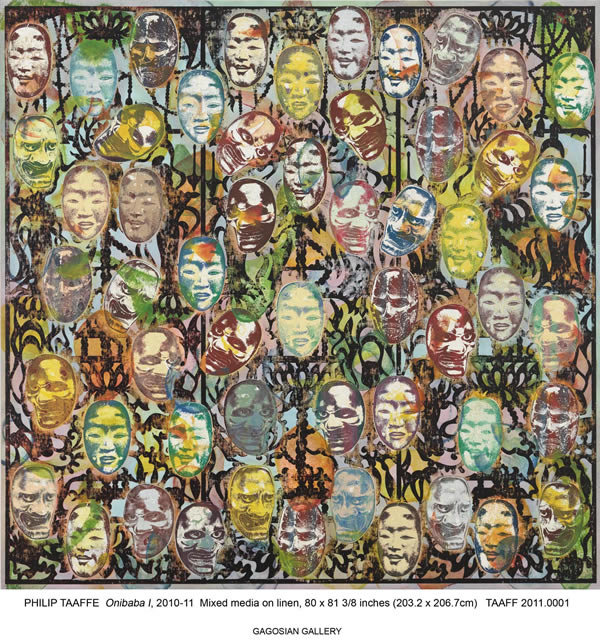
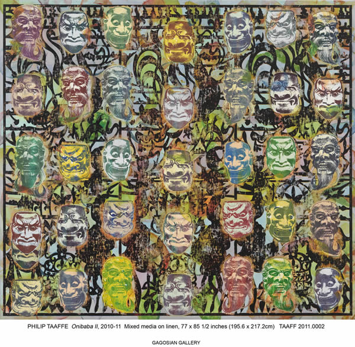
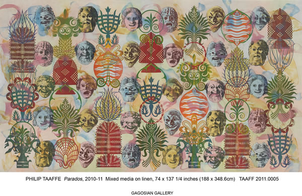
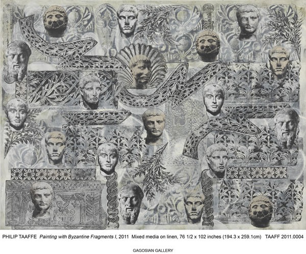
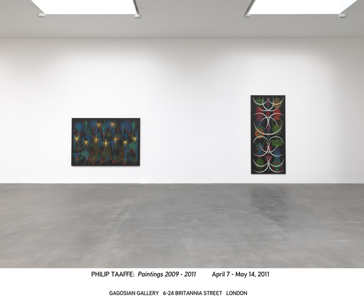

Born in the Philippines, migrated to Spain and now living London, **I am a perfect example of the phenomenon of globalization**. Like the rest of my people who have moved abroad and others who are also in diaspora,  **there will always be a struggle of maintaining a cultural identity**. I am still South-east Asian in so many ways, but I can also identify with European ideals. As an Asian, I am very diplomatic to a fault, and yet as a European, I value individuality, personal expression and non-conformity. Sometimes, I envy the Japanese because everywhere they go, they stay Japanese and nothing else.

But my roots are different. The Philippines is not an ancient civilization like Japan. It is a by-product of Spanish colonisation, American imperialism and Catholicism. (Tough combination!) Back in school, I cannot even remember any studies in Pre-spanish era. I **recently discovered we had our own form of writing called the [Baybayin](http://en.wikipedia.org/wiki/Baybayin "baybayin"), which the Spanish eradicated for the Roman alphabet.** But the Spanish didn´t really teach us proper Spanish while the Americans taught us English. So now here we are: the only Spanish colony who cannot speak Spanish; the only Catholic country in a predominantly Buddhist or Muslim South-east Asia; and the only US ally who call themselves brown Americans but speak in broken English. This is definitely a social experiment gone wrong.

And this globalisation phenomenon isn´t helping much either. The more the world wants to stay interconnected, the more there is a need to forget the old and make way for the new. **And so my Baybayin which even for its beauty, I will never use, will just be forever at the back of my mind.**

**The only person who can change my mind of unearthing Baybayin is the American artist [Philip Taaffe](http://philiptaaffe.info "Philip Taaffe"). Philip is heavily invested in lost cultures. His aim is to dig deep into the primitive by encompassing the genre of design, decorative, archeology and history through his art.** In an interview with Diego Cortez in 2009, Philip said: “The materials are taken from the investigated remains of lost cultures. The difficulty is in recovering them in such a way as to speak to our present circumstances.”

**Philip believes its his sense of cultural urgency that makes his art “historical” and yet post-modern**.  Rather than go with the new world and the tides of globalisation, Philip protests against it and retrocedes to the past as primitive and as archaic as he could. “This is my protest against the sensory deprivation that we experience, which is due to this tendency towards globalization, towards homogenization, towards the generic: a technological standard rather than an aesthetic standard. I’m mining history, trying to regenerate a pictorial situation that is more humanistic. It’s not about commodification, it’s not about fitting into some sort of corporate structure. It’s opposed to that direction.”

Philip draws inspiration from different world cultures. Much of his work at the **[Gagosian gallery](http://gagosian.com "Gagosian ")** is mixed-media: a combination of action painting, silk-screening, relief printing and collage on linen and batiks paired with historical and anthropological inferences from Islamic, Pacific and Indonesian cultures. His works are visually decorative and echo traces of textile design. But at closer inspection, it is the details which peel of the layers of the cultural urgency that Philip often speaks of. **Philip seems to have a fascination with masks as art objects and as representations of these buried cultures.**

In **Onibaba I and Onibaba II**, Philip uses colorful Noh masks on top of patterns of Japanese lanterns drawn in black calligraphy. In **Parados and Painting with Byzantine fragments**, Roman and Byzantine masks are overlaid on top of ornamental friezes.

The second group of works are abstract meditations. In **Crescent Totem**, Philip employs ornamental motiffs representing them in abstraction. In **Muscorum and Flowering Loculus**, botanical forms are carried out as abstract patterns to pay homage our natural history.

<iframe allowfullscreen="" class="youtube-player" frameborder="0" height="505" src="//www.youtube.com/embed/Fq3y8Nm0zvc?wmode=transparent&fs=1&hl=en&modestbranding=1&iv_load_policy=3&showsearch=0&rel=0&theme=dark" title="YouTube video player" type="text/html" width="640"></iframe>

<figcaption>Philip Taaffe talks about his art</figcaption>

PS: All Photos courtesy of **Mr. Raymond Foye** of Raymond Foye Ltd, Fine Arts Services administrative contact for Mr Philip Taaffe.
