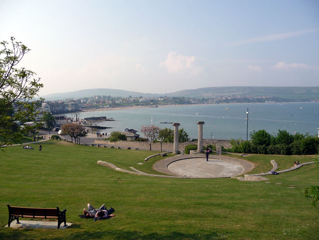
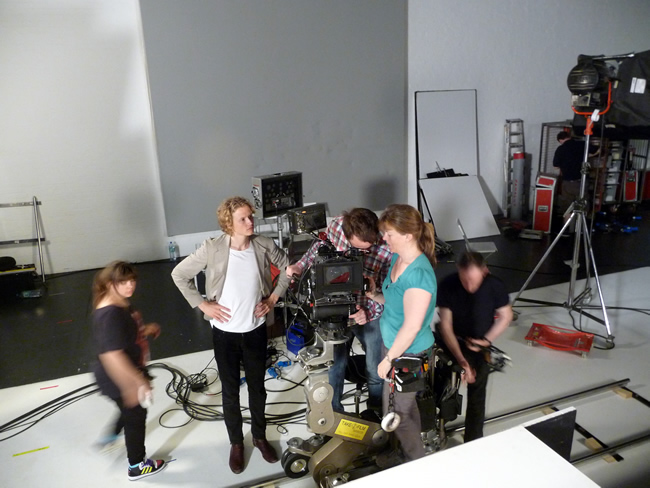
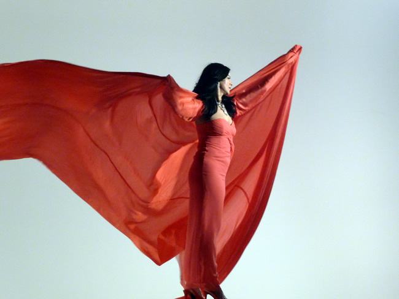

**Osama Bin Laden** is dead. The Americans can now, atleast temporarily, heave a sigh of relief and I am doing some form of cheering myself. The holidays had been good, a moto trip around **Bournemouth, Poole and Swanage** and while I´ve been battered by the wind during the trip, I am feeling sunny about starting an internship this week at **[Phaidon Press](http://phaidon.com "Phaidon")** with the digital marketing team.

Also before the holidays, I was asked to work as a runner for a film shoot for the **[Royal Opera House](http://roh.org.uk "royal opera house")** and met world-renowned opera singer **Angela Gheorghiu** and she was more than spectacular. I had to sit down by her side to play her a clip from Madame Butterfly which she had to lip-sync to for the shoot. She sometimes couldn´t help but burst into singing in between takes.

I got to experience how a British production team work and I must say, the British like to take things in stride. They are so calm and well-mannered - but I do miss the pandemonium of Filipino productions and the food!

Some other good news: **[Gagosian gallery](http://gagosian.com "gagosian")** did not reply to my email request for publicity photos for **Philip Taaffe**´s exhibit but **Mr. Raymond Foye** (who represents the administrative side of Mr Taaffe) had been most kind to send me all the photos. Ximena Garrido-Lecca, the artist who refashioned nichos as still-life images in The Followers, has agreed to an e-mail interview. I´ve sent her the list of questions and hopefully will be receiving them within the week. I´ve also scored press passes for the **[Tate exhibition on Joan Miro](http://tate.org.uk "tate").** Another gallery from Paris has contacted me and would like to be featured in the blog. So there you go, the wheels are starting to roll and I feel the earth is starting to move.

**Watch Angela Gheorgiu sing Un bel di vedramo from Madame Butterfly**.

<iframe width="560" height="315" src="https://www.youtube.com/embed/OELonx63k7s" frameborder="0" allow="accelerometer; autoplay; encrypted-media; gyroscope; picture-in-picture" allowfullscreen></iframe>
