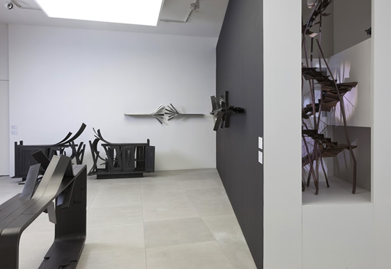
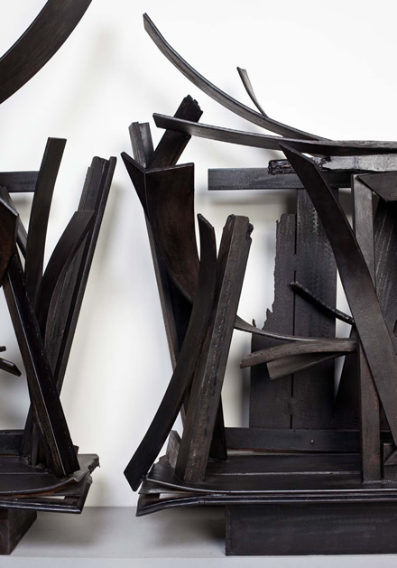
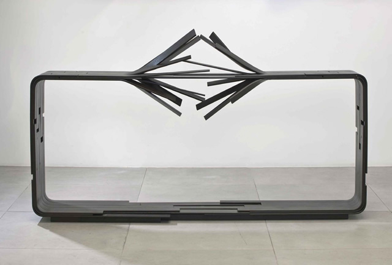
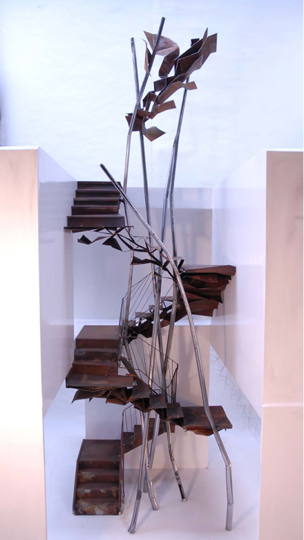

So far, in this blog, I´ve seen exhibits of artists stretching the realm of a particular medium into a sculptural language: **Both Angela de la Cruz and Rashid Rana´s artworks blur the line between painting and sculpture**. If you come to think of it, this is probably a natural progression, reflecting our human desire to stretch our limits and master as many disciplines as possible. This is a century of being multi-faceted, multi-tasking after all. For us unlucky commoners deprived of any God-given talents, we can only call ourselves jacks of some trade, masters of what-nots. (That was a bit negative don´t you think? Pach says we all need to strive to discover our talents and stay fearless. I am lucky to have my own personal life-coach).

Another one of those lucky ones is **Vincent Dubourg**. Having studied Applied Arts, Furniture Design and Industrial Design, Vincent is, for me, a triple threat artist. In an exhibit at the **Carpenters Workshop Gallery** in **Albemarle Street** in London, a gallery for contemporary design, the young French artist´s works encompass the genre of architure, furniture design and sculpture – confirming the fact that there are really no limits on what one can consider as art.

Challenging traditional standards of furniture design, Vincent´s found objects seemed violently destroyed and yet beautifully intertwined with nature to effect a poetic imagery. **‘”I like the idea of creating something beautiful out of something broken”**, Vincent says in an interview at the Wallpaper magazine.

Sideboards are destroyed in **Double Buffet Nouvelle Zélande**, and the wooden parts (actually of aluminum) are ripped open like tree branches. (In fact, this is the piece that stopped me on my tracks when I happened to pass by Carpenters Workshop Gallery) “**When I first started with wood, it was like a game between two people, each trying to tame the other: a young branch, inflexible, and me, demanding. And this led us to find a harmony together, which is translated into a dance of curves. It’s only then that we’re able to create an alphabet, which in turn brings with it sentences that make a dialogue possible,”** Vincent says.

The destructive aspect in his art echoes a sort of Shadow-esque Jungian archetype only to emerge finally as flights of visual poetry highlighting the relationship between man and nature. **A staircase is dilapidated** (a maquette) grows like a tree house from the floor to the ceiling. In **Vent sur la Table**, a deconstructed table balances on top of twigs. In **Exile**, an old suitcase is intertwined with branches which evoke a sense of nostalgia on the viewer.

Thanks to Stephanie Gabriele, Gallery Director of Carpenters Workshop Gallery for providing me with the photos!
