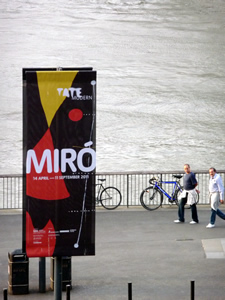
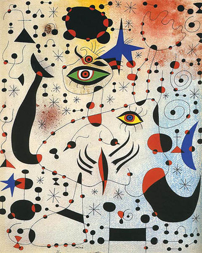
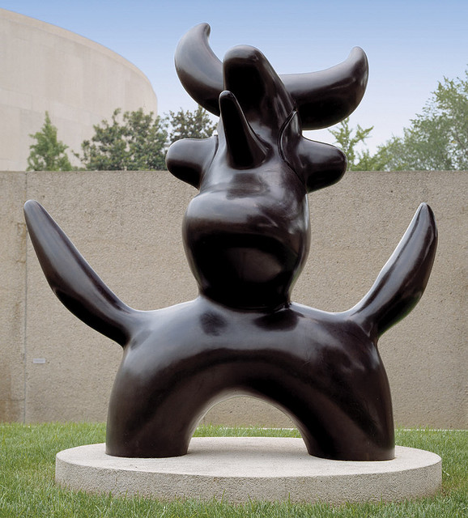
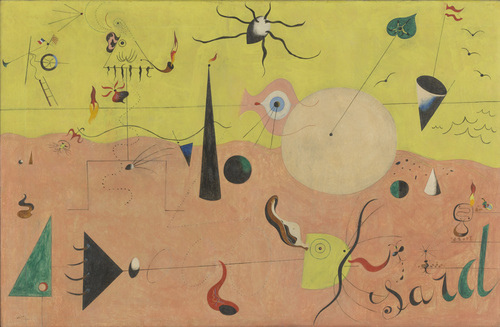
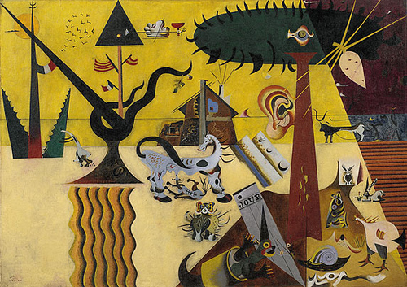
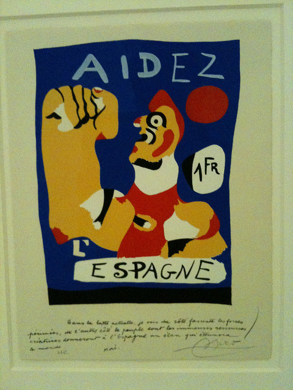

**Hunger is the word I would describe Joan Miró´s retrospective at the Tate Modern**. Not because I came there with an empty stomach and could hear it growling (I was starving, yes and could eat a horse, but that´s really beside the point) — but it is really hunger which drove Miro to find his own pictorial language. He went literally famished in his experiments with surreallism often recording his hallucinations brought by hunger on paper. In fact, it was his muse. “Hunger was a great source of hallucinations. I would sit for long periods looking at the bare walls of my studio trying to capture these shapes on paper or burlap,” he said.

This going beyond the extreme resulted in a massive artistic output of more than 2,000 paintings for 70 years of his life until his death in 1983. **He painted daily, driven by an inner hunger to widen the scope of visual perception. André Breton called him “the most surreal of us all.”**

I really found it hard to pigeon-hole Miró. This retrospective shows that Miro might be a surrealist at heart and have painted in the name of the subconscious but he was first and foremost a Catalan. In the *Vegetable Farm*, Miró glorified Mont-roig, a town near Tarragona where his parents had a farm. **In this painting, one could see visible signs of the style he will be later known for but clearly it is his Catalan identity and the love of the Catalan landscape which loom in this retrospective.**

<iframe allowfullscreen="" class="youtube-player" frameborder="0" height="505" src="//www.youtube.com/embed/l0Pi1SSHbGo?wmode=transparent&fs=1&hl=en&modestbranding=1&iv_load_policy=3&showsearch=0&rel=0&theme=dark" title="YouTube video player" type="text/html" width="640"></iframe>

<figcaption>Joan Miro at the Tate Modern</figcaption>

He must have consulted his dreams and hallucinations to do some of his best paintings but there is a level of dark reality that pervades his art works. Miro waged his own war against the dictatorship by creating his **Savage Paintings** as a statement against the suppresion of Catalan Republic. In Barcelona Series, 50 lithographs, by drawing a cast of “surrealised” characters representing dictators as protest for the Phoney Spanish war. **My personal favorite, the twenty-three gouaches in Constellations**, a poetic star-studded burst of symbols and colours signifying his remorse for the futility of the Second War.

Although his works showed political leanings, Miró was first and foremost an artist, though he refused to submit himself fully to any art movement, rejecting to even sign the Surrealist Manifesto. But undoubtedly, his trust of the imagination as well as dreams clearly makes him a frontrunner in that field. As a surrealist, Joan Miró clearly became the author of a visual primitive language – signs – sun, stars, lines for horizons, an eye, an ear floating, and glyphs are often used to convey poetic emotion (Example: the series on *Catalan peasant*).

In one interview, Miro said **“As you see i attach an increasing importance to the content of my works. To me, rich and vigorous material seems necessary to give the spectator a blow between the eyes at first, which must hit him before other thoughts can intervene.”** (Interview with Roland Penrose).

")

He didn´t constrict himself to surrealism either. He tried to stay away from the Surrealist movement and hung out with poets in order to find his own visual poetry. His style was often judged as child-like and yet has a sophistication and a complexity to them. **He dabbled in abstract expressionism as a revolt to the standard aesthetics of art**: drew lines in the horizontal triptychs ***The Hope of the Condemned Man*** and burned some of his paintings as parody to the money-making sharks of the art world. Though not as flamboyant as his contemporary Dalí, Joan Miró is still one of the best artists the world has ever known.

<iframe allowfullscreen="" class="youtube-player" frameborder="0" height="505" src="//www.youtube.com/embed/ulKZdOKQpgM?wmode=transparent&fs=1&hl=en&modestbranding=1&iv_load_policy=3&showsearch=0&rel=0&theme=dark" title="YouTube video player" type="text/html" width="640"></iframe>

<figcaption>Chris Dercon, new director of the Tate Modern on Joan Míro and the Ladder of Escape</figcaption>

**For more on Joan Miró at the Tate, check these reviews:**

- [Joan Miró is Marvelous at the Tate at the Socialist Worker](http://www.socialistworker.co.uk/art.php?id=24604 "Marvelous Joan Miro")
- [Joan Miró, Tate Modern by Charles Darwent at the Independent](http://www.independent.co.uk/arts-entertainment/art/reviews/joan-mir243-tate-modern-london-2268835.html "Independent")
- [Surrealism? It was always old hat by Jonathan Jones of the Guardian](http://www.guardian.co.uk/artanddesign/jonathanjonesblog/2011/apr/08/joan-miro-surrealism-painting-tate "Jonathan Jones")
- [Joan Miró: The Ladder of Escape by Time Out London](http://www.timeout.com/london/art/event/212965/joan-miro-the-ladder-of-escape "Time Out")

PS: Thank you to **Duncan Holden**, Press Officer of the Tate Modern, for providing us with press passes.
