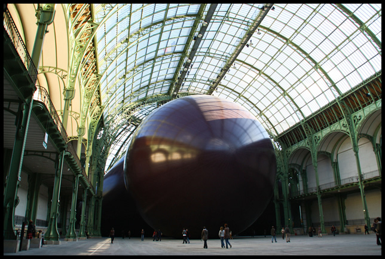

A friend of mine will take a few days off work just to visit Paris and see **[Anish Kapoor´s Leviathan](http://www.monumenta.com/en/2011/accueil "Anish Kapoor")**, a monumental balloon sculpture at the Grand Palais in Paris. There are no pangs of envy but I wish I had cheap Eurostar tickets just to pop in for a day. But my internship days are not yet over, and I´m unfortunately not yet in the position to splurge in the name of art.

Every year, the French Ministry of Sculpture picks an artist for the Monumenta series, an exhibition to explore the architectural space of Grand Palais. **This year they picked Indian-born British-Artist Anish Kapoor who responded with this challenge by creating a temporary-inflated sculpture made of PVC material that is 35 meter tall and filling up at least 13,500 square meters when inflated.**

I just want to feel what it would be like to be inside this giant sculpture. I know the experience would be jaw-dropping as soon as I see the enormity of this beast. Just imagine a tiny speck of me against the backdrop this monster sculpture and being gorged in its digestive track. To add, **the literal meaning of Kapoor ´s Leviathan is sea monster in the bible – and in some way, judging from the pictures, he has created one humongous creature that lie in the nave of the Grand Palais**. I would literally feel like Jonah inside a giant whale.

It seems like size is tantamount to viewer experience which is why it is such a huge theme in contemporary sculpture. Minimize **[Richard Serra](http://www.pbs.org/art21/artists/serra/ "Richard Serra")´s Man of Time at the Gugghenheim** for example, and you will lessen the experience of the sublime. I asked a friend **Reg Yuson**, one of the leading sculptors in the Philippines on why he cannot make his sculptures smaller (a really stupid question to ask) and he answered, what´s the point? **Sacredness perhaps has something to do with grandeur and the audacity of the object**. Churches are built to tower over man, and in this case, Leviathan attempts to form a cathedral space inside. I´ve heard people suffer from vertigo and get disoriented inside Leviathan. I imagine that its mere presence inside or out can affect the personal space. I imagine that the Leviathan can be imposing and foreboding at the same time.

 Alexandre Marchand")

 Alexandre Marchand")

 Alexandre Marchand")

 Alexandre Marchand")

 Alexandre Marchand")

In one of his interviews, Anish Kapoor explains the significance of this project. He says he wants the viewer to “have a moment of a shock, aesthetically but also physically so that when you enter you would go wow.” Colour, he says, played a big role in this piece and his objective was to make it an all-encompassing monochrome. He also wants the viewer to bring both their body and memory in the act of looking at this piece.

<iframe allowfullscreen="" class="youtube-player" frameborder="0" height="505" src="//www.youtube.com/embed/rt3ZcMO8JFI?wmode=transparent&fs=1&hl=en&modestbranding=1&iv_load_policy=3&showsearch=0&rel=0&theme=dark" title="YouTube video player" type="text/html" width="640"></iframe>

<figcaption>Anish Kapoor Interview</figcaption>

<iframe allowfullscreen="" class="youtube-player" frameborder="0" height="505" src="//www.youtube.com/embed/F6QJ4V3Z_h8?wmode=transparent&fs=1&hl=en&modestbranding=1&iv_load_policy=3&showsearch=0&rel=0&theme=dark&feature=related" title="YouTube video player" type="text/html" width="640"></iframe>

<figcaption>Anish Kapoor Interview</figcaption>

*All Photos in the Gallery by Alexandre Marchand*
