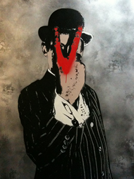
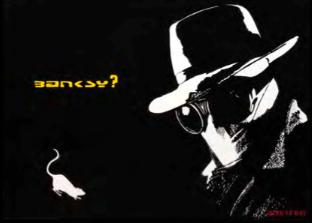
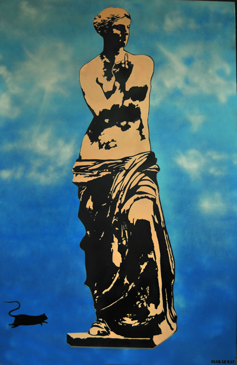
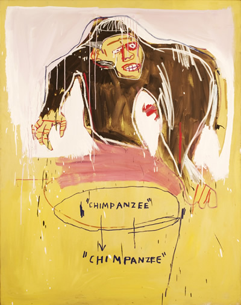

Wow, I am truly excited about this upcoming exhibit! From June 17 onwards, **[Banksy](http://www.banksy.co.uk/ "Banksy"), [Blek Le Rat](http://bleklerat.free.fr/ "Blek Le Rat"), Haring** and so many others are all going to participate in the **upcoming Street Art Show at the [Opera Gallery](www.operagallery.com/ "Opera")**. Street Art has definitely arrived in the shores of the famous and posh Bond Street spraying cans of love to the (supposedly) elite art audience. **From an underground phenomena years ago, graffitti art is now as mainstream as can be**. And there´s no turning back.

As an underground genre, graffiti art is really created for the general public, but perhaps, the prospect of being able to exhibit in an established gallery is (consciously and subconsciously) an objective of every artist, underground or not. Though catering to an elite audience, private galleries ensure that their artworks are taken care of and documented, which the merciless streets unfortunately cannot rightfully defend and conserve.

Just to let you know how powerful this show is, a friend who is not really into art told me, “I wanna go, I wanna go. I like Banksy

**The fact is, street art is a genre that all of us can understand. Even if it is somehow tied to pop culture, graffiti art is devoid of snobbery and is accesible to all.** It´s humourous, ironic and can be dark all at the same time. It entertains you and also makes you think even if you are not truly into art. And most of all, it confirms our standing wish of going against the establishment. In the back of our minds, we all have a dark wish to break free from the shackles of this 9 to 5 life. Street Art protests for us and voices our concerns. Nothing is more politically and socially direct than this type of art.

**This exhibit is one of a kind because it brings together the founding fathers, the established and upcoming artists of Street Art**. The greatest thing about this exhibit is that we will see their artworks in the flesh and the artists get to conserve it for other generations to see. By coming out of the daylight, they can now avoid having their artworks disappear!

All of us are excited (Pach, me and my friend) of seeing a real Banksy art work in a gallery setting, but I also want to see works of the Street Art founding fathers like [Jean Michel-Basquiat](http://basquiat.com/ "Basquiat") and Blek Le Rat, the pioneer of stencil art. Other artists in the bunch are: [Keith Haring](http://www.haring.com/ "Keith Haring"), Seen, [Ron English](http://www.popaganda.com/blog1.php), [Logan Hicks](http://workhorsevisuals.com/new/ "Logan Hicks"), Crash, [The London Police](http://www.thelondonpolice.com/NewTLP/News.html "The London Police"), [Nick Walker](http://web.mac.com/nickwalkerz/Nick_Walker_Art/Welcome.html "Nick Walker"), [How & Nosm](http://hownosm.org/ "How & Nosm"), [Saber](http://saberone.com/ "Saber"), Roa, b., [Swoon](http://www.designboom.com/contemporary/swoon.html "Swoon"), [Kid Zoom](http://www.kid-zoom.com/ "Kid zoom"), [AlexOne](http://www.alexone.net/ "Alex One"), [Anthony Lister](http://www.listerart.com.au/ "Anthony Lister"), [Alexandros Vasmoulakis](http://www.vasmou.com/ "Alexandros Vasmoulakis") and Rich Simmons.

As **Gilles Dyan & Jean-­David Malat**, curators of this exhibition at the Opera gallery, say in their press release. “We think Street art is a major art movement of the era,” and I, your humble abode, Tuesday aka Momardi, truly agree.

Related Links:

- [The Top 50 Most Beautiful Graffiti Art](http://www.smashingmagazine.com/2008/09/14/tribute-to-graffiti-50-beautiful-graffiti-artworks/ "The top 50 Graffiti")

<iframe allowfullscreen="" class="youtube-player" frameborder="0" height="505" src="//www.youtube.com/embed/CkX8ZqmvmcQ?wmode=transparent&fs=1&hl=en&modestbranding=1&iv_load_policy=3&showsearch=0&rel=0&theme=dark" title="YouTube video player" type="text/html" width="640"></iframe>

<figcaption>Banksy´s Street Art</figcaption>

PS. Watch out for the review of the exhibit this June. Many thanks to Florie-Anne Mondoloni (Press Office and Communication of the Opera Gallery) for providing photos to Momardi. More photos will be included in the next blog post. Download the Opera Gallery [catalogue](http://www.operagallery.com/catalogues/TheMarketMag/cata.pdf "Catalogue") for this show.
