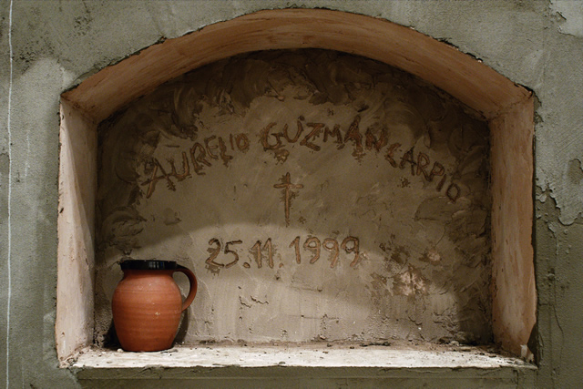

I had been mesmerized by **[Ximena Garrido-Leccas](http://www.ximenagarridolecca.com/ "Ximena website")´s The Followers** which I saw at the Saatchi Gallery early this year. It is a powerful visual smorgasborg of an installation that explores the adverse effects of colonialism and the cult of the dead in native Peru.

Anybody who has grown up in an environment violently battered by social, cultural and religious upheavals can relate to The Followers. I for one, being born in the Philippines, know first-hand the extent of the damage colonialism can make to one´s cultural identity. I mourn for the history of my people that I do not even recall. Ximena´s The Followers brings the symbol of Death as an allegory to a conflicted social history of Peru. I was very lucky to score an interview with Ximena. She talks to me about her art, her inspiration for **The Followers** and her advocacy for indigenous arts.

**What inspired you to become an artist?**

My father is a musician and my mother an actress/writer so I was always surrounded by art. I guess growing up in a conflictive environment such as Peru, makes you want to express and communicate ideas that could encourage a change or at least inspire a reflection on social matters.

**How was the idea for this exhibition born?**

I was in Cuzco and entered one of the local cemeteries. I was very overwhelmed by the amount of effort and care that was put into each grave. It is common practice to bury the dead in raised structures, mainly in less affluent areas, but the particular decoration of each ‘nicho’ really took my attention. People from different social backgrounds of this town where buried there.

Each one of the facades represented not only the individual life of each one of the deceased and their social background; in relation to the others they became a unity, one that reflect much higher realities: the one of death of course, but also the complex social and political background of the country. These arrangements and crossed aesthetics between traditional indigenous forms and occidental culture, reflected the situation of the country and its search for a national identity.

**I understand that these are faithful reproductions of nichos in Peru. Why was it so important for you to tackle the theme of death in The Followers? How should it be seen in relation to Peruvian history?**

The cult of the dead has always had a very significant role in ancient and modern cultures. It reflects many subjectivities and social/ political structures within the population. I think that in The Followers, death functions a a vessel to understand Peruvian culture and its history.

**Should your work be considered still-life paintings or sculpture? What type of materials do you identify with?**

I use all kind of materials. My work is mainly 3D, but I have been recently working with video and photography, so I guess my practice is varied.

**For an artist who is an advocate of indigenenous arts, why is it important for you to work in the West? Why is it important for you to pay homage to your roots?**

I think that by being away, my vision of Peru has become more objective. I can actually see the culture from a different perspective, though keeping a strong connection with my roots and culture. In terms of exhibiting the work in the west, I think that by re-contextualizing Peruvian Culture and subscribing it into a Global environment, its uniqueness and complexity is emphasized. While being celebrated, other issues are also exposed, such as its paradoxical urge to fit within the globalized world itself.

**What do you think is the role of an artist to the public? to your people?**

I would like to think that by making art we are encouraging thought and making people more aware of their environment in order to appreciate more theirs and other cultures.

**What´s next for you? Any upcoming exhibits?**

I have a show in September at Mimmo Scognamiglio gallery in Milan. I will also be doing a solo project at Frame in October this year.

Peruvian-born British-based Artist Ximena Garrido-Lecca studied in the Bryam School of Art in London and has since participated in numerous group exhibitions in London. More photos of her works below as featured in the [Max Wigram Gallery](http://www.maxwigram.com/index.php?section=ximena_garrido_lecca&category=works "Max Wigman Gallery").

 2011. Wood, PVA, plaster, acrylic, emulsion, flowers. 76 x 77 x 64 cm. Courtesy of the Max Wigram Gallery")

Related Links:

- [Ximena Garrido-Lecca´s Artist Profile in the Saatchi Gallery](http://www.saatchi-gallery.co.uk/artists/ximena_garrido.htm?section_name=new_britannia "Ximena at Saatchi")

PS. Many thanks to Ximena who was so accomodating and to Sidonie Motion of Max Wigram Gallery for providing publicity images for this blog post.
