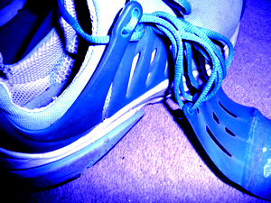
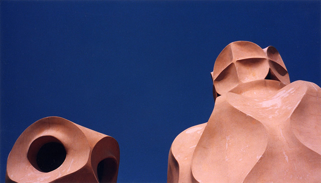
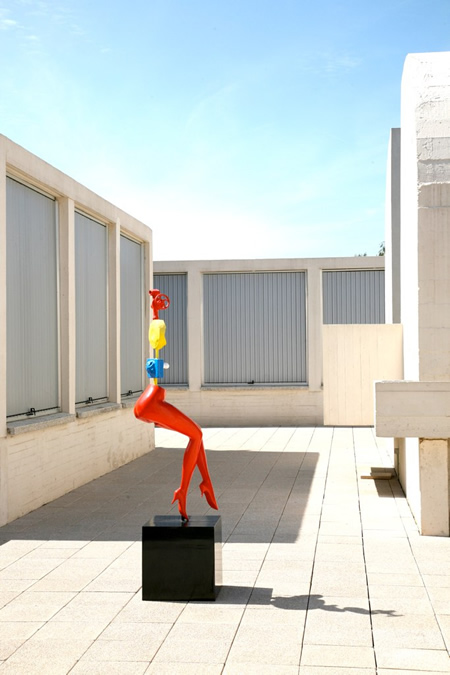
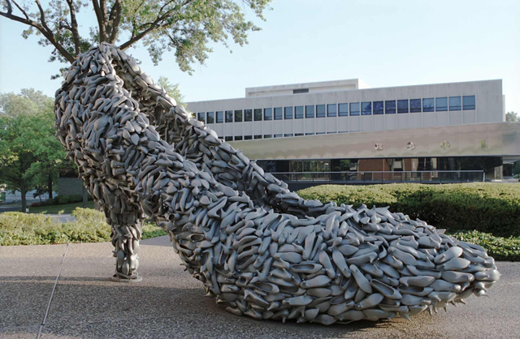
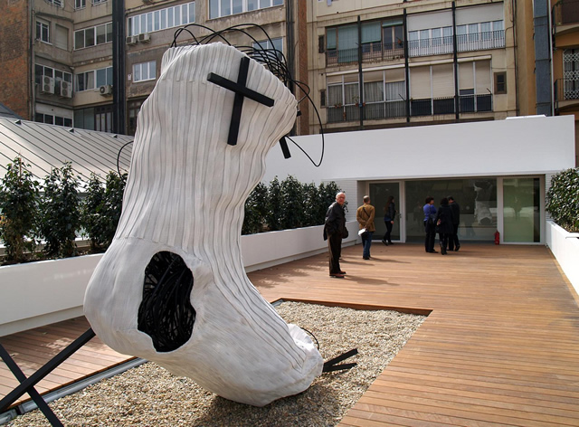

My trainers have finally succumbed to its finality-a slow, painful but sure death and I am the only one mourning. The plastic straps that held the shoe laces fell out and as much as I want to revive them with superglue, I know it is high time to give them a rest. There were tears shed indeed, for these once-beautiful worn-out shoes have been with me since the start of my European saga and have witnessed my personal retreats, ups and downs, journeys and art discoveries.

For a year, these trainers have been in Barcelona and discovered the trails of the fathers of modern art: the **[Fundación Joan Miró](http://www.fundaciomiro-bcn.org/?idioma=2 "Fundacio Joan Miro"), [Pablo Picasso Museum](http://www.museupicasso.bcn.es/en/ "Museo Picasso Barcelona"), Gaudi´s Sagrada Familia/Casa Mila** and also discovered the avant-garde **Antoni Tapiés**. They have basked in the Figueres sunshine to catch a glimpse of what inspired **[Salvador Dali](http://thedali.org/ "Salvador Dali")**.

They´ve gone to Madrid for 2 1/2 years to see **Velazquez** and **Goya** and have been mesmerized by the works of El Greco. They´ve made fantastic and meaningful trips: two months in Paris with a daily dose of the **[Centre Pompidou](http://www.centrepompidou.fr/ "Centre Pompidou")** Library and the cobblestoned streets of Montmartre where most of the artists who shaped modern/contemporary art have once lived. And now here in London, they´ve finally come to pass. They´ve surely done their part to traverse real-life and creative experiences with me. With the passing of these trainers, a new chapter unfolds. And I am willing to go as far as I can until my new trainers bow down.

In modern and contemporary art, I am not alone with my foot sentiments. I´ve also seen how artists have glorified shoes. Joan Miró made a sculpture of a figure with red shoes displayed at the **Fundació Joan Miró** in Barcelona. And one other painting called a “**Still life with an Old Shoe**,” which he made in Paris in 1937 as a protest against the Spanish civil war. (See the Moma video below).

[Still Life with  Old Shoe by Joan Miró](https://www.moma.org/collection/works/80555)

Moving on to contemporary times, in Berlin, soccer shoes were commemorate in Berlin as part of the **Land of Ideas**, in honour of their developer, the Dassler family (Adidas).

<iframe allowfullscreen="" class="youtube-player" frameborder="0" height="505" src="//www.youtube.com/embed/Cvl4u1CCp3o?wmode=transparent&fs=1&hl=en&modestbranding=1&iv_load_policy=3&showsearch=0&rel=0&theme=dark" title="YouTube video player" type="text/html" width="640"></iframe>

<figcaption>Land of Ideas in Berlin</figcaption>

Artist **[Victoria Fuller](http://www.victoriafullerart.com/ "Victoria Fuller")** also made an ode to the Shoe of Shoes. It is a large shoe sculpture made up of shoes. Victoria says, “While the collection of many shoes can represent commercial mass production, it can also represent a cultural icon of femininity, perhaps collective feminine strength. The common object is elevated to a higher form, by transforming the mundane into a surreal fantasy.”

American artist **Tyree Guyton** made a shoe installation in Detroit to explore the theme of homelessness. The outdoor installation literally populated an entire block with all kinds of shoes. He says, “‘I live around the corner here, and so I see every day this church behind me, feeding people every Wednesday, and I knew I wanted to say something,” he said. “And it came to me to talk about the plight of the people right here.’

<iframe width="560" height="315" src="https://www.youtube.com/embed/OadEGn8w0l8" frameborder="0" allow="accelerometer; autoplay; encrypted-media; gyroscope; picture-in-picture" allowfullscreen></iframe>

<figcaption>The outdoor installation of Tyree Guyton in Detroit</figcaption>

On the otherhand, **Antoni Tapiés** made an Ode to a dirty sock displayed at the **Fundació Tapiés** in Barcelona. In fact, Tapiés is known to incorporate the image of the foot, footprint, sock and shoe in his works notably in works such as **Brown Bed (1960)**, **Matter in the Form of a Foot (1965)** and **Sole of Foot (1984.)** He takes this unappealing and simple image to convey a complex meaning.  He says, “Sometimes people have the idea that art should be highly refined. But I always believed that one could make art out of simple, humble things,” he says. “Small things can be transcendental. They can change our way of looking at the world. I think it’s important to make art out of almost anything.” ( [Telegraph Article](http://www.telegraph.co.uk/culture/art/3651105/From-earth-to-eternity.html "Telegraph Article"))

I can´t help but remember how the poet **Pablo Neruda** has once penned an ode to his socks. An excerpt goes:

*“my feet were honored in this way 
 by these heavenly socks. 
 They were so handsome for the first time 
 my feet seemed to me unacceptable 
 like two decrepit firemen, 
 firemen unworthy of that woven fire, 
 of those glowing socks.”*

Pablo Neruda

The writer **Erica Jong**, on the otherhand, also took a jab at writing an Ode to her shoes. An excerpt:

“Darling shoes, 
 beloved feet 
 ten toes to walk me 
 toward my true love, 
 fuck-me pumps to fuel his passion 
 stiletto heels to stab him 
 if he strays. 

Shoes tell you everything. 
 Shoes speak my language. 
 Their tap tap tap on the airport runway 
 tells me the story 
 of a lovely, lonely woman flying after love– 
 That old, old story 
 in a new pair 
 of shoes.”

Erica Jong

<iframe allowfullscreen="" class="youtube-player" frameborder="0" height="505" src="//www.youtube.com/embed/TYBpVw4sxJQ?wmode=transparent&fs=1&hl=en&modestbranding=1&iv_load_policy=3&showsearch=0&rel=0&theme=dark" title="YouTube video player" type="text/html" width="640"></iframe>

<figcaption>Video of the Dirty Sock by Antoni Tapiés</figcaption>
