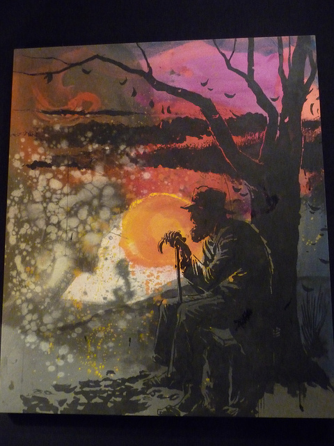
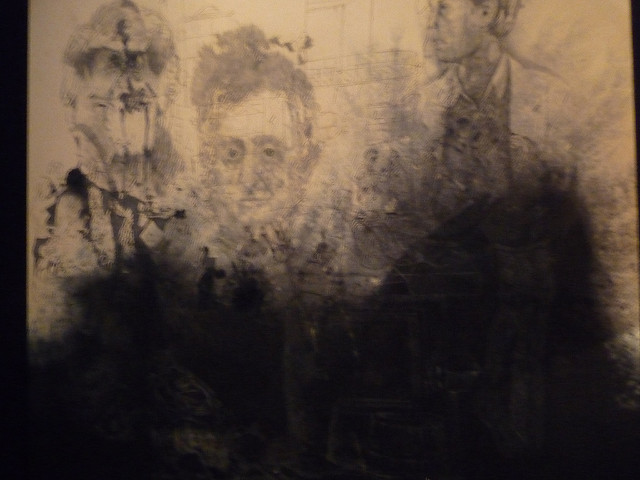
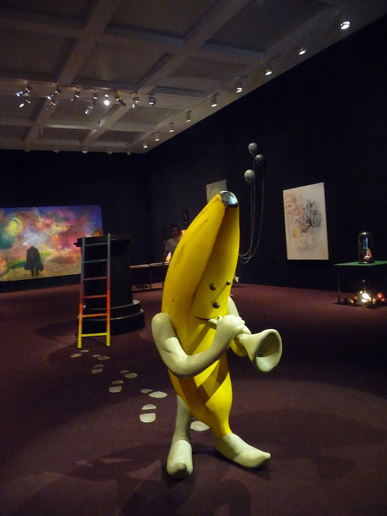
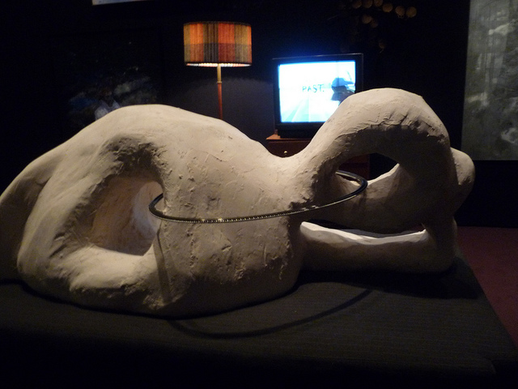
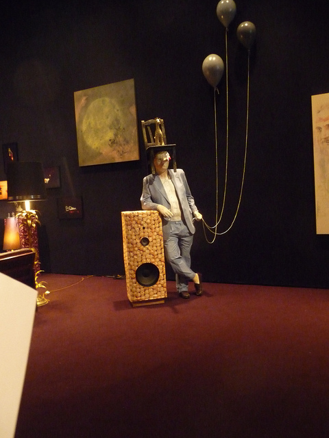
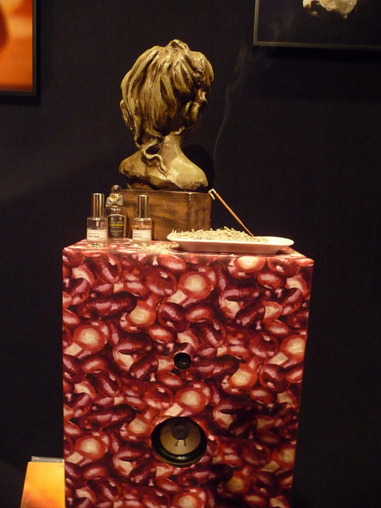
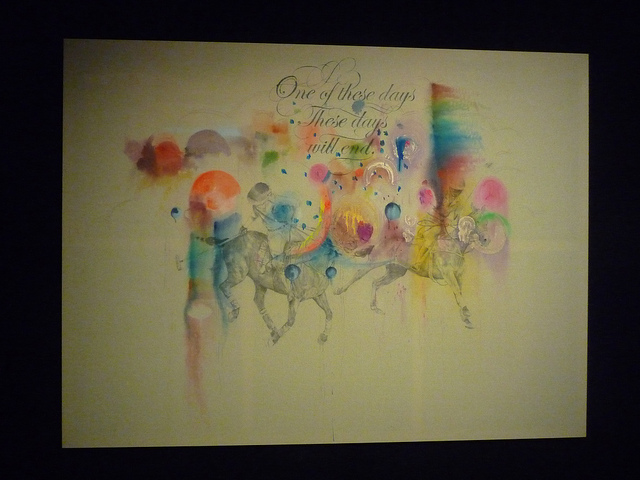

If I could create a space to describe how surreally crazy my life has been this past year, **(Title: The Travails of a Stubborn Dreamer Immigrant who thinks Europe still has something to offer while all of her friends are now going back to Asia)**, I´d probably emulate the exhibit of **Friedrich Kunath** at the White Cube. Just like Friedrich, I´ll make the room a **David Lynch** meets **Buster Keaton** dreamscape: paint the walls black, have incense burning and yeah, I will also put a human-sized banana with a trumpet to welcome my visitors. Because just like my laughable absurd sense of optimism and pessimism about life in Europe, my room is a dreamland where tragedy and comedy meets.

As Kunath´s UK solo show, I was fortunate to catch it before it ended last June 4. The exhibit was a total brand experience in a surreal tragimelancomic utopia: **The Most Beautiful World in the World** according to Kunath.

 In almost Summer by Friedrich Kunath")

I wanted to doze off in one of the sofas  and smoke a Cuban cigar while looking at those vibrant watercoloured artworks that depict a male figure in the absurdities of over-loneliness, this word scrawled in text in **I heard I was in Town**. I like the title of the other work: **Let those Days I Don´t Care Begins -** because it would be really great if there could be some moments when we can just stop giving a damn about everything and about nothing. Kunath has a penchant for branding his artworks with poweful titles – for example **Younger Men Grow Older** was a powerful punch eerily accompanied by a visual black and white portrait of melancholic men pondering the inevitably of aging.

A German-born American artist, **Friedrich Kunath**´s exhibit explore themes of loneliness and dream possibilities in this exhibit. In variety of mediums encompassing sculpture, painting and installation, the dark room is unbearably melancomic as it brings a twisted sense of nostalagia of childhood.

Playthings become absurd mementos such as the **banana sculpture with its footprints on the carpet; the man with a chair on its head and bird on its nose holding balloons; and a reclining male figure watching a film while a toy train passes thru its body**. The sounds of chirping birds mixed with the smell of incense is Kunath´s nostalgia for that space-moment of what has been. The central piece of the exhibit was in **Almost Summer**, a eye-catching piece because of its vibrant watercolours which is offset by the sad figure of a man holding a luggage. It is what I can call a picture of the summer of discontent.

**The Most Beautiful World in the World** only exists in the mind. It is a space that acknowledges the purity of a distant past and honours (albeit with irony), the ambiguous outcome of the present where the most tragic of all tragedies is to be lonely. I am still not yet lonely in Europe (thank God!) but my past life in the Philippines had been brighter. I feel exactly like Kunath´s **One day We will Follow the Birds**, where a voice utters, **“I didn’t expect to remain the same but I didn’t know what to expect.”** But hey, I am still dreaming by the way. **One of These Days will End**. Bow.

<iframe allowfullscreen="" class="youtube-player" frameborder="0" height="505" src="//www.youtube.com/embed/DqLDrmn8GoI?wmode=transparent&fs=1&hl=en&modestbranding=1&iv_load_policy=3&showsearch=0&rel=0&theme=dark" title="YouTube video player" type="text/html" width="640"></iframe>

<figcaption>Interview with Friedrich Kunath</figcaption>

Related Links:

- [The Most Beautiful World in the World by Aesthetica Blog](http://aestheticamagazine.blogspot.com/2011/05/most-beautiful-world-in-world-friedrich.html "Aesthetica Blog")
- [Friedrich Kunath by Artwrit](http://www.artwrit.com/article/friedrich-kunath-the-most-beautiful-world-in-the-world-london/ "Art Writ")
