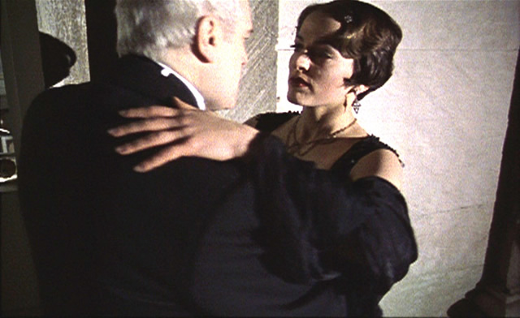
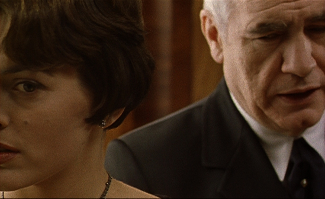
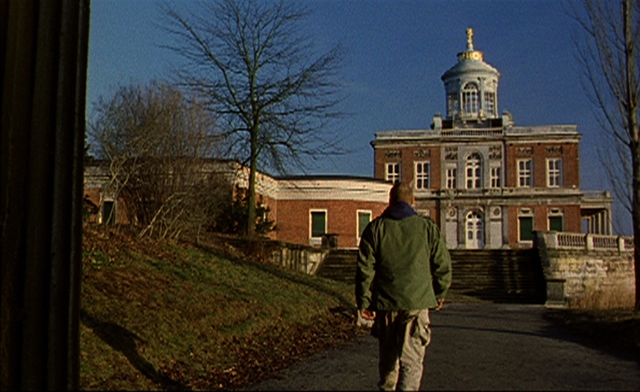

I was getting a little bit grumpy from not receiving replies from the **Gagosian gallery** for my request on publicity images for the **John Chamberlain** show. Ignored by an elite gallery for the nth time, I had been wondering if I was mistaken about Momardi as an effective platform for me. I have a feeling that in London, traditional critics-journalists are still hailed as the bearer of tidings and bloggers are still nothing but amateur cheapskates. Unless of course you are Jonathan Jones, blogger slash critic of the Guardian.

I did change my mood when **Institut Français** London contacted me to let me know about this special screening on David Lamelas´movies. Two good points to be noted. Institut Français is the cultural arm of the French embassy and second, I am passionate about everything French. So this is really good news! I did study French for almost 3 years at the Alliance Française – but I need to improve it, desperately. My level is in between intermediate-advanced and I realised it´s about time to fulfill passion no. 2. After reading two more books on art, I will try to read French magazines from now on and go see French movies.

And speaking of movies, Institut Français presents two movies of Argentinian-born artist David Lamelas: The Invention of David Morel (2000, 25 minutes) + The Light at the Edge of the Nightmare (2002-2005,75 minutes).

Originally a sculptor, David Lamelas uses film, photography and installation to explore a sculptural language that embodies time, space and language. Inspired by literary genres such as Latin American fantastic realism and French New Novel, David deconstructs normal film narration. David says he treats sculpture the same – he deconstructs its storyline. Here is an interview with David Lamelas at the Bloomberg Space this June:

<iframe allowfullscreen="" class="youtube-player" frameborder="0" height="505" src="//www.youtube.com/embed/YIPb3F5pEQI?wmode=transparent&fs=1&hl=en&modestbranding=1&iv_load_policy=3&showsearch=0&rel=0&theme=dark" title="YouTube video player" type="text/html" width="640"></iframe>

<figcaption>David Lamelas at Bloomberg Space, June 2011</figcaption>

Many thanks to Camille Tennesson of the Institut Français for inviting me to this event. Merci beaucoup! Catch the movies of David Lamelas at the Ciné Lumiere this 22 of June, 6:15 pm at the [Institut Français](http://www.institut-francais.org.uk "Institut Français").
