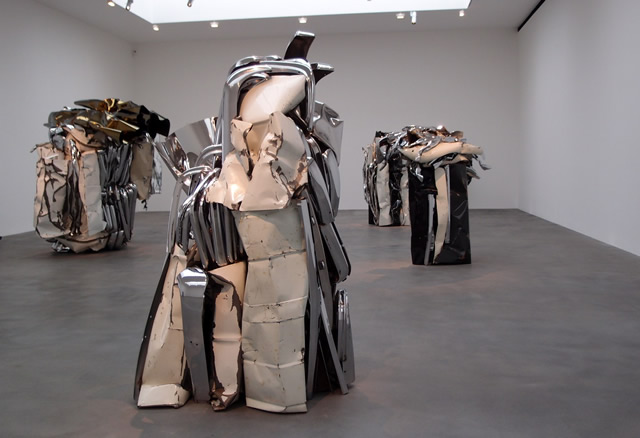
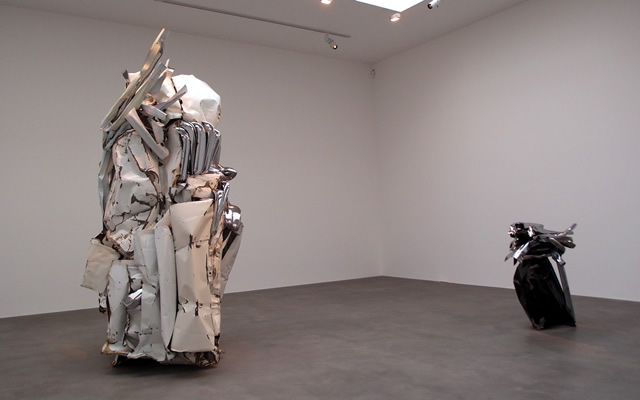
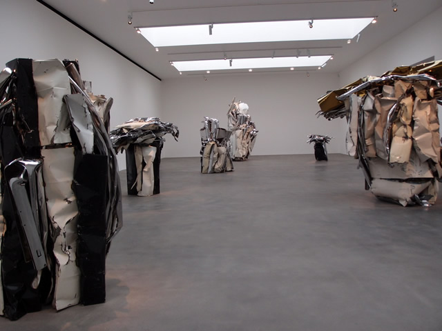
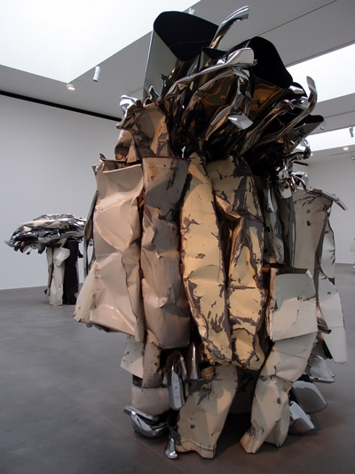

**This is not a rant, but a fact**. I am still puzzled as to why there are more **Men in Black** guards at the Gagosian gallery than the artworks. On my visit to see John Chamberlain´s exhibit, I did not feel comfortable that somebody had been following me around as if I´m about to snatch some artwork. Believe me, these guards are not the normal kind of invigilators that you see in other galleries. At the Gagosian, the guards are tall and towering  who seem very ready to knock your teeth out if you make any false moves. **Only one thing missing would be for them to wear some shades and this would be The Matrix Gagosian land.**

But as a gallery space, I really like the Gagosian. **It´s huge and well-lit with a capacity to host some very big sculptures just like the ones from John Chamberlain**. But as I said, the presence of the guards diminished my enjoyment of viewing the sculptures. For example, when I tried to snap pictures of John Chamberlain´s car artworks only because I saw another lady did it (apparently this lady belongs to an official team of photographers), a big muscular invigilator came down marching  telling me, oh no, **”you are not allowed to take pictures madam”** and he followed me everywhere I went.

**I loved John Chamberlain´s sculptures even if I had only 5 minutes to enjoy it** and even if there was an unwanted presence at my back. John is known for his sculptures made from vibrantly coloured of crushed automobile parts bringing an Abstract Expressionism feel in 3d. I´ve never seen his sculptures live before but I appreciate the art of assemblage done in the pieces, where the wildness and primitiveness are maintained with the jagged edges of the fenders and hangars  still propping up in the air.

**I imagine the process of crushing these cars and I realise that not only the physical aspect of the car is smashed but so also the emotional attachment we have for these cars.** I asked myself who were the owners of these cars and where are they now? John Chamberlain preserves our connection with these objects and makes them monumental pieces that exude both grandiosity and frailty. At 84, John Chamberlain is already suffering from bad health but still this exhibit was a powerful one. I really left happy even if I was almost thrown out by the guard behind me.

As for my photo, I failed to take one. Good thing my Flickr friend and fellow art enthusiast **[Trevor](http://london-art.net "Trevor")** was able to go to Gagosian on the inauguration and he was allowed to take photos. Trevor has been art blogging too and had always gone to exhibits like me. But he´s always been very lucky that nobody stops him when he snaps photos. The magic trick must be his Iphone. Time to buy a spy camera.

<iframe allowfullscreen="" class="youtube-player" frameborder="0" height="505" src="//www.youtube.com/embed/eueukekMA3k?wmode=transparent&fs=1&hl=en&modestbranding=1&iv_load_policy=3&showsearch=0&rel=0&theme=dark" title="YouTube video player" type="text/html" width="640"></iframe>

<figcaption>John Chamberlain installation at the Gagosian New York</figcaption>

<iframe allowfullscreen="" class="youtube-player" frameborder="0" height="505" src="//www.youtube.com/embed/AHClgHdFvcY?wmode=transparent&fs=1&hl=en&modestbranding=1&iv_load_policy=3&showsearch=0&rel=0&theme=dark" title="YouTube video player" type="text/html" width="640"></iframe>

<figcaption>Interview with John Chamberlain</figcaption>

PS. After researching, I found out the reason why the Gagosian gallery is strict with taking photos. They have introduced an App for the Ipad. Nonetheless, I enjoyed this exhibit. So peace and out.

Photo Credit: All photos taken by Trevor. Visit his blog at [London-art.net](http://london-art.net "Trevor´s site")

Related Links:

- [A Crusher of Cars, a Molder of Metal by The New York Times](http://www.nytimes.com/2011/05/09/arts/design/john-chamberlain-the-crushed-car-sculptor.html)
