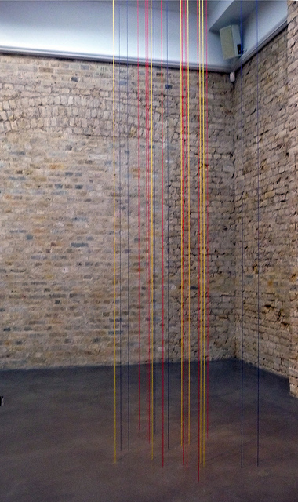

This had been a crazy week! Juggling work (internship) at Phaidon Press and attending several job interviews (including one for an arts organisation which I am particularly excited about), I thought it´s time have some respite from this intense week. I did the best I could and have explained why I am the best person for the job and it´s really all up to the heavens now. Longing for something zen to bring back balance in my life, I visited **[Fred Sandback](http://fredsandbackarchive.org/ "Fred Sandback")´s** retrospective at the **WhiteChapel** gallery. The artist, who died in 2003, is known internationally for his concept-based minimalist sculptures using the barest and simplest materials like acrylic yarn.

Unlike his contemporaries such as Carl Andre, **Sandback has been overlooked throughout the years** but this retrospective shows that Sandback was as great as all the other Minimalist artists of his time. Sandback had been fascinated with stringed instruments when he was young hence the interest with strings and wires as material for his geometrical pieces.

**His artworks are crafted to achieve volume without mass resulting in sculptures that are drawn directly from the air** – using the architecture of the room, ceiling, floor etc as geometrical points. ”The first sculpture I made with a piece of string and a little wire was the outline of a rectangular solid . . . lying on the floor. It was a casual act, but it seemed to open up a lot of possibilities for me,” Fred Sandback wrote in 1986.

")

I was particularly drawn to **Untitled (Sculptural Study Seven-Part Triangular Construction)**. The biggest piece in the retrospective, Untitled draws seven triangular spaces from black yarn whose bases are pinned to the floor with points reaching up to the ceiling. I took several turns to observe the space that it occupied, each step as contemplative and meditative as I discovered prisms criss-crossing in pedestrian space, a term which he himself has coined to explain how his work is much a part of the environment that envelops it. For me, Fred Sandback is truly great artist because his pieces allow the viewer to contemplate and imagine form while going thru an actual experience of interacting with the work much like Richard Serra.

**The fascinating thing of course is his use of an economical household material like yarn to achieve this Zen-like stillness in his work**. Modest in his use of materials but like a river that runs very deep, his artworks particularly resonate a spirit of mysticism that alters our traditional perceptions. He said, “the inherent mysticism resides in persisting in wanting to make something as factual as possible and having it turn out just the other way… the realisation that the simplest and most comfortable of perceptions are shadows’.

I ended my exhibit visit by going to the corner of the room, colorful yarns are attached from the ceiling to the floor inviting the viewer again to observe it from different points, each colour more apparent as you move around it. **For someone like me who has been zigzagging thru both the humdrum of and pandemonium of existence, I have found myself inexplicably relieved after a day of art meditation of Sandback works**.

<iframe allowfullscreen="" class="youtube-player" frameborder="0" height="505" src="//www.youtube.com/embed/rkc2AwX0AJg?wmode=transparent&fs=1&hl=en&modestbranding=1&iv_load_policy=3&showsearch=0&rel=0&theme=dark" title="YouTube video player" type="text/html" width="640"></iframe>

<figcaption>Seven Part Triangular Construction at Art Basel</figcaption>

Related Links:

- [Fred Sandback at the Whitechapel London by Artwrit](http://www.artwrit.com/article/fred-sandback-at-whitechapel-london/ "Artwrit")
- [Fred Sandback at the Whitechapel by Blueprint Magazine](http://www.blueprintmagazine.co.uk/index.php/everything-else/fred-sandback-at-whitechapel-gallery/ "Blueprint Magazine")
