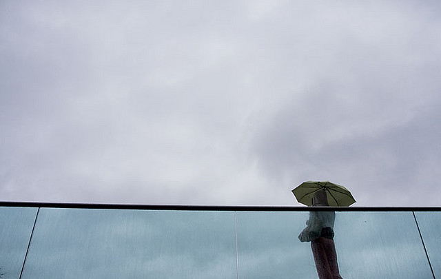
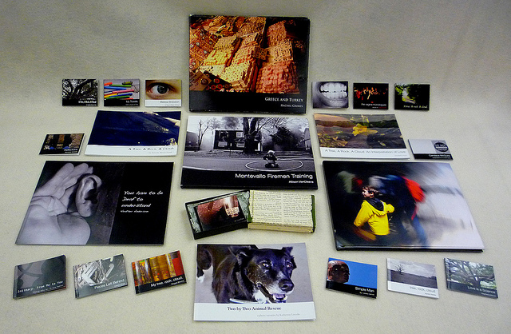
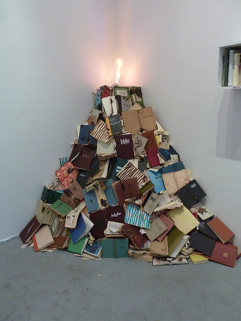

**In London, summer is a bit of oxymoron** because for the past few weeks, it had been raining every single day. But whether it rains or the sun shines in the UK, I am just amazed how the weather could be such a mundane ice-breaker in conversations  whether it be on the lift or the bus stop. But beyond the topic of weather, small talk just falls  short.

People are just in a hurry to really speak with one another. As soon as the doors of the lift open, it´s too late to catch the slightest spark if there ever was any to begin with. I miss the sunny disposition of the people in the Philippines where elevator conversations become the start of real friendship. **In the UK, the weather is just what it is. Always cloudy with occasional rain.**

On another front but still on the subject of  weather and oxymorons – There is a brewing storm in publishing industry posed by the digital age. The once untouchable industry is still standing, but flailing to maintain ground. Publishers are still stubbornly resisting the digital threat and what could certainly become a deluge to their business.

**The Storm Signs:**

1. Profits in traditional media are way too low. Publishing houses are slashing jobs left and right
2. Amazon´s Kindle and Apple´s Ipad are drastically changing the face of publishing and the way we consume literature.
3. Amazon is selling more e-books than traditional print
4. More and more people are buying Ipad and kindle because they are handy and hip
5. People do not read the way they used to.  The internet has wired our brains to browse.

Although I still like to hold a real book in my hands and to flip the pages with my fingers, I know digital books cannot be ignored. I still don´t have those two gadgets but I know one day I´d have no choice but to give in to the digital temptation. But not all books can be easily digitalised.  It is much easier to translate a book with text in the digital form but art books is a different matter.

**The Art Book Challenge:**

1. Significantly picture-based, art books have loads of images that just makes the file very large. If you switch the pictures to low-res, you lose a lot of quality.
2. Kindle, for example, is not yet programmed to handle image browsing. It is still in the black and white stage and it´s just way too small to view photos.
3. Ipad maybe more handy in image browsing
4. With more and more digital books produced, the cost of production of traditional art books would double or triple.

But not everything is bad news. **Large-format books are still collector´s items and can never be replaced by digitalised versions**. Art books in general are targeted to a niche upscale market who still prefer to have traditionally printed materials. Professionals who use art books as reference materials still love leafing thru real pages of a book and still love to display big coffeetable books in their homes.

So traditional art books are never going to be a thing of the past. They are still worthwhile to own especially if you have money to shell out because it´s the closest thing you can have to acquiring a real work of art. However, publishers need to use digital strategies to promote their product online and invest more money on digital marketing than traditional media. Forget courting traditional journalists and show more love to art and design bloggers. **Stop being snooty and go as grassroots as you can.** Moreover, collector´s editions need to be more exciting to entice people to open their pockets. Maybe tie it up with a product give-away. Create online games and give sneak peak previews either in video format or apps. In other words, swear allegiance to your digital enemy and no one´s going to rain on your parade.

<iframe allowfullscreen="" class="youtube-player" frameborder="0" height="505" src="//www.youtube.com/embed/cGtmHm5N_Qc?wmode=transparent&fs=1&hl=en&modestbranding=1&iv_load_policy=3&showsearch=0&rel=0&theme=dark&feature=related" title="YouTube video player" type="text/html" width="640"></iframe>

<figcaption>The Future of Publishing: New York Rountable Discussion</figcaption>

<iframe allowfullscreen="" class="youtube-player" frameborder="0" height="505" src="//www.youtube.com/embed/ErE0zjzEQs0?wmode=transparent&fs=1&hl=en&modestbranding=1&iv_load_policy=3&showsearch=0&rel=0&theme=dark&feature=related" title="YouTube video player" type="text/html" width="640"></iframe>

<figcaption>Harlequin Exec says Ebooks will not replace P-books</figcaption>
