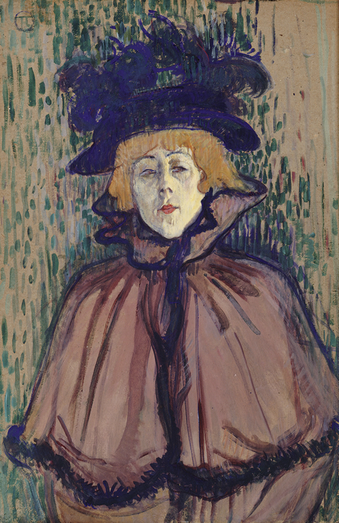

Despite being in the dumps for not being hired by the [Art Fund](http://artfund.org "Art Fund") (I think they made a mistake! lol), **I was very excited to see [Courtauld Gallery](http://www.courtauld.ac.uk/index.html "Courtauld Art Gallery")´s new exhibition on [Toulouse Lautrec](http://www.toulouse-lautrec-foundation.org/ "Toulouse Lautrec Foundation") and the dancer Jave Avril which highlights the creative partnership between the two**. Toulouse Lautrec really needs no introduction. He was an enfant terrible in the art world and was an emblematic figure of bohemian Paris in the fin de siecle whose artworks and posters have defined the crossover between and art and advertising of today. What was really surprising in this exhibit was not just Toulouse Lautrec´s genius, but its equal treatment and homage to both Lautrec and his model Avril as if saying one could not have existed without the other.

The critic **[Arsene Alexandre](http://www.amazon.com/s?ie=UTF8&rh=n%3A283155%2Cp_27%3AArs%C3%A8ne%20Alexandre&field-author=Ars%C3%A8ne%20Alexandre&page=1 "Arsene Alexandre")** really summed up the relationship of Lautrec and Avril which went beyond the normal artist and muse paradigm. **“Painter and model, together have created a true art of our time, one through movement and one through representation.”** Toulouse hailed from one of the oldest noble families while Avril was a daughter of a courtesan, so there was a big gap in economic stature. But their symbiotic relationship was not a product of their genealogy but of their unfortunate disabilities.

<iframe allowfullscreen="" class="youtube-player" frameborder="0" height="505" src="//www.youtube.com/embed/L23V5Rm6kX8?wmode=transparent&fs=1&hl=en&modestbranding=1&iv_load_policy=3&showsearch=0&rel=0&theme=dark" title="YouTube video player" type="text/html" width="640"></iframe>

<figcaption>Introduction to the Exhibit: Toulouse Lautrec and Jane Avril</figcaption>

Lautrec was born short due to a genetic disorder while Jane Avril entered the Salpêtrière hospital to be treated for a nervous disorder called St Vitus Dance which rendered her in jerky and frenzied movements. **Their abnormalities have served useful in Montmarte, specifically the Moulin Rouge which embraced a world of eccentricities and freakiness.** Toulouse created paintings and posters that depicted a decadent age where dancers, clowns and prostitutes were the protagonists. He was the master of ceremonies and Montmarte was the center of his universe. The stick-thin Avril, in contrast, has discovered her talent in dance and became a fixture in the groups of both the bohemian and the elite.

")

<iframe allowfullscreen="" class="youtube-player" frameborder="0" height="505" src="//www.youtube.com/embed/XECFeTjqWDg?wmode=transparent&fs=1&hl=en&modestbranding=1&iv_load_policy=3&showsearch=0&rel=0&theme=dark" title="YouTube video player" type="text/html" width="640"></iframe>

<figcaption>Dr Nancy Ireson, Exhibition Curator on the painting At the Moulin Rouge where Lautrec and Avril were shown together for the first time</figcaption>

**They struck a partnership and also a friendship until Toulouse´s death**. A photograph of Toulouse below shows him wearing Avril´s boa and hat and there were numerous accounts of Avril coming to the house of Toulouse for dinner before modeling. Toulouse not only portrayed Avril in his advertising posters but also depicted her in paintings. Surprisingly, the exuberant posters he creatd of Avril highly contrasted to the private paintings where he depicted Avril as a sad and melancholic persona.

**Were they both living dual lives?** Toulouse´s public exuberant persona was very different to the man who has been privately battling alcoholism. In Avril´s case, though only 24 years of age, Toulouse has rendered her long sad face much older, painting her with a gaze of both defeat and frustration, as if contemplating that even the eccentric-embracing Can Can attitude of Montmarte has no place for broken souls like hers. Toulouse on the otherhand, has been gorged by this world of absinthe and outsiders, dying at age 36 by alcoholism and syphilis. Avril later on succumbed to obscurity until her death at age 77.

**With sketches, lithographs and memorabilia, this exhibit brings light to the uncanny relationship of the artist and his muse and the decadent age that consumed them.**

 held by the Courrier français at the Elysée-Montmartre, BJ March BIJC, 1892. Photograph. Dimensions and location unknown")

Some of Toulouse Lautrec´s posters of Jane Avril:

. Jane Avril, 1899. Colour lithograph, 56 x 38 cm. National Gallery of Art, Washington, Rosenwald Collection, 1953.6.137")

. Jane Avril at the Jardin de Paris, 1893. Colour lithograph, 125 x 90 cm. Museum of Modern Art (MoMA), New York")

Related Links:

- [Toulouse-Lautrec and Jane Avril, Courtauld Gallery, London, review by the Telegraph](http://www.telegraph.co.uk/culture/art/art-reviews/8587338/Toulouse-Lautrec-and-Jane-Avril-Courtauld-Gallery-London-review.html "Toulouse Lautrec Telegraph")
- [Jane Avril in the Entrance of the Moulin Rouge, Toulouse-Lautrec (1892) by Jonathan Jones](Jane%20Avril%20in%20the%20Entrance%20of%20the%20Moulin%20Rouge,%20Toulouse-Lautrec%20%281892%29 "Jane Avril by Jonathan Jones")
- [Toulouse-Lautrec and Jane Avril: Beyond the Moulin Rouge, Courtauld Gallery – review by Brian Sewell](http://www.thisislondon.co.uk/arts/review-23969855-toulouse--lautrec-and-jane-avril-beyond-the-moulin-rouge-courtauld-gallery---review.do "Brian Sewell review")

PS. Many thanks to Ms Juliette Crane of [Sue Bond Public Relations](http://www.suebond.co.uk "Sue Bond Public Relations") for providing the images for this post.
