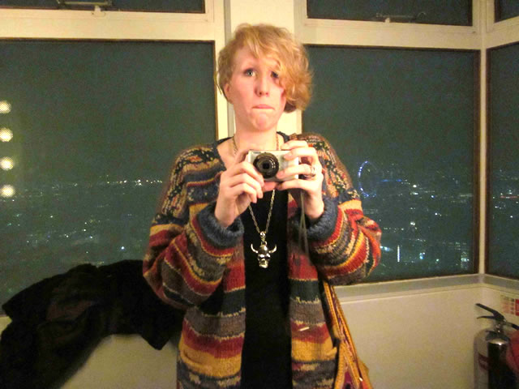
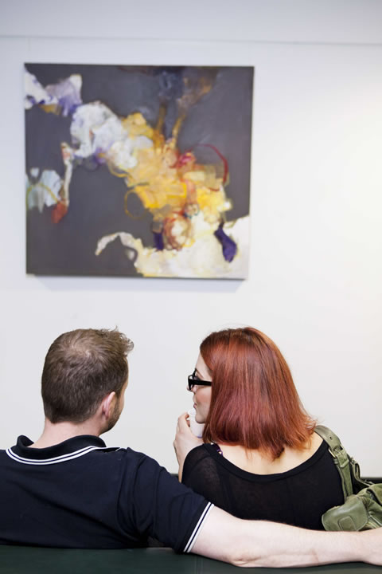
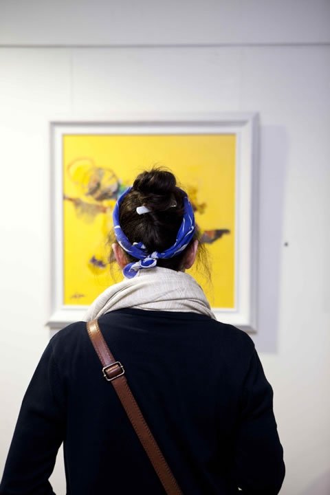
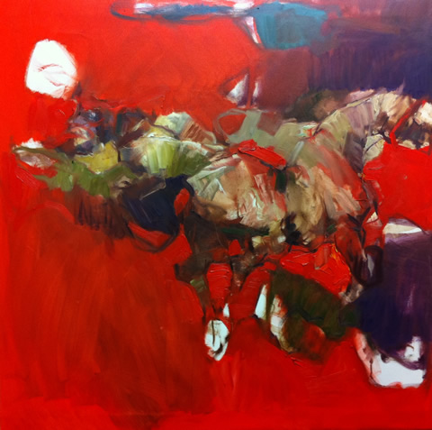
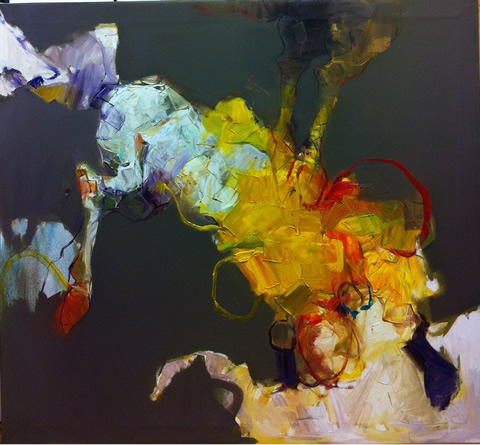

I have a long-standing date to meet Mel and visit her gallery, **[Freespace](http://freespaceatthewigg.wordpress.com/ "Freespace Gallery")**, in the Kentish Town Health Centre in North London. Freespace gallery aims to promote under-represented artists and advocate art as a vehicle for social change. I normally feature artists and current exhibits, but I am also interested to meet people who work in the art industry especially **curators who are just as passionate about art as the artists themselves**. Mel has emailed me a month ago to let me know about her gallery work and the exhibit she curated featuring refugee and Iraqui artist **Emad Altaay** who has made London his new home.

Emad has exihibited extensively in the Middle East has been known for his realistic figurative paintings of Iraqi culture but his move to **London has created not only a change in physical address but a 180 degree shift in his art.** Inspired by what he saw in Camden and exploring his changing identity, Emad is now working on bold colours and abstraction in his paintings far from the dark characters he used to portray in his old artworks. He uses this new cultural perspective to create a heightened vitality and sense of movement in his latest paintings. Mel explains her love affair with art and the creative process behind this exhibit.

**1. Please tell us a little bit about yourself. When did your interest in art begin and what triggered it?**

I cannot really trace down what may have triggered my interest in the arts. All I can say is that I am a visual person, that I analyse the world in a visual way and am always inspired by art, a visual language, that makes me think further about the world in which we live.

**2. How did you end up becoming a curator of Free Space Gallery?**

The Free Space Gallery is based within the Kentish Town Health Centre a modern building  which has been highly praised for its architecture. Built on the principle that light and colour can engender feelings of well being the building acts like a temple to health. It was envisaged as both a physical and social health centre, art being a core to this mission.

I began working at the health centre in another role and quickly became interested in the art programme which included an artist in residence, a permanent commission, art workshops and the gallery itself. At this time the arts programme had no name so I named it Free Space Gallery because of my interest in art as a form of free expression as well as the fact that the space is infact free for artists to exhibit in and free for people to visit.

**3. Please tell us more about Free Space Gallery. Why is it different from the other galleries out there? Since it is based in the Kentish Town Health Centre, is it safe to say that you promote art therapy or is it therapy in art?**

Free Space Gallery does not demand that any particularly therapeutic art be displayed, we seek to deliver a diverse range of art to the users of the centre and to the visitors to the gallery. However I believe that art in its must basic form and in any context provides a feeling of well being and provides a therapy both to the artist and the viewer.

**4. What is the role of art in society? Given the riot incidents that happened in London, do you think that art (in context of funding and community arts centre programs) should play a bigger role in educating the youth today?**

Art is a way of making yourself heard, presenting an idea in the form of a visual art or other art form such as music or film I believe is hugely important. Having worked in youth art programmes in south London I became very aware how those taking part in the art activities developed a way of communicating, they felt safe to present themselves through art when they were unable to explain their insecurities or ideas through discussion.

Language was developed by humans to communicate, art is another form of language and can sometimes show nuanced ideas which spoken language cannot. I believe therefore art programmes in education and youth work should be supported and we should appreciate how important art can be.

**5.What type of art/artists do you show there?**

We do not specifically chose types of artists, we support current art practice but show a range of styles.

 chatting with a guest")

**6. Tell us about the exhibit of Emad Altaay. What genre of art does he do?**

Emad Altaay is an artist who creates beautiful abstract works. His art is based on his use of colour, he is inspired by the colour he sees in London, having moved here less than a year ago. He talks of how his paintings are based on dreams of dancing horses and these horses are seen in his work. He loves their power and strength as well as their delicate movements.

**7. What was the idea behind this exhibit and what was it about Emad that attracted you to create this exhibit at Free Space Gallery.**

Emad’s story as well as his art work attracted me to exhibiting his work. Emad arrived in London less than a year ago as a refugee from Iraq. In Iraq and across the middle east he was an established artist his style however was very different. He was known for producing realistic depictions of middle eastern life with a traditional painting style. When he arrived in the UK he adopted a new style, his paintings became increasingly colourful and increasingly abstract. He was influenced by his new and frenetic life in the city.

At the Free Space Gallery we are interested in showing work which has a story or can prompt discussion on social justice issues and I felt that Emad’s work had this potential.

**8.What is the process of putting a show like this?**

My favorite part of putting a how together is getting to know the artist, spending time with them and really feeling as though you are getting to know their way of working.

**9. Who is your favourite artist? Do you practise art in private? If yes, what type of art do you do?**

I could not say that I have a favorite artist, I think as a human we want to feel understood and accepted, so depending on how I am feeling I like artists who produce work which makes me feel as though someone else may be having similar thoughts. One artist who I have been working alongside recently and who I think is wonderful is David Harker. He produces complex landscape drawings with thousands of small pencil dots. I can get absorbed in his work for hours.

I write in my spare time rather than produce other art forms, I guess I spend my time recording art rather than producing it.

**[Free Space Gallery](http://freespaceatthewigg.wordpress.com/ "Freespace Gallery")**

2 Bartholomew Road
Kentish Town
London NW5 2BX United Kingdom
www.freespaceatthewigg.wordpress.com
T. 07950695699
