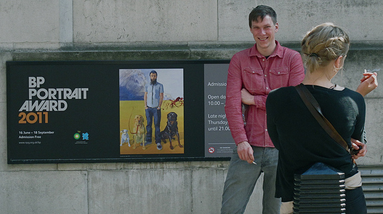
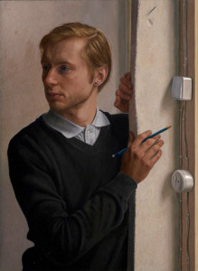
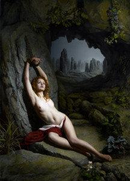
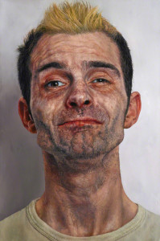

**With Lucien Freud’s death, whoever attempts to become the next best figurative painter of the 21st century has got some huge shoes to fill**. Not to say there aren’t any good figurative portrait painters around today, but only a handful has something unique to say, especially in an art form where the same things have been said all over and over again.

**So here goes the [BP Portrait Awards](http://www.npg.org.uk/index.php?id=6757 "BP Portrait Award") which believes in figurative painting´s place in society and have supported young portrait artists for over 30 years**

This year´s portrait awards at the [National Portrait Gallery](http://www.npg.org.uk/ "National portrait gallery"), however, was far from free from intrigues. **Critic Brian Sewell said it had been “melancholy duty” reviewing it and believed the awards should be “garroted.”** As for me, I scrambled to get myself to the door because there’s only two weeks left before this exhibition closes. I was excited to see that the whole place was jam-packed with both Londoners and tourists. Not to mention that I came on a Monday so in a sense, it was a successful venture to bring portrait back to our consciousness.

<iframe allowfullscreen="" class="youtube-player" frameborder="0" height="505" src="//www.youtube.com/embed/5O5VdcOgBAE?wmode=transparent&fs=1&hl=en&modestbranding=1&iv_load_policy=3&showsearch=0&rel=0&theme=dark" title="YouTube video player" type="text/html" width="640"></iframe>

<figcaption>BP Portrait Award: Next Generation Taster Sessions</figcaption>

**Distracted by Wim Heldens**: A self-taught Dutch painter, the 57 year old Heldens won the 25,000 prize and an art commission for Distracted, his painting of the 25 year old philosopher named Jeroen, whom he already have painted 17 times since the latter was four years old. Heldens is a father-figure in Jeroen’s life and this intimate relationship translates in the artwork.

The painting is a simple portrayal of Jeroen holding a brush while leaning on a white wall. **The intensity of the painting comes from its pure simplicity – evoking a quiet and at the same time solemn quality which perhaps we have only seen in the figurative portraits of the old masters.** In fact, nostalgia is probably the reason why this piece won. I can imagine this intimate portrayal of Jeroen being placed side by side with a 19th century portrait painting. Such is the power of this simple portrait because it reminisces a time in the past where art was direct and easy to understand. Did it break any new barriers in figurative painting? Perhaps not, but I can never get Jeroen out of my mind.

<iframe allowfullscreen="" class="youtube-player" frameborder="0" height="505" src="//www.youtube.com/embed/B9qTYPfx7JU?wmode=transparent&fs=1&hl=en&modestbranding=1&iv_load_policy=3&showsearch=0&rel=0&theme=dark" title="YouTube video player" type="text/html" width="640"></iframe>

<figcaption>Wim Heldens win the BP Portrait Award</figcaption>

**Holly by [Louis Smith:](http://www.louissmithportraits.co.uk/ "Louis Smith")** This was painted by Smith who studied scenic painting at the Royal Academy of Dramatic Art. The piece is a modern version of the Allegory of Prometheus this time, in female form. Provocative and reminiscent of Baroque style, the painting depicts  Holly, the female Prometheus, naked, chained and bound to a rock.

**This is Jonathan Jones’ favourite among all the finalists for its eclectic visual resonance with 19th century academic art, kitsch and even soft-porn**. I, too, was rather perplexed with the message. In one way it looked as if it came out of the cover of a Mills and Boons book but no one can ignore the artist’s skills, and the homage he brings to Baroque style which we no longer see in the art world.

**Just to Feel Normal by [Ian Cumberland:](http://www.iancumberland.com/paintings.php "Ian Cumberland")** This is probably my favourite piece in the whole show. The portrait is arresting for the hyper-realistic details Cumberland made on the subject’s face including the details on skin texture  and colour. But what really stands out is the **model’s face expression which seem to go from a smirk and a half-smile and communicates a much deeper complexity and melancholy on this person’s life**.

With slightly closed eyelids and a tuft of blond hair, Cumberland’s success is depicting a half-comic, half-tragic character who seems to know that being “normal” ain’t going to happen. **Ian Cumberland studied Fine Arts in the University of Ulster and had been interested in people and the “absurd things they do.”** I really see a bright future for this artist and I can’t wait what he’s about to do next.

**Check out this video below of the winners of the Young Portrait Award and the BP Travel Award:**

<iframe allowfullscreen="" class="youtube-player" frameborder="0" height="505" src="//www.youtube.com/embed/HWL6ag5Wmq0?wmode=transparent&fs=1&hl=en&modestbranding=1&iv_load_policy=3&showsearch=0&rel=0&theme=dark" title="YouTube video player" type="text/html" width="640"></iframe>

<figcaption>Interview with [Sertan Saltan](http://sertansaltan.com/ "Sertan Saltan"), who won the Young Artist Award</figcaption>

<iframe allowfullscreen="" class="youtube-player" frameborder="0" height="505" src="//www.youtube.com/embed/8Ni4Ve7YAHQ?wmode=transparent&fs=1&hl=en&modestbranding=1&iv_load_policy=3&showsearch=0&rel=0&theme=dark" title="YouTube video player" type="text/html" width="640"></iframe>

<figcaption>BP Portrait Travel Award</figcaption>

PS. All photos are limited to 300×300 pixels complying with National Portrait Gallery rules on image use. Thank you to Neil Evans, Senior Press Officer of the NPR for providing these images.

Related links:

- [The shock of the old by Jonathan Jones – The Guardian](http://www.guardian.co.uk/commentisfree/2011/apr/14/bp-portrait-award-louis-smith-holly "Jonathan Jones : SHock of the Old")
- [BP Portrait Award 2011, National Portrait Gallery by Brian Sewell](http://www.thisislondon.co.uk/arts/review-23975527-bp-portrait-award-2011-national-portrait-gallery---review.do "Brian Sewell")
- [Dutch artist takes BP Portrait Prize by the Guardian](http://www.guardian.co.uk/artanddesign/2011/jun/14/dutch-artist-takes-bp-portrait-prize "The Guardian")
