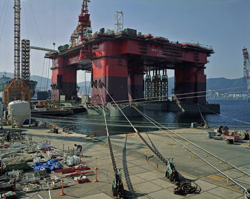
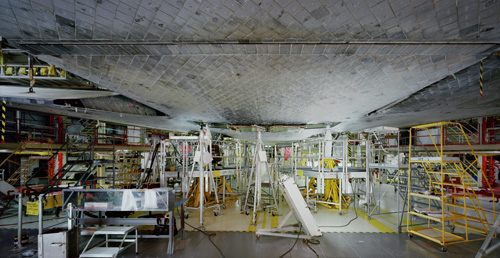
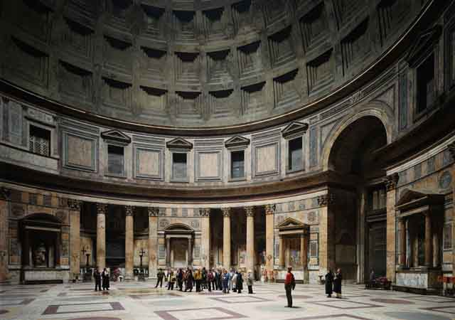
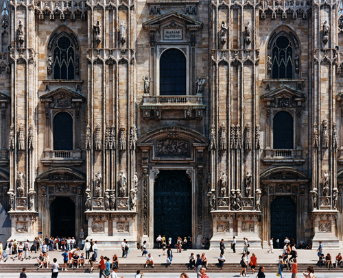

Unlike other photographers, it sometimes takes **[Thomas Struth](http://thomasstruth25.com/ "thomas struth")** a few days to capture an image on camera. **The celebrated German photographer’s long and arduous creative process demonstrate the emphasis he puts in the art of seeing** and his meticulous love for details.

Visiting his first UK survey at the [Whitechapel gallery](http://www.whitechapelgallery.org/ "whitechapel"), I was overwhelmed by the range and diversity of subjects and the way they were arranged as if the pieces themselves were engaged in a visual  conversation. **From jungles, skyscrapers, family portraits and his much celebrated museum photographs and technical pieces, it is evident that Thomas Struth continues to search for the sublime in the mundane** – things that  we don’t normally give a damn just because we see them everyday.

But despite tackling themes that are at the other ends of the spectrum, like nature in his paradise series and technology in Kennedy Space Centre, **there is an energy of consistency in all his works. Subject matters all take centre stage**, even if they were just oil rigs and space shuttles, basking in grandeur and appearing monumental as large-scale works.

<iframe allowfullscreen="" class="youtube-player" frameborder="0" height="505" src="//www.youtube.com/embed/wx5DJCVQbFI?wmode=transparent&fs=1&hl=en&modestbranding=1&iv_load_policy=3&showsearch=0&rel=0&theme=dark" title="YouTube video player" type="text/html" width="640"></iframe>

<figcaption>Achim Borchardt Hume introduces the exhibition Thomas Struth: Photographs 1978-2010, showing at the Whitechapel Gallery until 16 September 2011</figcaption>

They aren’t things we don’t necessarily find beautiful in sight. In my case, I am not normally drawn to technological pieces but looking at them was a visual meditation for me. Have I ever looked at machines and space centres this way before? Every iron, every wire and colour and **the erratic cluttered commotion in technological environments all become beautiful in Thomas Struth’s photographs and in fact reminded me of  abstract expressionist paintings.**

<iframe allowfullscreen="" class="youtube-player" frameborder="0" height="505" src="//www.youtube.com/embed/pm-cdtsseE8?wmode=transparent&fs=1&hl=en&modestbranding=1&iv_load_policy=3&showsearch=0&rel=0&theme=dark" title="YouTube video player" type="text/html" width="640"></iframe>

<figcaption>Thomas Struth interview in Cologne</figcaption>

It might not be a coincidence that Thomas Struth started out in painting in the 70’s and trained under [Gerard Richter](http://www.gerhard-richter.com/ "Gerard Richter") therefore **much of his photographs communicate a sensibility to fine arts such as the museum photograph of the Pantheon in Rome**. But he  became fascinated with photography as a medium of expression and went on to study under Bernd and Hill Beche in Germany. Over time, he became known as one of the best fine arts photographer of the late 2oth century until today. 

**Addressing different themes in his work, as he himself explained, was not about reinventing himself but was really brought about by his own personal evolution**. “New things fascinate me,” he once said. His family portraits are unique as they show the underlying social dynamics of a particular culture. One family portrait  captures Chinese culture’s regard for the elderly people while another portrait of a Japanese family shows man’s place in society and the secondary role a woman has in Japanese society.

The most amazing thing I discovered was his use of old-fashioned plate cameras in his work. **Panning the use of digital cameras except for test shots, Thomas Struth obviously regards the old as a major part of his  process of creating new works**. He explains that a digital camera can never capture the nuances and the details than an old-plate camera can do. He orchestrates to capture an image with this very colossal camera and bare the true essence behind his subjects.

In some way, Thomas Struth embraces all of life and everything that envelops it. **If we contemplate hard enough, we cannot live without our cityscapes, our technology, our jungles and our families.** Thomas gives us a chance to see it from his perspective. In one of his self-portraits, we see a back of a man contemplating before a painting. So that’s what he is. A man who contemplates, a man who looks and looks until he sees beauty and the sublime.

With over 70 photographs in this UK survey, the Thomas Struth exhibit at the Whitechapel is simply a knockout.

<iframe allowfullscreen="" class="youtube-player" frameborder="0" height="505" src="//www.youtube.com/embed/0XLVvwUSojY?wmode=transparent&fs=1&hl=en&modestbranding=1&iv_load_policy=3&showsearch=0&rel=0&theme=dark&NR=1" title="YouTube video player" type="text/html" width="640"></iframe>

<figcaption>Thomas Struth (in German)</figcaption>

PS. Many thanks to **Emily Doran** and **Inbal Mizhari** of the Whitechapel Gallery for providing these images.

Related links:

- [Thomas Struth: Photographs 1978-2010, Whitechapel Gallery, review by Alastair Sooke](http://www.telegraph.co.uk/culture/art/art-reviews/8629783/Thomas-Struth-Photographs-1978-2010-Whitechapel-Gallery-review.html "Alastair Sooke")
- [Thomas Struth: Life through an epic lens by Laura McLean-Ferris for the Independent](http://www.independent.co.uk/arts-entertainment/art/features/thomas-struth-life-through-an-epic-lens-2311573.html "The Independent")
- [‘Thomas Struth: Photographs 1978-2010? at the Whitechapel Gallery by Vignette](http://www.vignettemagazine.com/exhibitions-events/thomas-struth-photographs-1978-2010-at-the-whitechapel-gallery/ "Vignette")
- [Thomas Struth: photos so complex ‘you could look at them forever by Sean o’ Hagan for the Guardian](http://www.guardian.co.uk/artanddesign/2011/jul/03/thomas-struth-interview-photography-whitechapel "The Guardian")
