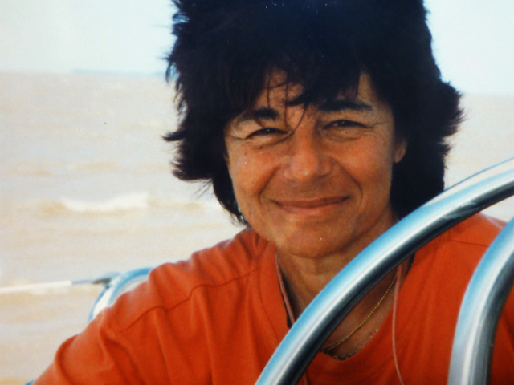
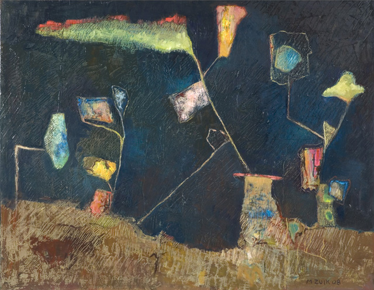
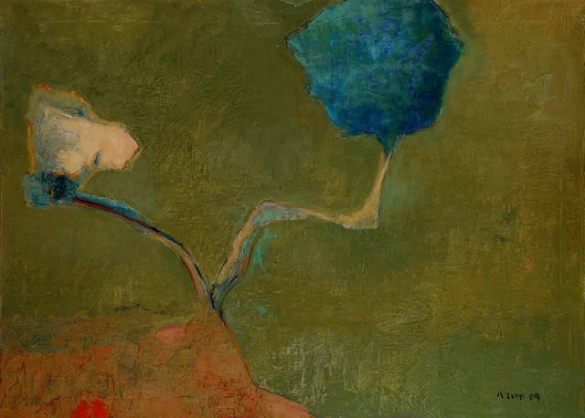
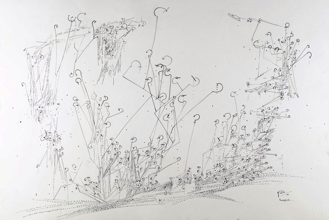
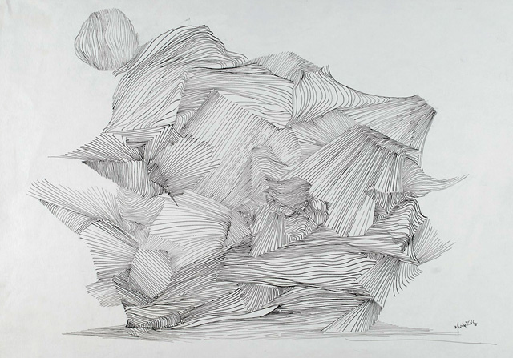
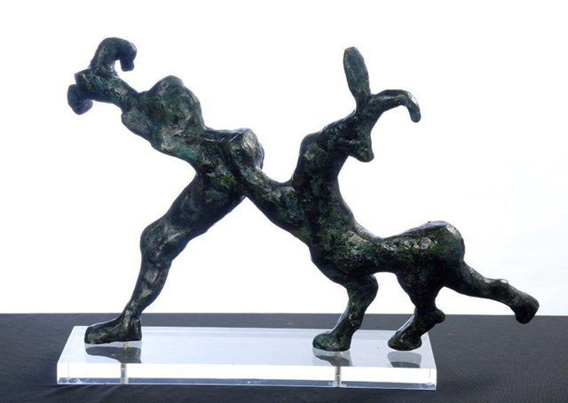
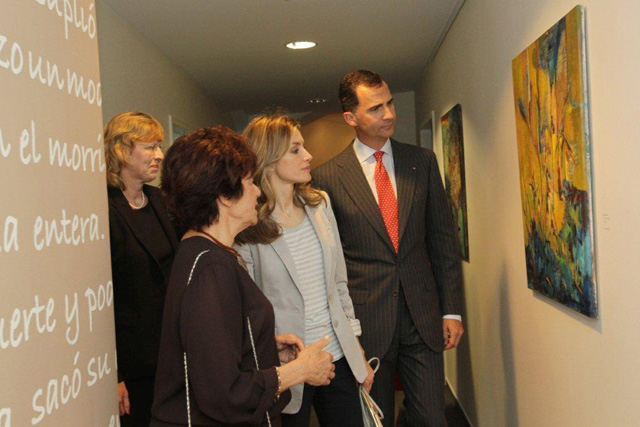

I have been using [Linkedin](http://linkedin.com "Linkedin") lately as a tool to network with artists and  people who work in the creative sector. One of the artists I’ve had the opportunity to connect with is Argentinian  artist **[Martha Zuik](http://marthazuik.com.ar "Martha Zuik")**, who recently had a back to back show in **[Centro Cultural Borges](http://www.ccborges.org.ar/ "Centro Cultural de Borges") in Buenos Aires** and also at the **[Instituto Cervantes](http://hamburgo.cervantes.es/de/default.shtm "Instituto Cervantes") in Hamburg**, Germany where **Prince Felipe and Princess Leticia of Spain** came to grace the show.

Martha’s paintings have been shown in different parts of the world since 1958 and at the beginning of her career was able **to exhibit in Paris along side Picasso, Magritte and other masters.**

For years, Martha has accumulated a strong body of work in different media such as paintings, line drawings, and sculpture. She explores the use of bright colours in relation to the surrounding environment and the considers space as a medium of communication between objects. The interview was done in Spanish and what you see below is the translated version.

**1. How did your love affair with art begin? Were you already conscious about your love for art at a very early age?**

It happened during one travel I made with my parents to Patagonia, to the South of Argentina when I was eight years old. It was a long-haul travel because during that time, the train ride lasted 2 days and 2 nights to arrive to Patagonia. The train suddenly stopped in the middle of the night – It was August and it was really cold. All the passengers went down the carriage very annoyed and very anxious. It was a dark night, it was cold and we were in the middle of nowhere. And then in the middle of this uneasiness, a young man took out his harmonica and started playing it. It was magical because the music changed our mood. From this moment on, I had an idea and desire to have something that was easy to bring with and one which will amuse me and others but I didn’t know what that could be.

Soon I discovered paper and pencil and never stopped using them. Then came paint and other techniques. But I was never conscious about what art is. Mine was just a huge passion for life that shows through in what I do.  In this world in which all the rules are mine, I do not care if that fits in what do.

**2. Looking back, after exhibiting in Argentina, your next exhibition went international- in Paris. what was the experience like to exhibit side by side with world-renowned painters like Picasso and Magritte?**

During that time, I was still studying in secondary school so I couldn’t travel but only sent my work to Paris. The exhibit was in a gallery called Le Soleil dans la Tete and the work I sent were drawings using Chinese ink. In this exhibit, the members of the group Fantasmagie saw my work and invited me to become part of their group.

For 20 years until the dissolution of the group I was able to exhibit together with the great masters like Picasso, Magritte and others but I never had the notion of how important that was. My point of focus and all my energy were always with my work – in the process of creating and never in what will occur after the artwork leaves the studio.

**3. How would you define your art? your visual language?**

As a search for the relationship between things, such as objects, figures, forms, rhythms in which the colour in paintings has the supreme importance. Space is also considered form and is part of these relationships which provide spaces in which to manifest and form.

**4. How is your creative process? Do you work on one particular work at the same time or different projects at the same time.**

The emotion that opening a bottle of Champagne brings is similar to what I feel when I come into my studio. This does not mean that there is a feeling of fascination before I begin or I have a friendly dialogue with the painting or in what I’m doing. On the contrary, it really begins with a relentless struggle between what I draw and the image appears. I fight tooth and nail for many hours to bring up something that attracts me. Maybe what I did the next day may or may not interest me. In any case, it may cover much of the painting and I leave some traces to keep this process of fighting.

I work in several projects at the same time, not simultaneously. That’s what appeals to me get to work methodically every day from 8 to 10 hours and more. And this is what it was all about ever since the beginning. Inspiration is what I receive when I work and I do not think that thought negates creation. What motivates me? I think I could describe it as: the pleasure of creating.

**5. What advise can you give to aspiring artists?**

To observe and study Nature because it is the greatest teacher to all the greatest artists who ever lived. They put a lot of passion and perseverance in what they do. This will provide a lot of inner strength and satisfaction.

**6. Will you ever invite me for coffee or in one of your future exhibits? =)**

I would be delighted if you could come to my next exhibit where we will drink….champagne!

Check Martha Zuik’s paintings on her website [www.marthazuik.com.ar](http://marthazuik.com.ar "Martha Zuik")

<iframe id="iframe_player" src="https://vdmplayer.shooowit.net/embed/ff18c6bbea/73aec2c7-6ee7-c1e5-ed57-73fd017d759f" width="616" height="347" frameborder="0" scrolling="no" allowfullscreen></iframe>

<figcaption>Interview with Martha Zuik on her exhibit at the Instituto Cervantes in Germany (in Spanish)</figcaption>
