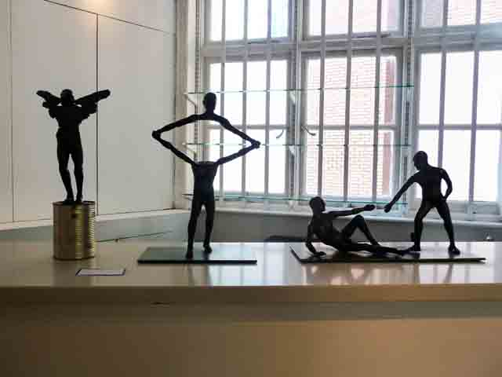

[Artrustee](http://www.artrustee.com/ "Artrustee"), an art consultancy company based in **Tel Aviv**, has invited me to review an exhibit of Israeli Art at the [Gallery Soho](http://www.thegallerysoho.com/ "The Gallery Soho") last week. **With more than 17 of the most prominent artists from Tel Aviv, the four-day exhibit confirms how exciting Tel Aviv’s contemporary art scene is fast becoming**. In Freedom of Expression: True Colours, the artists explore themes of identity, territory and sexual liberation with a particular focus on gay and lesbian issues.

Some of the artists that participated in the exhibit were: **[Raphael “Rafi” Perez](http://www.ionone.com/pntperez.htm), Dan Reisner,Ronit Yanizki, Ammon David Ar, Sichi Gilad, Uri Gershuni, Maya Kapelushnik,[ Howard Fox](http://www.howardfox.com/ "Howard Fox")** and so much more. Please read the article [here](http://www.artrustee.com/freedom-of-expression-true-colours?view=article&article=202 "Freedom of Expression") and tell me what you think =)

