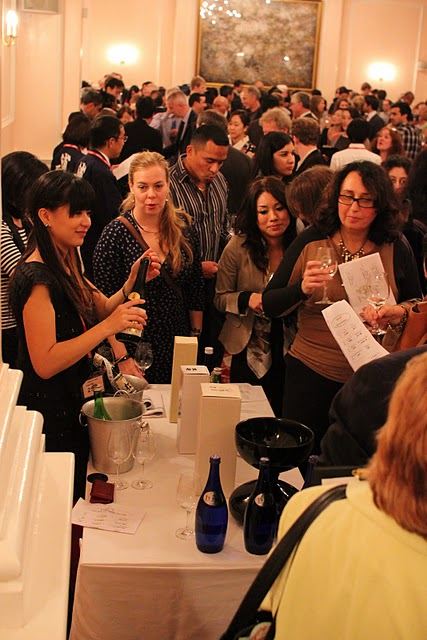
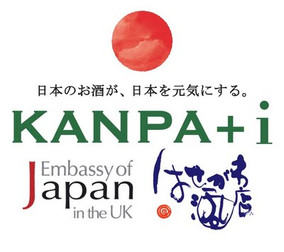
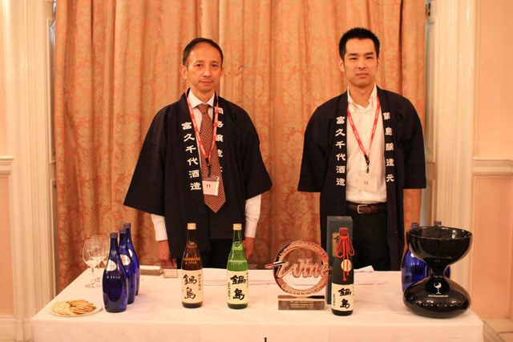

My friend Cristina, Pach, and I had a chance to attend a [sake-tasting event at the Japanese embassy](http://www.japansociety.org.uk/14016/iwc-award-winning-sake-tasting-at-the-japanese-embassy/) last Thursday and had fun drinking 14 of the award-winning sake (from the [International Wine Challenge](http://www.internationalwinechallenge.com/)). Despite our sake-newbieness, our favourite turned out to be the [IWC Trophy Champion for 2011](http://www.internationalwinechallenge.com/wine/150513/2011/Nabeshima-Daiginjo.aspx "IWC Sake Winner") **(Nabeshima Daiginjo, 2010).** The judges of the International Wine Challenge describe it as **“Soft with a sweet, fruity aroma. On the palate the flavours are dry, earthy and nutty with hints of fresh stone fruits. The finish is long with warming alcohol and lift.”**

**Our palate needed some re-education on everything about sake**. I’ve always thought sake should be served warm but we learned a special tidbit from a Japanese girl who told us that warm sake is a sign of low quality. 

For a more professional sake advise, our blogger friend slash sake sommellier **[Natsuki Pimienta Kikuya](http://natsukipim.com "Natsukipim")** wrote a more in-depth post at her blog. She is organising a sake charity event to support the Japan earthquake victims on **Sept 20 at the Japanese embassy**. **RSVP to kanpailondon@gmail.com**.

Beyond the sushi and the sake wooziness, I stumbled upon a brochure from the **Daiwa Foundation announcing its Foundation Art Prize which is open to all British artists who previously haven’t had any solo exhibition in Japan.** The winning artist will receive a participation fee of 5000 pounds, travel and accommodation costs for a 7 day period in Japan plus assistance with introductions with key individuals in Japanese contemporary art. Open to all artists working in any medium. For more information check the Daiwa Foundation [website](http://www.dajf.org.uk/grants-awards-prizes/daiwa-foundation-art-prize "Daiwa Foundation website").

Related Links:

- [Saga’s Nabeshima chosen as champion sake at London wine competition](http://http://mdn.mainichi.jp/mdnnews/national/news/20110908p2g00m0dm033000c.html "Nabeshima")
- [Saga tipple named champion sake at London blind wine-tasting event](http://search.japantimes.co.jp/cgi-bin/nb20110909a3.html "Nabeshima wins")
- [Supermarkets Reign Supreme in the IWC’s World of Wine](http://www.hospitalityandcateringnews.com/2011/09/supermarkets-reign-supreme-in-the-iwcs-world-of-wine/ "Supermarkets reign supreme")
- [Nabeshima wins](http://search.japantimes.co.jp/cgi-bin/nb20110909a3.html "Nabeshima wins")
