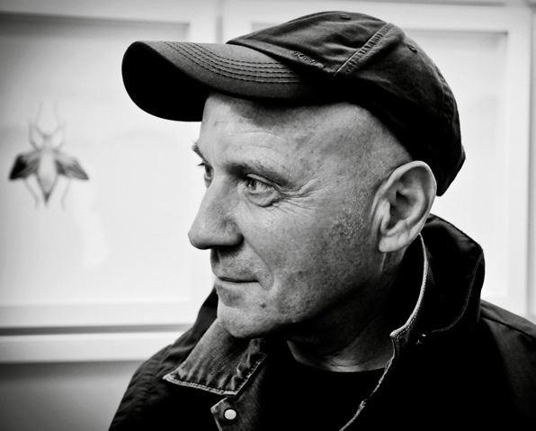
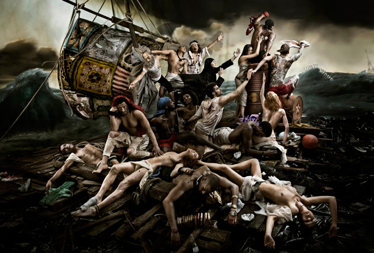
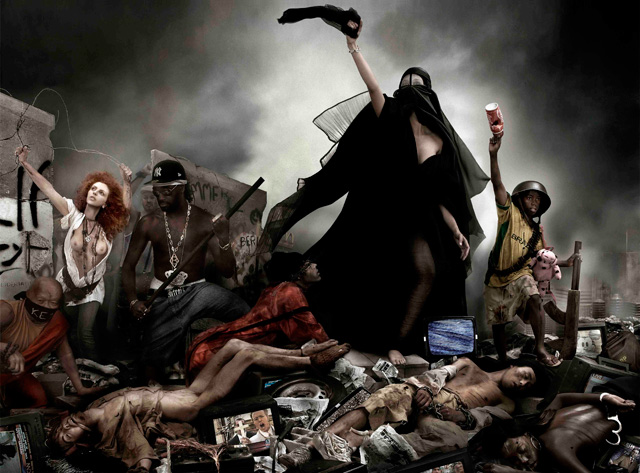
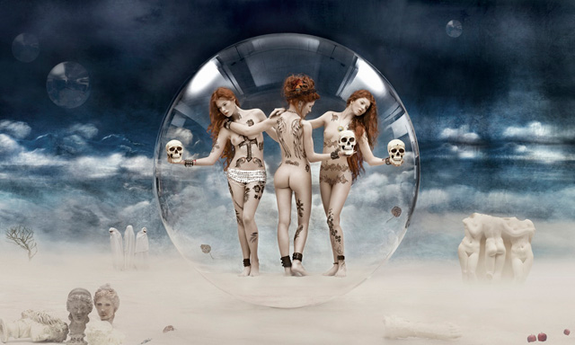
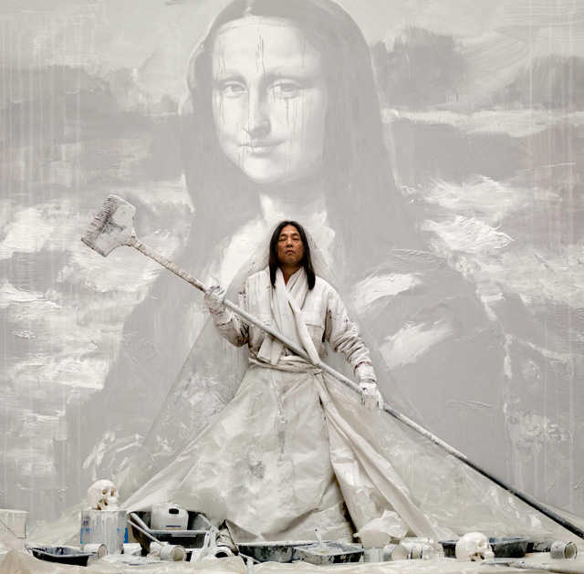

I was lucky to be the first person to arrive for the press preview of ‘Rancinan in London’ at the [Opera Gallery](http://www.operagallery.com/ "Opera Gallery") last week, because other than being the art blogger who has beaten ‘real’ journalists for being on time (I arrived 12 noon sharp!), **I also had the opportunity to meet [Gérard Rancinan](http://www.rancinan.com/2010/ART-RANCINAN/__HOME_4___RANCINAN.html "Rancinan") himself who was still in the middle of overseeing the arrangement of his large-scale photographs** with Jean-David Malat, Director of Opera Gallery and journalist [Caroline Gaudriault](http://www.gaudriault.com/ "Caroline Gaudriault").

Clad in denim jeans and jacket, the great  Rancinan had no airs. **He was simple, unassuming, accommodating and was kind enough to give this blogger time and say “you can ask me anything.”** This man, who has earned four World Press Awards and was on his first stop world photography tour has just told me that. I knew this was not about being a darling of the press but I  like him.

If Rancinan looked like a simple fellow you can actually have coffee with, his photographs are the opposite. **His Metamorphoses series are opulent, visually arresting, monumentally flawless and poetically disturbing social commentaries about contemporary life.** It’s really hard to pin down his genre of photography because it’s as complex as the subjects he tries to cover – globalisation, poverty, freedom and human rights – just **humanity’s most ancient interrogations which still remain unanswered today.**

Rancinan continues to probe these questions and toys our imagination with his vivid and highly stylised photographs which **weave different genres from fine art photography, photojournalism, history painting, portraiture and event hints of fashion photography**, albeit the latter is only evident because Rancinan likes to parody fashion and consumerism in his works.

Inspired by the **[Raft of Medusa](http://en.wikipedia.org/wiki/The_Raft_of_the_Medusa "Raft of Medusa")**,  an icon of French Romanticism by **Théodore Géricault**, Rancinan’s version called the **Raft of Illusions** honours the latter’s dramatic depiction of 15 survivors in the aftermath of a wreck but this time, the models are the image of **refugees donning branded ripped clothes and bling-blings** sailing away to a submerged  Hollywood sign in a disintegrating makeshift vessel. 

Clearly, this is a testament to what we may call our **contemporary version of a shipwreck** – touching on the hopeless dreams of refugees to reach the West for a better life. But their idea of a better life is rooted on materialism, and for Rancinan, **this is the surest way to more bondage**. Rancinan told me that it took him at least three months preparation to make this photograph.

<iframe frameborder="0" height="480" src="http://player.vimeo.com/video/983936?title=0&byline=0&portrait=0" width="640"></iframe>

<figcaption>The Making of Raft of Illusions</figcaption>

**Decadence (or the Apotheosis of the Moderns), Metamorphosis XI** is another photo that speaks along the lines of Rancinan’s view on contemporary life. If you want to picture what Sodom and Gomorrah would look like before the fall, Decadence has fully captured the essence of what happens when man becomes a **“monstrous simulacrum of an egocentric, individualistic, virtual humanity” leading to spiritual abyss**. (Source, Rancinan brochure).

Rancinan didn’t have to explain anything about his works because all the photographs in the exhibit speak volumes of concern regarding how society is affected by globalisation and accelerated change. **Every picture tells of an uncertainty in what we have become and how our insatiable appetite to consume may lead to our downfall** such as in the case of **Big Supper** where overweight models subvert the image of the Last Supper, gorging on fries, burger, fried chicken and hotdogs.

<iframe allowfullscreen="" class="youtube-player" frameborder="0" height="505" src="//www.youtube.com/embed/SvoupFHYA90?wmode=transparent&fs=1&hl=en&modestbranding=1&iv_load_policy=3&showsearch=0&rel=0&theme=dark&feature=channel_video_title" title="YouTube video player" type="text/html" width="640"></iframe>

<figcaption>The Making of Decadence</figcaption>

**There are hints of how our lives have become meaningless and how we feel insignificant and just waiting for our end**, hence the need to gratify ourselves as much as we can. But for all the opulence depicted in Rancinan’s photographs, not everything seems hopeless.

The issues we face are serious but we can go thru life by having some sense of humour. **Wonderful World, Batman and even his not yet revealed photograph depicting look-alikes – James Dean, Andy Warhol, Marilyn Monroe and Elvis all lying dead in an automobile**, all suggest that maybe even if we know the truth about our own self-inflicted doom, we can still have a laugh.

With portraits, life-size photographs on the Metamorphoses series, Wonderful World, etc., **Rancinan in London** is one of [Opera Gallery](http://www.operagallery.com/ "Opera Gallery")‘s best exhibits this year. Open until October 2.

<object classid="clsid:d27cdb6e-ae6d-11cf-96b8-444553540000" codebase="http://download.macromedia.com/pub/shockwave/cabs/flash/swflash.cab#version=6,0,40,0" height="480" width="100%"><param name="quality" value="high"></param><param name="wmode" value="default"></param><param name="allowFullScreen" value="true"></param><param name="allowScriptAccess" value="always"></param><param name="flashvars" value="&config_settings_showUpdatedInFooter=true&embedPageUrl=http://news.bbc.co.uk/1/hi/world/europe/8392226.stm&fmtjDocURI=/1/hi/world/europe/8392226.stm&config_plugin_fmtjLiveStats_edition=Domestic&embedReferer=http://www.google.co.uk/search?q=gerard rancinan&oe=utf-8&rls=org.mozilla:en-US:official&client=firefox-a&um=1&hl=en&biw=1280&bih=646&ie=UTF-8&tbo=u&tbm=vid&source=og&sa=N&tab=iv&config=http://news.bbc.co.uk/player/emp/2_0_17/config/default.xml&config_plugin_fmtjLiveStats_pageType=eav1&playlist=http://news.bbc.co.uk/media/emp/8390000/8392200/8392226.xml&config_settings_showPopoutButton=false&domId=emp_8392226&config_settings_autoPlay=true&holdingImage=http://newsimg.bbc.co.uk/media/images/46845000/jpg/_46845716_jex_537211_de27-1.jpg&uxHighlightColour=0xff0000&config_settings_showShareButton=true&config_plugin_fmtjLiveStats_pageType=eav6&config_settings_autoPlay=false&config_settings_showFooter=true&config_settings_showPopoutButton=false&config_settings_showPopoutCta=false&config_settings_addReferrerToPlaylistRequest=true"></param><param name="src" value="http://www.bbc.co.uk/emp/external/player.swf"></param><param name="allowfullscreen" value="true"></param><param name="allowscriptaccess" value="always"></param><embed allowfullscreen="true" allowscriptaccess="always" flashvars="&config_settings_showUpdatedInFooter=true&embedPageUrl=http://news.bbc.co.uk/1/hi/world/europe/8392226.stm&fmtjDocURI=/1/hi/world/europe/8392226.stm&config_plugin_fmtjLiveStats_edition=Domestic&embedReferer=http://www.google.co.uk/search?q=gerard rancinan&oe=utf-8&rls=org.mozilla:en-US:official&client=firefox-a&um=1&hl=en&biw=1280&bih=646&ie=UTF-8&tbo=u&tbm=vid&source=og&sa=N&tab=iv&config=http://news.bbc.co.uk/player/emp/2_0_17/config/default.xml&config_plugin_fmtjLiveStats_pageType=eav1&playlist=http://news.bbc.co.uk/media/emp/8390000/8392200/8392226.xml&config_settings_showPopoutButton=false&domId=emp_8392226&config_settings_autoPlay=true&holdingImage=http://newsimg.bbc.co.uk/media/images/46845000/jpg/_46845716_jex_537211_de27-1.jpg&uxHighlightColour=0xff0000&config_settings_showShareButton=true&config_plugin_fmtjLiveStats_pageType=eav6&config_settings_autoPlay=false&config_settings_showFooter=true&config_settings_showPopoutButton=false&config_settings_showPopoutCta=false&config_settings_addReferrerToPlaylistRequest=true" height="480" quality="high" src="http://www.bbc.co.uk/emp/external/player.swf" type="application/x-shockwave-flash" width="100%" wmode="default"></embed></object>

<figcaption>Gérard Rancinan talks about his works with BBC</figcaption>

Related Links:

- [Rancinan in London by Matilda Battersby for the Independent](http://www.independent.co.uk/arts-entertainment/art/features/rancinan-in-london-2355870.html "Matilda Battersby on Rancinan")
- [London: Rancinan at the Opera Gallery by Butterfly Art News](http://butterflyartnews.com/2011/09/23/london-rancinan-at-opera-gallery/ "Butterfly art news on Rancinan")
