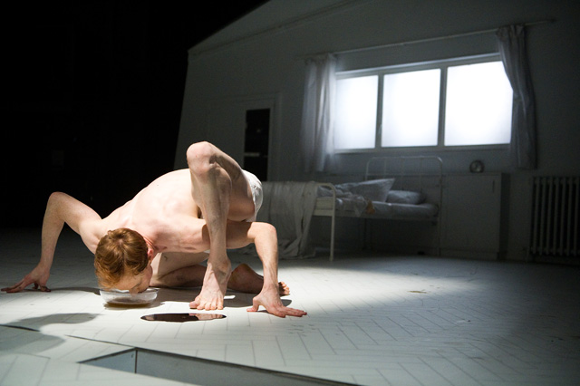
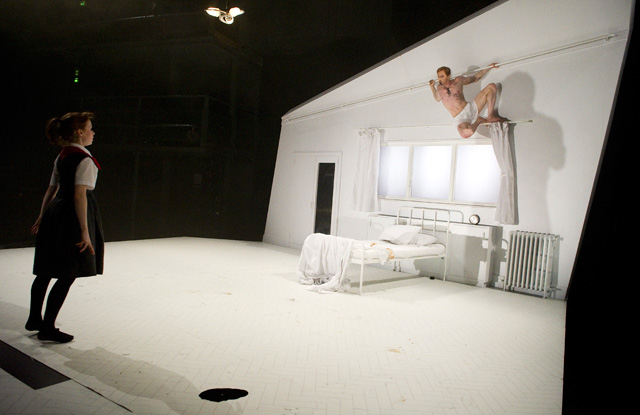
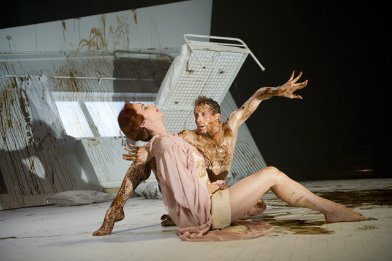

So violent and disturbing the body contortions were when George Samsa finally mutates into a man-like insect in the new  play **Metamorphosis at the [Royal Opera House](http://www.roh.org.uk "Royal opera house")**, that my eyes popped out and my jaw dropped to the floor seeing **Franz Kafka’s literary work interpreted with a new stage of physicality that will shake your existential sensations to the core**. 

I really had no idea know how they would pull this off without using wild insect-costumes and props but **[Edward Watson](http://www.roh.org.uk/discover/artistdetail.aspx?id=346 "Edward watson"), Royal Ballet’s principal dancer, only uses his body and his extreme level of flexibility to breathe life into the role of Georg Samsa**. He contorts and folds his body into shapes that simulate insect movement: pulling and coiling his limbs, his hands become crabbed claws, his toes moving individually just like when a real insect does with its legs when it is turned over on its back.

<iframe allowfullscreen="" class="youtube-player" frameborder="0" height="505" src="//www.youtube.com/embed/a5jTwEiEz90?wmode=transparent&fs=1&hl=en&modestbranding=1&iv_load_policy=3&showsearch=0&rel=0&theme=dark" title="YouTube video player" type="text/html" width="640"></iframe>

<figcaption>Trailer of Metamorphosis produced by the Royal Opera House</figcaption>

And while doing this physically demanding movements and also being covered with icky, sticky, pungent dark goo for most of the show, Edward retains a haunting gaze that makes his portrayal of **Georg not just of a doomed giant insect but a persona of an anguished tortured soul.**

The set in itself is eerily white, a **world divided into two rooms, one Georg’s bedroom and the other the kitchen where Georg’s family pretends to have a normal and yet insignificant existence**. The father drinks his coffee and reads the newspaper in the morning, the mother exercises and Greta, Georg’s sister played by the talented Laura Day, escapes her own dreary world by practising her ballet.

When Georg finally becomes a man-insect, the family is caught in denial. Greta attempts to **help Georg untangle himself from the web of his misery, uncoiling his hands and feet** which flips and jumps back to a pathetic insect position. And in the following scene, what could have been a dance between Georg and Greta, only becomes a harrowing confrontation ending in desperation.

The nightmare scene is ingenious. The walls and the bedroom reclines as if you are in a German expressionist movie and the surreal music adds to the denouement. **Three dark giant insects enter the scene to confront Georg, spurting him with this dark, goeey liquid which not only stains his body but his entire being**. At that point, Georg has fully embraced his metamorphosis and would have rather desired to be an insect rather than a man whose existence before was an insignificant mechanical clockwork of nothingness.

I’ve read the book twice, one when I was in the University and a few years ago and I could never imagine it being re-interpreted this way. I was very lucky to be in the first row to see everything on an eye-level and though it was just the rehearsal which I saw, **Arthur Pita’s new production is truly a ride in Kafka-esque land**. My heart is still pounding as we speak.

Related Links:

- [The Metamorphosis, review by Judith Mackrell for the Guardian](http://www.guardian.co.uk/stage/2011/sep/22/the-metamorphosis-dance-review?newsfeed=true "Judith Mackrell Metamorphosis")
- [The Metamorphosis, Linbury Studio, London Jewels, Royal Opera House, London by Jenny Gilbert for the Independent](http://www.independent.co.uk/arts-entertainment/theatre-dance/reviews/the-metamorphosis-linbury-studio-londonbrjewels-royal-opera-house-london-2360369.html "Jenny Gilbert, metamorphosis")
- [The Metamorphosis by Neil Norman for The Stage](http://www.thestage.co.uk/reviews/review.php/33626/the-metamorphosis "Neil Norman for the Stage")
- [The Metamorphosis, Linbury Studio Theatre, Royal Opera House by Ismene Brown for the Arts Desk](http://www.theartsdesk.com/dance/metamorphosis-linbury-studio-theatre-royal-opera-house "Ismene Brown for Metamorphosis")
- [The Metamorphosis, Royal Opera House, London by Zoe Anderson for the Independent](http://www.independent.co.uk/arts-entertainment/theatre-dance/reviews/the-metamorphosis-royal-opera-house-london-2359420.html "Zoe Anderson")
- [Edward Watson on Kafka, contemporary dance and David Attenborough – Royal Opera House](http://www.roh.org.uk/news/edward-watson-on-kafka-contemporary-dance-and-david-attenborough "Edward watson - royal opera house")
