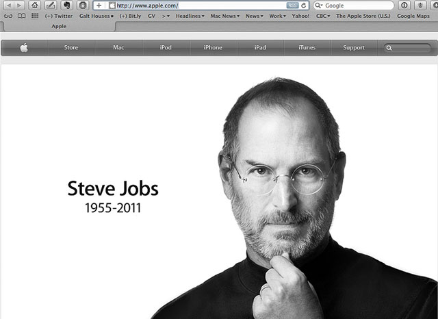
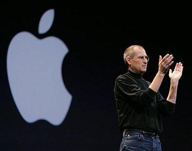

**This blog would not have existed in the first place if it weren’t for the many creative individuals that continue to inspire me until today**. And one of these people was no other than **Steve Jobs** – the visionary of Apple who died yesterday at the age of 56, (such a short time here on earth!) but whose legacy will live on for generations. He was a personal hero of my father (an advertising executive in the Philippines), who once told me that he wouldn’t mind working for Steve serving him coffee.

I am a fan of Apple products – I literally wake up looking at my Ipod and use it watching videos before I sleep so it has become a huge part of my life. These gadgets have revolutionized our lives in the 21st century but more than that, I love the idea that Apple was headed by a **cult figure like Steve Jobs**. I honestly think that there is no giant corporation here on Earth headed by a leader as inspiring as Steve. It was what he stood for. **He was a college dropout – an underdog with a relentless passion to create things that will change the world**.

But even if we have no desire to change the world, even if we only want to “contribute a verse”, in whatever job we have whether in art or in menial things, **Steve encouraged us to seek our passion and never settle**. I think artists and creative people have so much to learn from Steve’s philosophy.

It wasn’t just a marketing strategy when he said “Think different”, as part of the slogan of his Apple commercials. Yeah, this man wanted to sell a lot of products and probably wanted to beat his best rival Bill Gates but his mission was other-wordly. **He was encouraging us to find our creative voice and in way he wanted us to make our short sojourn here on earth worth the ride**. So to you, Steve Jobs, thank you for inspiring us not to be mediocre. Thank you for being a big part of our creative spirit.

**Great Quotes from Steve Jobs:**

“**You have to trust in something — your gut, destiny, life, karma**, whatever. This approach has never let me down, and it has made all the difference in my life.” (Steve Jobs, 2005)

“Your time is limited, so don’t waste it living someone else’s life. Don’t be trapped by dogma — which is living with the results of other people’s thinking. **Don’t let the noise of others’ opinions drown out your own inner voice**. And most important, have the courage to follow your heart and intuition. They somehow already know what you truly want to become. Everything else is secondary.” (Steve Jobs, 2005)

<iframe allowfullscreen="" class="youtube-player" frameborder="0" height="505" src="//www.youtube.com/embed/UF8uR6Z6KLc?wmode=transparent&fs=1&hl=en&modestbranding=1&iv_load_policy=3&showsearch=0&rel=0&theme=dark" title="YouTube video player" type="text/html" width="640"></iframe>

<figcaption>Commencement speech of Steve Jobs in Stanford in 2005</figcaption>

<iframe width="560" height="315" src="https://www.youtube.com/embed/cFEarBzelBs" frameborder="0" allow="accelerometer; autoplay; encrypted-media; gyroscope; picture-in-picture" allowfullscreen></iframe>

<figcaption>Think Different from Apple</figcaption>

Related Links:

- [Steve Jobs Legacy: Think Different from Adam Ludwig for Forbes  ](http://www.forbes.com/sites/techonomy/2011/10/06/steve-jobss-legacythink-different/ "Forbes: Steve Jobs") [How Steve Jobs made the world beautiful from Jonathan Jones for the Guardian](http://www.guardian.co.uk/technology/2011/oct/06/steve-jobs-world-more-beautiful "Jonathan Jones: Steve Jobs")
- [Steve Jobs saw digital future, world followed CBSNews](http://www.cbsnews.com/stories/2011/10/06/national/main20116647.shtml "CBS News: Steve Jobs")
- [Steve Jobs and the business of design by Jay Green for Cnet News](http://news.cnet.com/8301-13579_3-20116821-37/steve-jobs-and-the-business-of-design/ "Steve Jobs on Cnet news")
- [How Steve Jobs Touched My Life: Readers Speak from Information Week Tech elite share Jobs’ Tributes on Google+ Facebook for Computerworld](http://www.computerworld.com/s/article/9220610/Tech_elite_share_Jobs_tributes_on_Google_Facebook "Computerworld: Steve Jobs")
- [Remembering Steve Jobs across the web from Wired News](http://www.wired.com/gadgetlab/2011/10/remembering-steve-jobs-web/ "Wired News: Steve Jobs")
- [Q&A: U2 Manager Paul McGuinness Reflects on Steve Jobs’ Passing](http://www.billboard.biz/bbbiz/industry/legal-and-management/q-a-u2-manager-paul-mcguinness-reflects-1005395422.story "Paul Mcguinness on Steve Jobs")
- [U2’s Bono defend’s Apple’s Steve Jobs’ lack of philanthropy](http://www.irishcentral.com/news/U2s-Bono-defends-Apples-Steve-Jobs-lack-of-philanthropy-129402108.html "Bono and Steve Jobs")

