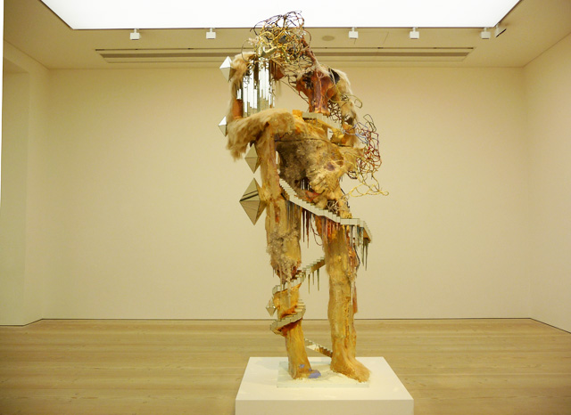
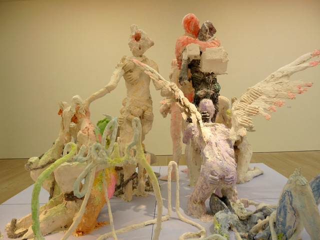
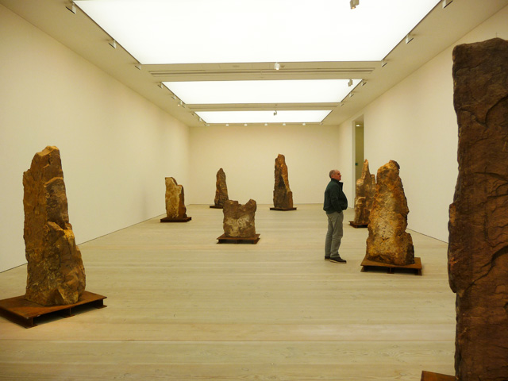
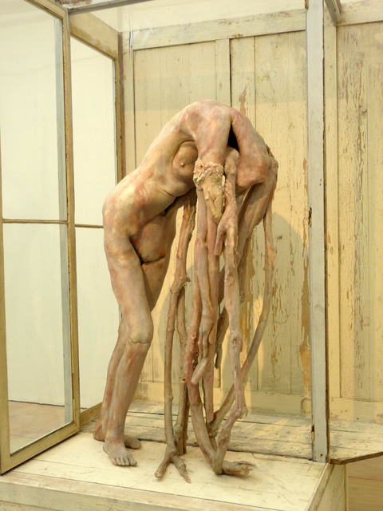
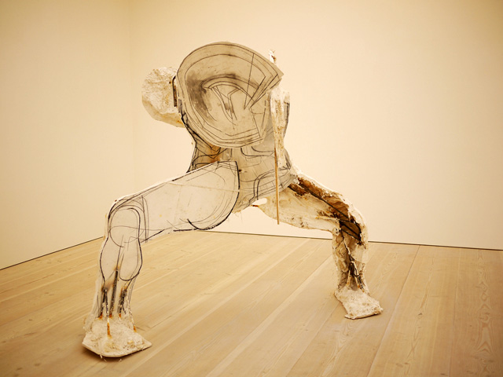
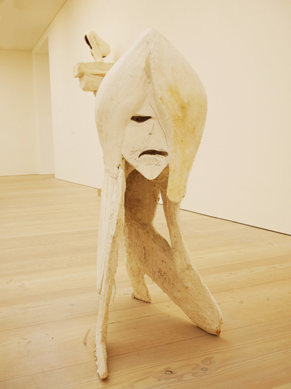
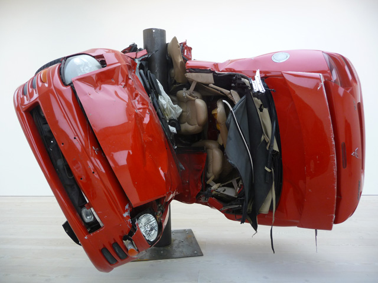

I can’t help feeling pessimistic seeing the exhibit Shape of Things to Come at the Saatchi Gallery. In some way, I’m glad that it would soon be over and that contemporary art would hopefully come back to being glorious. With warped cars, ghost-like wax figures, unfired clay female nudes and orgies of faceless sculptures, there’s nothing more depressing than having this exhibit tell me that contemporary sculpture has completely lost its faith in its own self and society.

But I have tenacious unbendable belief in the brighter side of things so I am always quick to circumvent these kinds of disastrous thoughts. **The only way for me to appreciate The Shape of Things to Come is to look for my favorite pieces** and not view the exhibit as one whole picture. So here are my favorites:

**[David Altmedj](http://www.guardian.co.uk/artanddesign/2008/oct/23/david-altmejd "David Altmedj: Guardian")‘s New North is an intriguing piece of four-metre high sculpture that combines landscape, architecture and sci-fi elements in constructing a human figure**. He used a mixture of materials – hair, resin, wood quartz and scraps – the way a master of assemblage does. In fact, with very unstable materials, I am surprised that the figure can maintain standing and it is a testament to David’s technical ability. “When I work, the body is like a universe where I can lose myself. It is a metaphor for the landscape, nature and the mountains,” Altmejd has said.

**The Healers** is an ensemble of anthropomorphic figures engaged in sexually charged state of orgy or religious rite – you don’t actually know if it’s one or the other or both. It is a scenery of debauchery and it’s both comic and painful to watch.

More prehistoric than contemporary, **[Kris Martin](http://www.whitecube.com/artists/k_martin/ "Kris Martin: White Cube")‘s Summit is  composed of eight megalith-like stones standing on iron plates with iconic figures on top of each structure**. It’s really two extreme poles apart when you come to think about the entire expanse of human civilisation and the journey it took us to get here. It’s suppose to be a commentary on the “futility of human ambition” and how the process of creating is much more important than reaching our goals or conquering our desires.

A fixture of the international contemporary art scene, **[Berlinde de Bruckyere](http://www.google.co.uk/url?sa=t&source=web&cd=3&ved=0CC0QFjAC&url=http%3A%2F%2Fjustinfitzpatrick.wordpress.com%2F2009%2F04%2F07%2Fberlinde-bruckyere-at-hauser-wirth%2F&rct=j&q=berlinde%20de%20bruckyere%20&ei=ePCRTpq2D8WGhQfe8JDnDw&usg=AFQjCNG4K_mViYeNZ_5pjjtii21dz7zqQA&cad=rja "Berlinde de Bruckyere: Hauser and Wirth") is known for reconfiguring the human body into its rawest form just like the sculpture Marthe**. By rendering this in wax, this cadaver-like sculpture suggests a half-human figure in a state of transformation. There is no visible head and the hands are forming into sinewy twig-like limbs. The flesh which is very translucent has a physicality that creates an atmosphere of carnal mortification.

<iframe allowfullscreen="" class="youtube-player" frameborder="0" height="505" src="//www.youtube.com/embed/Ve8m5Z8iKZg?wmode=transparent&fs=1&hl=en&modestbranding=1&iv_load_policy=3&showsearch=0&rel=0&theme=dark" title="YouTube video player" type="text/html" width="640"></iframe>

<figcaption>Video about Berlinde de Bruckyere’s past works</figcaption>

**Thomas Houseago’s Folded Man (in 4 models) and Joanne are not necessarily beautiful to look at especially if you have a fixed notion what sculpture is**. In fact, Thomas challenges the concept of sculpture. Joanne and Folded Man look like they are unfinished figures made in plaster and some even showing the artist’s sketches. Joanne, for example, is suppose to be a rabbit-like figure with its ears hanging from its side and it is created in a way that it doesn’t impose itself as a three-dimensional object.

In the ground floor, there are two life-size crashed cars. Made by **German artist Dirk Skreber**, it is an interesting take on the concept of industrialisation which he experienced as a child in Germany. These two cars are wrapped in iron poles givi**ng me a sense that this is more than just** showing off the artist’s technical expertise but the actual bending of physical laws.

So is The Shape of Things to Come a pessimistic review of contemporary sculpture or simply solid exhibit? **It really depends on your state of mind**. Featuring the best 20 sculptors around, the Shape of Things to come is both intriguing and controversial. Ends Oct 16.

<iframe allowfullscreen="" class="youtube-player" frameborder="0" height="505" src="//www.youtube.com/embed/nAp5_5rCirg?wmode=transparent&fs=1&hl=en&modestbranding=1&iv_load_policy=3&showsearch=0&rel=0&theme=dark" title="YouTube video player" type="text/html" width="640"></iframe>

<figcaption>Video by webartmagazine</figcaption>

Related Links:

- [The Shape of Things To Come: Saatchi Gallery, London](http://www.3quarksdaily.com/3quarksdaily/2011/07/the-shape-of-things-to-come-saatchi-gallery-london.html) by Sue Hubbard
- [Let’s get Physical by Jackie Wullschlager for the Financial Times](http://www.ft.com/cms/s/2/d452e012-87e5-11e0-a6de-00144feabdc0.html#axzz1NutrLvTC "Jackie Wullschlager for the Financial Times")
- [The shape of things to come: New Sculpture by Brian Sewell for the London Evening Standard](http://www.thisislondon.co.uk/arts/review-23955734-the-shape-of-things-to-come-new-sculpture.do "Brian Sewell: Shape of Things to Come")
- [Shape of Things to Come from Art Observed](http://artobserved.com/2011/08/go-see-london-shape-of-things-to-come-new-sculpture-at-saatchi-gallery-through/ "Art Observed: Shape of Things to Come")
- [The Shape of Things to Come from the Sunday Times](http://www.saatchi-gallery.co.uk/current/timesonline_sottc.jpg "Times Online: Saatchi")
