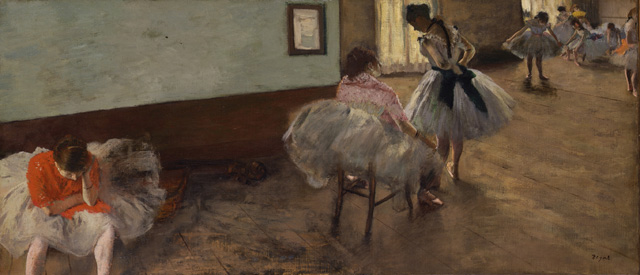
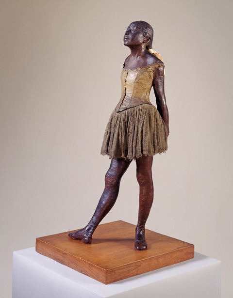
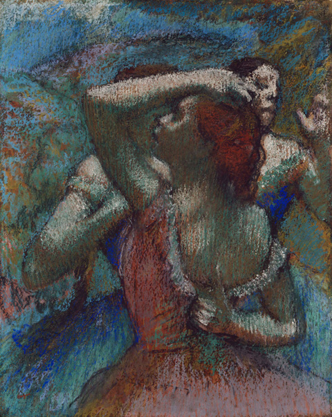
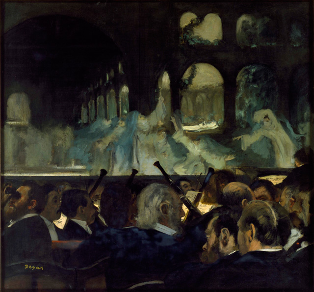

It is hard to imagine a world without Monet and his water lilies, and so much more without **Edgar Degas and his ballerinas**. Ever since I saw Degas’ works at the [Musee d’ Orsay](http://www.musee-orsay.fr/en/home.html "Musee d'Orsay"), I was introduced to a **fascinating behind-the-scenes world of ballet dancers**, which were more interesting than the actual spectacle.  

Clearly, **ballet was the domain of Edgar Degas**, who was known to be a fixture of the Paris Opera in the late 19th century in his attempt to capture movement and beauty. But in this exhibit at the [Royal Academy of Art](http://www.royalacademy.org.uk/exhibitions/degas/about-the-exhibition/ "Royal academy of art: Degas"), there was so much more about Degas that I didn’t know. I expected only to be bombarded by images of ballerinas, but **the exhibit also focused on his creative process and his experimentation with the technological advances** of his time.

<iframe allowfullscreen="" class="youtube-player" frameborder="0" height="505" src="//www.youtube.com/embed/sNHkujPaibY?wmode=transparent&fs=1&hl=en&modestbranding=1&iv_load_policy=3&showsearch=0&rel=0&theme=dark" title="YouTube video player" type="text/html" width="640"></iframe>

<figcaption>Ann Dumas of the Royal Academy</figcaption>

**The genius of Degas is of course his way of capturing special and unguarded moments.** Just look at the many images of ballet dancers slumped in a corner or when they are just in repose such as in the **Dance Lesson and the Dance rehearsal**. He captured this essence of spontaneity but **framed the scenes asymmetrically allowing us an experience of seeing it mid-scene**. The composition of his paintings made me wonder whether he was sketching or fiddling with an advanced camera with a fantastic element of depth of field to record these scenes before actually painting them.

")

**He was obsessed with human figure movement and choreography**. Degas, however, couldn’t find alliance with his Impressionists friends to share this new passion except for the photographers which eventually led him to photography. There were **three photographs he shot of three ballet dancers** which showed his interest in lighting effects. There was also a photo of a woman in a bathtub which was the inspiration for the famous bathtub painting.

The exhibit even went so far as including a clip **(Serpentine Dance) from the Lumiere brothers** and displaying items such as plate cameras which were a novelty during that time. **Ann Dumas**, curator of the Royal Academy of Art said these films were frequently shown in Montmarte and Degas would have certainly known about them.

<iframe allowfullscreen="" class="youtube-player" frameborder="0" height="505" src="//www.youtube.com/embed/kjIvOc6szZ8?wmode=transparent&fs=1&hl=en&modestbranding=1&iv_load_policy=3&showsearch=0&rel=0&theme=dark" title="YouTube video player" type="text/html" width="640"></iframe>

<figcaption>Serpentine Dance from the Lumiere brothers, 1899</figcaption>

**The fantastic array of sketches included in the show also demonstrated his dedication of studying movement**. With photography as his new ally, he pushed boundaries in his art and translated himself in a variety of medium – oil painting, pastels and sculpture.

, c. 1880-85. Charcoal with stumping on buff paper, 336 x 227 mm. Trinity House, London and New York")

The only sculpture he exhibited during his lifetime, the Little Dancer was a central piece of the show. The way people inspected the **Little Dancer** in the exhibit, **I forgot how much this sculpture had been criticized and called ugly and a monkey**. There were a whole lot more of figurative sculptures in the room, and I wonder if the criticism on Little Dancer led him to practice sculpture privately. The exhibit ends with a short clip of **Degas captured in film**, walking in Paris with a lady.

<iframe width="560" height="315" src="https://www.youtube.com/embed/KET94NlM7Ys" frameborder="0" allow="accelerometer; autoplay; encrypted-media; gyroscope; picture-in-picture" allowfullscreen></iframe>

<figcaption>Film clip of Edgar Degas</figcaption>

, 1885-90. Pastel on joined paper laid down on board, 580 x 490 mm. On loan from the Honorable Earle I. Mack Collection")

Related Links:

- [Degas and the Ballet Picturing Movement by Alastair Sooke for the Telegraph](http://www.telegraph.co.uk/culture/art/art-reviews/8758374/Degas-and-the-Ballet-Picturing-Movement-Royal-Academy-of-Arts-review.html "Degas by Alastair Sooke")
- [Degas and the Ballet in Pictures from the Guardian](http://www.guardian.co.uk/artanddesign/gallery/2011/sep/12/degas-ballet-movement-in-pictures "Degas and Ballet in pictures: Guardian")
- [Degas: More than Just a Ballet Master by Souren Milikian for the New York Times](http://www.nytimes.com/2011/09/24/arts/24iht-melikian24.html?_r=1&ref=royalacademyofarts "Degas from the New York Times")
- [Workers wearing Toehoes by Alastair Macaulay for the New York Times](http://www.nytimes.com/2011/09/04/arts/dance/degass-ballet-at-the-phillips-collection-and-royal-academy.html?ref=royalacademyofarts "Alastair Macaulay for the New York Times")
- [A Fine Balance: Degas and the art of ballet by James Davidson for the Guardian](http://www.guardian.co.uk/artanddesign/2011/sep/07/edgar-degas-ballet-royal-academy "Degas: James Davidson")
