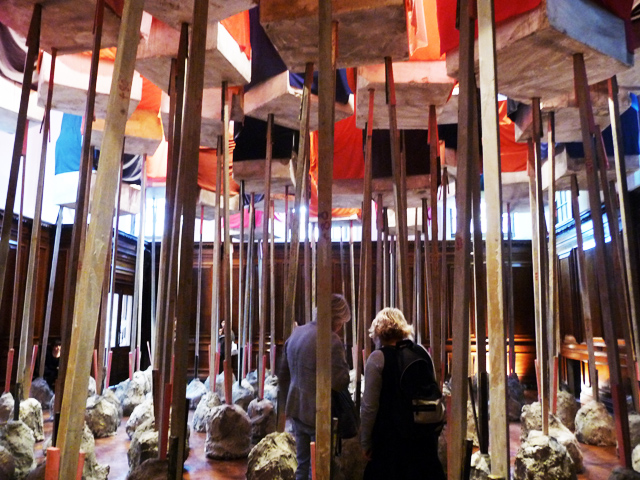
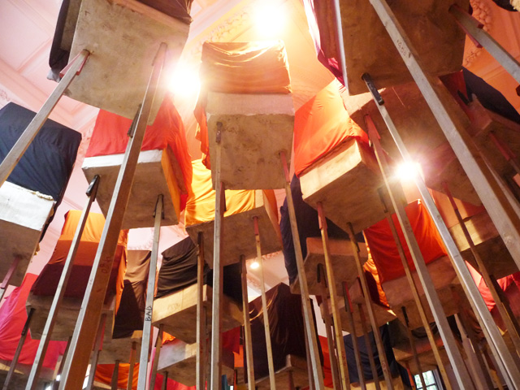
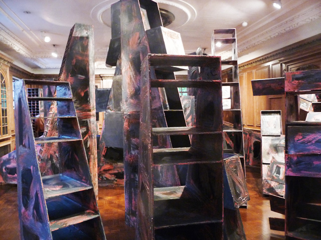
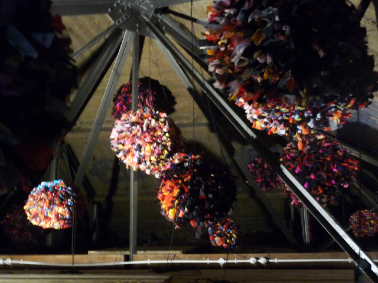
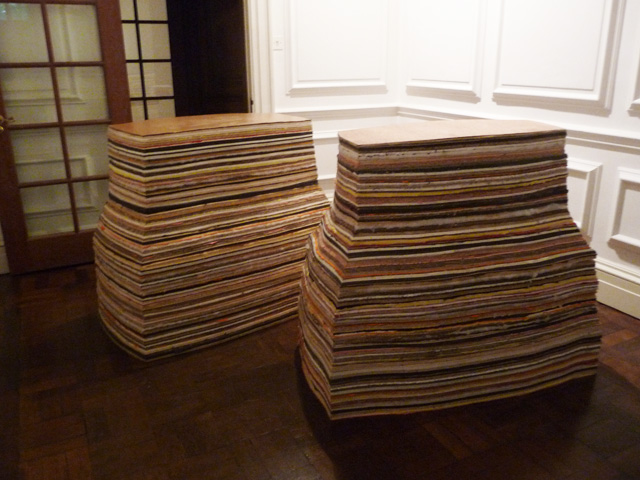

There’s something about artists that get discovered quite late in life – they are like wine, they get better with age – such as the late **Louise Bourgeois who became a critically-acclaimed artist at the age of 70** and went on to change the face of modern and contemporary art.

**Phyllida Barlow seems to be the next Bourgeois, in the same breadth of class and momentum**. According to this [article](http://www.thisislondon.co.uk/arts/review-23982887-phyllida-barlow-rig-hauser-and-wirth---review.do "Phyllida"), Phyllida was an art teacher to the likes of **Angela de la Cruz** and **Rachel Whiteread** and only started to receive some acclaim well into her retirement age. But seeing her show at the Hauser and Wirth, there’s no doubt we are just seeing the tip of the iceberg of Phyllida’s art.

**The Hauser and Wirth first floor is a jungle of towering blocks supported by long wooden stilts  resting on cement mounds**, scattered on almost the entire space of the room. They all look unstable. To move around it, you have to zigzag and navigate your way around these obstructions. Despite the concrete chaos, something pulls me back to the centre where I am  able to screen and scan these huge blocks threatening to topple over me. I wonder if the wooden support would snap and I’d be squashed flat to the ground.

And that’s the beauty of the installation. The viewer, the space and the sculptures have an ambiguous connection. **The viewer faces the challenge to confront these sculptures mentally and physically by navigating thru limited space**. With this seemingly urban chaos, it came as no surprise when I watched an old video about Phyllida explaining that the street is what normally inspires her.

**“The street is a resource for me of ambivalent objects that have ambiguous nature. They are neither one thing or another**. so bringing them into the gallery is bringing them into another location. It is almost an act of fakery. It is theatrical. It is making a drama out of something that probably is quite dramatic out there but is almost hidden,” Phyllida says in an interview with Isolde Charim in Youtube.

In some way, the installation also seems to be a **parody about our urban landscape** and everything that it implicates – the street where we grew up, this microcosm of cities and skyscrapers and how much we all are managing to survive and overcome this  jungle.

On the second floor balcony, I finally discover that the supposedly cement blocks are actually made of polysterene. Viewing them now from that angle, I realise that they no longer appear as threatening to the point of being banal when covered by colourful veils. Here, **Phyllida points out how much she explores the frontier of ambiguity and at the same time question the idea of monumentality.**

Calling herself the “anti-monumental” sculptor, there is really nothing monumental about her works because her sculptures and installations are all temporary. **She uses scrap materials to parody fake monuments which are then destroyed afterwards to create new sculptures**. Phyllida says what intrigues her the most is “this constant evolution of repair, destruction and rebuilding.”

The whole Hauser and Wirth gallery has become an accomplice to Phyllida’s goal of spinning obstructions to challenge the viewer to concoct his own path around the installations. In the upstairs room, **non-functional shelves entitled emptyunits (2011), of different sizes and shapes are jammed all together creating an imaginary maze** without any clear paths. I come to view this disorder and it overwhelms me. I don’t know where to start, to step, meander or wander. **Then as I stay longer, I begin to weave a plan of escape, only this time, I am beginning to like the view** and even start relating to the objects around me.

Finally, my journey ends as I climb a rigid metallic stairs to peep into the attic, where giant pompoms hang in the air. The entrance is small and nobody dares to enter. I heave a sigh of relief and say it’s worth just seeing it. **Then, I come home and regret not crawling and entering the attic**.

Related Links:

- [This time it’s permanent by Griselda Murray Brown for the Financial Times](http://cloud.hauserwirth.com/documents/R41QB40u0Jv0PrHoNOXpQhIi9MB67lkAY6Tv2d19d8y8TuiBjC/ft_0304092011_pb-903SdA.pdf "Financial Times: Phyllida Barlow")
- [Phyllida Barlow: Rig from This is London](http://www.thisislondon.co.uk/arts/review-23982887-phyllida-barlow-rig-hauser-and-wirth---review.do)

