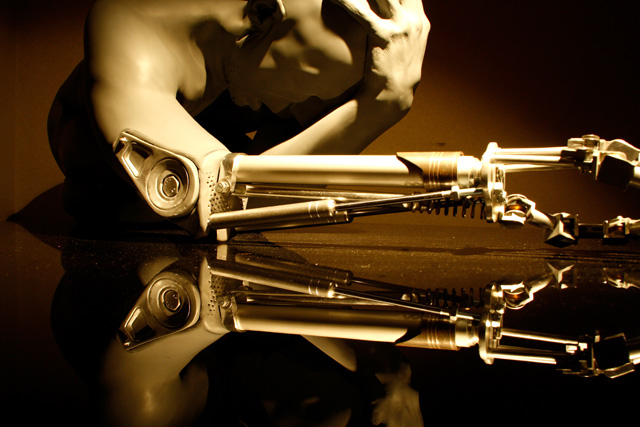
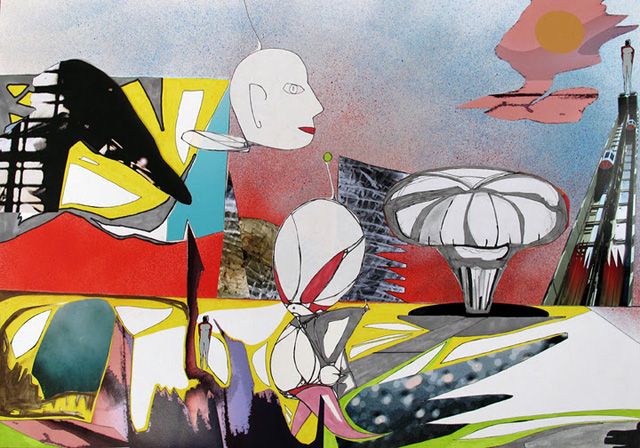
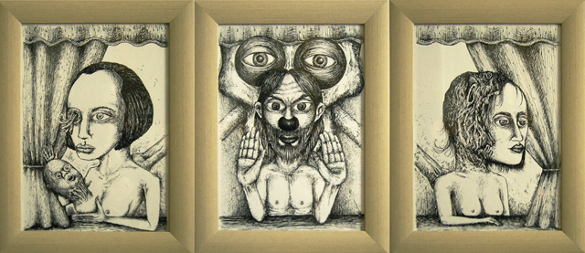
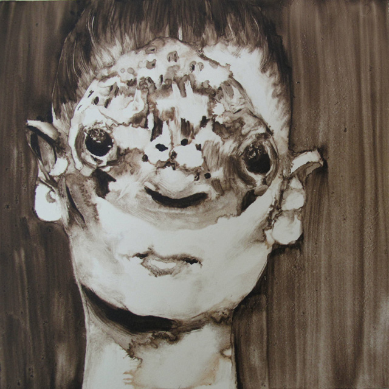
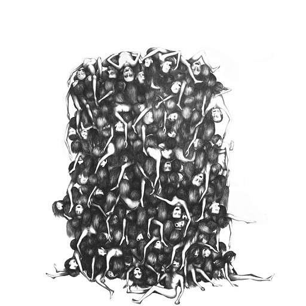

Do you believe the world will end this December 2012? Well, apparently some artists think we are a time-bomb waiting to happen if we don’t change our ways. **These artists came together for a special exhibit called the Project 2012** at the Left Gallery in London first week of October. I missed this first series of the planned rolling exhibition but was in touch with Lucia Burbano, head of PR and media, to tell me more about the concept of the show.

**Project 2012 aims to stimulate dialogue on the end of the world theories, focusing on our self-destructive patterns** as the likely cause of our impending doom. The first exhibition held last October was a huge success and the next exhibit would be held in February as a countdown towards December 2012. Seeing what’s happening in the news lately and all these occupy Wallstreet, occupy what-not hoopla in every nook and corner, that REM song “It’s the end of the world as we know it” keeps ringing in my head.

**1. Tell me more about Project 2012 and why did you choose to make it a rolling exhibition until next year?**

Project 2012 aims to provide a platform to reflect on the path our society has taken in relation to other cultures throughout history as well as nature. We have chosen this theme as we believe that the end of the world can be an inspiring source for creation and destruction.

We chose to give it continuity to act as a countdown until December 2012, the date when the possible end of the world will take place. There will be four more shows, one per season, with different artists each time. They will all be held in London in different spaces to reinforce an idea of itinerancy. The last one which will showcase all the artists which have taken part from the previous shows.

**2. How did you come up with the list of artists? Did you reach out to them and pitch the idea or vice versa?  How difficult was it to get the collaboration of these artists?**

The idea of Project 2012 came first. Once we defined it, we actively searched for artists which we believe shared our core ideas and whose work can inspire others to re-think the issues we are confronted with on a daily basis. Through our blog and other websites, we made a call to attract similar-thinking artists too.  Generally we had a good response. We also asked the artists to justify the artwork they were presenting through a written statement to back-up their works with a more thorough reflection to help visitors understand their work and also the concept we want to transmit.

**3. Tell us about a few of these artists and why they became interested with joining your project.**

For the first show, we had an interesting mix, featuring paintings, illustrations and one sculpture. Our main aim was to provide a narrative within the artworks creating a chronological story which transits from the end of the world to some kind of rebirth as a result of change. Some of the participating artists of this first Show are:

**Patrick Jannin** opened the exhibition with a satirical judgment day. His work acts like a witness of everyday life, studying human kind and showing what everyone hides. We think this was a good introduction, preparing the viewer to something new which was about to occur.

**Katrine Roberts** presented a series of disfigured portraits following her fascination in the power a face has to seduce yet simultaneously repel. She aims to offer the viewer a dialogue with the paintings whilst also causing them to step back and be challenged by the piece. The slow aging, maturing and eventual decay of the skin confronts us with what lies ahead. Again, Katrine’s work reinforces the idea of change and the decomposition of human kind.

**Nadège Druzkowski** showed a painting featuring an abandoned boat, which referred to the Great Eastern, a steam ship built in 1858 by Brunel. In her day, she was the largest ship that ever sailed on the oceans. She suffered a terrible fate, proportional in tragic measure to her great size. The idea behind Nadège’s work is in how these desolate sites, commonly viewed as blots on the landscape, are gradually being reclaimed by nature.

**4. Can you tell us a little bit about yourself and your background? Are you a practicing artist yourself?  If yes, what genre of art do you do?**

The chore of Project 2012 is form by two people which have different roles within the project:
**Lili Phelouzat** is the curator of the Show. She is an artist herself, mainly using mix media to explore the boundaries of reality, using imaginary characters in a abstract landscape. Her inspiration comes from experiences which are visual, mental and emotional. **Lucia Burbano** is in charge of PR and Media. She is a journalist and photographer with experience in different areas and media.

**5. What can we expect from the next exhibition?**

The second exhibition will take place in February and new space is to be announced  soon. The main idea will continue to be the same but with different artists and a new location. For the next exhibition we will try to introduce video and different media with the aim of creating a new narrative to offer visitors new grounds for reflection. For more information, please visit [Project 2012](http://project2012exhibition.blogspot.com/ "Project 2012").

