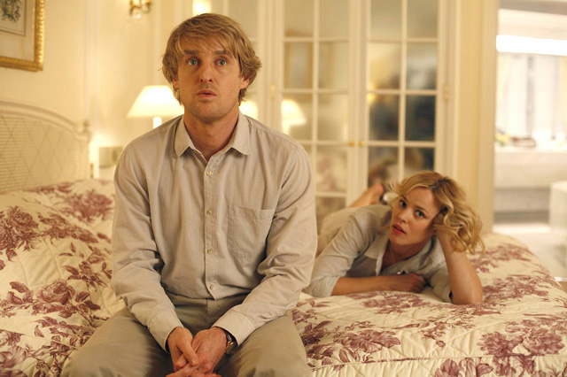
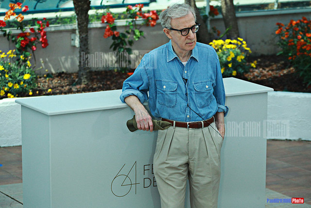
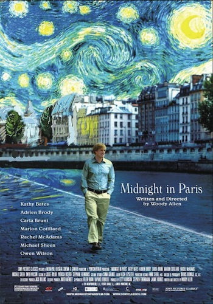

Wouldn’t you want to go back to the 20s and meet the greatest artists of all time? If you haven’t seen the movie **Midnight Paris** yet, try to catch a glimpse of **Woody Allen** in one of his finest. The boy wonder is not running out of ideas! And that makes me want to shrivel in one corner and curl myself in shame. I must admit, after Match Point and Vicky Cristina Barcelona, I thought Woody’s touch would start slipping away.

First, the movie has Paris as its backdrop and just by that, I’ve already fulfilled my silly obsession with the city of lights. **Midnight in Paris is a light hearted take on time travel with a character named Gil, who is a Hollywood hack scriptwriter attempting to pen a novel in Paris**. Although it is really a feel-good movie and so much easy to grasp than his older films, the concept of nostalgia has never had an auteur slash comic treatment this way.

**Enter Hemingway, Picasso, Dali, Luis Bunuel, Gertrude Stein with whom Gil gets to hang out after the clock strikes twelve.** It’s a Cinderella-induced story of escapism as Gil manages to enter the roaring twenties without much fan-fare or hoopla. All he did was jump on a wagon and voila, he gets to drink, smoke and even consult the masters for ideas for his book. As a result of his nocturnal activities, when he gets to be with his fiancee the morning after, **the once linear-headed Gil suddenly deconstructs**. Their lives which never had anything in common to begin with were suddenly split by Gil’s nostalgia about bohemian life and Ines’ foray into her upper-class exclusive lifestyle.

**Gil even met Picasso’s mistress Adriana who was as discontented with her era as Gil was with contemporary times**. Together, they had a romantic get-away back to the era of the Belle epoque meeting Degas, Toulouse Lautrec, Paul Gauguin and Manet who all believed that the Renaissance was the greatest period. Everyone it seems were clinging to the past. And that’s how Gil realized that he was living the grandest and most grandeur of illusions one can have – that the grass might not be greener in any side, even if you can be beamed thru a time-warped fence.

The present is all there is.

Related Links:

- [Cannes Film Festival Review: Midnight in Paris](http://www.guardian.co.uk/film/2011/may/11/cannes-film-festival-woody-allen-review)
- [Midnight in Paris by The Soft Echo](http://www.sofiaecho.com/2011/11/04/1195840_midnight-in-paris)
