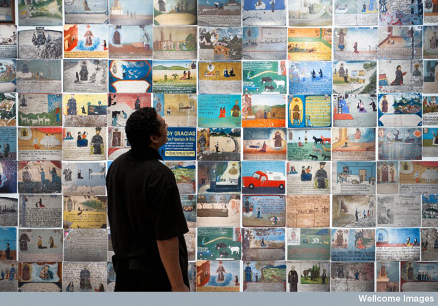
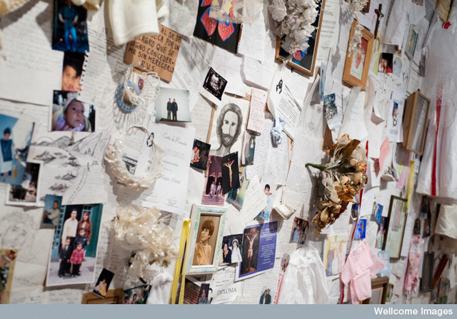

Wellcome Trust’s exhibit called Miracles and Charms is a respite from the Frieze-netic atmosphere of the past month and from the latest da Vinci saga of the National Gallery. I got tickets for Leonardo but will be postponing it until a time when I won’t be kicked out after 30 minutes of viewing! In [Wellcome Trust](http://www.wellcomecollection.org/), I can take all my sweet time to peruse the artworks without having to worry about the Leonardo-hungry crowd who want to take a piece of the newly discovered Salvador Mundi painting. **In contrast, Magic and Charms is a very small and intimate show which explores the relationship between art and religion.**

Not a new concept indeed if one has just been in other museums on a medieval trip. Religion has had an awful long winding road from being a cult of praise to being a subject of irony and indifference. And now here comes this exhibit which **explains human nature, and our propensity for supplication and devotion to the spiritual when one goes thru a life or death changing circumstance**. And for those who want to understand Mexican history, this is a great place to start.

<iframe allowfullscreen="" class="youtube-player" frameborder="0" height="505" src="//www.youtube.com/embed/_mwDt2YxwBI?wmode=transparent&fs=1&hl=en&modestbranding=1&iv_load_policy=3&showsearch=0&rel=0&theme=dark" title="YouTube video player" type="text/html" width="640"></iframe>

The first half of the exhibition is called Infinitas Gracias which show an array of Mexican votive paintings – small paintings drawn in tin roof tiles or small plaques which tell of personal stories in the moment of crisis and humility. Dating as far back as the 18th century, **the paintings are testament to a person’s faith when confronted by challenging circumstances:** ill health, gun fights, kidnapping etc. – and how much one calls upon saintly intervention to overcome these difficult situations.

**Votive paintings are quite different from traditional Christian art** because they are done by commissioned yet anonymous artists. Their objective for creating the art is not to achieve the perfect contours of expression but to maximise the use pictorial space to represent their customer’s experience. **Some paintings seemed as if they were pulled out of a page of a magic realism book**: a person survives a lightning strike while a saint hovers above in a cloud or someone is saved from drowning while falling asleep in a pool. Indeed, there are stuff from everyday life but it’s these little surreal things that make the exhibit very interesting.

 Museo Nacional de Historia – INAH On first day of June 1861, Juan Garcia was drifting into unconsciousness while bathing in a pool* and anxious that he was drowning and near death he passionately invoked Our Lord Saint Francis who saved him from such dreadful death. the smoke could suggest a hot spring")

 Santuario de San Francisco de Asis de la Diócesis de Matehuala / INAH San Rafael ranch, SLP July ’76. I thank God and Saint Francis of Assisi for saving our 4 horses and 2 donkeys from equine encephalitis. For this reason we offer this retablo. Zapata Family")

The paintings also demonstrate Mexican’s flair for colour – for example, hospital scenes are not all white-washed as expected. The use of colour in these ex-votos and the depiction of social history is truly Mexican indeed. For them, **religious devotion is a celebration of colours, a far cry from the somber and opulent style of Christian traditional art**. In Mexico, faith and gratitude is to be expressed to the world and not to be repressed inside the walls of a chapel. Indeed what this exhibit shows is how much Catholicism has shaped Mexican national identity and how religion has become a very big part of their lives.

In the other side of the room, these votive paintings are replaced by items from Modern times: wedding gowns, photos, baby clothes, school diplomas, braid of hair and scribbles form a wall collage of divine supplication. The best of course are the ex-voto paintings, which are sort of a **precursor to Diego Rivera or Frida Kahlo’s style** and even the brochure to the exhibit indicated that the couple collected them when they were still alive.

Seeing this exhibit really made me wonder whether these two great painters could have achieved their pinnacle of success if it weren’t for the ex-votos paving the way.

 Museo Nacional de las Intervenciones / INAH In the month of May 1885 Visenta Garcia went crazy and her husband Francisco Mejia, being in such a state of agitation, entrusted himself to María Santisíma de la Soledad de Sta Cruz de Mejico* and she was instantly cured. In gratitude he dedicates this retablo. Also known as the Virgin of Solitude")
 
 Santuario de San Francisco de Asis de la Diócesis de Matehuala / INAH The dog with rabies bites Pedro’s hands. Pedro and his wife give thanks to Saint Francis for finding himself healthy from the horrible illness of rabies. On the 19th day of the month of October, Pedro Martines was bitten by a rabid dog which left him deeply worried. He pleaded with all the fervour of his heart to the glorious Saint Francis to free him from the illness of rabies. Finding himself in good health after the threat of such a dangerous disease and for the Glory of God and the Catholic faith he now dedicates this retablo. Pedro Martinez. Mineral de la Paz, SLP")

Related Links:

- [Miracle and Charms by the Londonist](http://londonist.com/2011/10/review-miracles-charms-wellcome-collection.php)
- [Miracle and Charms by the Telegraph](http://www.telegraph.co.uk/culture/art/art-reviews/8841317/Miracles-and-Charms-at-Wellcome-Collection-Seven-magazine-review.html)
- [Miracle and Charms by Icon Magazine](http://www.iconeye.com/news/reviews-2011/review-miracles-and-charms)
- [Miracle and Charms by London is cool](http://londoniscool.com/miracles-charms-free-exhibition-at-the-welcome-collection)
