Video art has never held much of an appeal to me. In part, this is because it seems to take so much time, and inevitably when you come across it in a gallery it’s always half way through, meaning you either miss some of it, watch the end before the start, or wait for the loop to complete before watching from the beginning. Frankly, I rarely have time for this. However, the problem of time was something I was determined to avoid at the  **Moving Image Contemporary Video Art Fair in London** and I fully intended to watch all of the video art on offer.

The Inaugural exhibition of the Moving Image Contemporary Video Art Fair last October 13 to 16 featured a selection of single-channel videos, video sculptures and other **larger video installations by 28 artists, represented by 28 galleries and non-profit institutions from across the globe**. Moving Image was conceived to offer a unique viewing experience, providing a rich program of time-based works.

Set in a four-storey warehouse in Oxo Tower Wharf, the cool air and dilapidated interior added to a sense of removal from the outside world. Each corner of the building occupied a time and space defined by the work. It was a good environment for appreciating the video art, although I did get a little chilly!

**1. Jakup Ferri’s Line Dot Line (2009)**

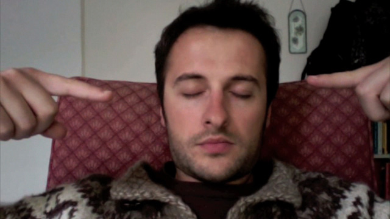

After a welcoming brunch, I embarked on my journey from the top floor of the warehouse beginning with [Jakup Ferri](http://www.weingruell.com/files/ferri---additional-information.pdf)’s Line Dot Line (2009) represented by [Weingrüll](http://www.weingruell.com/). At just 1:30 min, the piece focuses on Ferri, the protagonist, clothed in a thick jumper and sitting in a red chair. You note every small detail as he clears his throat, shuts his eyes, opens them and looks left then right, before shutting them again. At this point, an extended finger from each hand is gradually brought from the periphery of the frame towards his face. The camera appeared to bob up and down slightly mirroring breathing. When Ferri opens his eyes, only the left is visible, the right obstructed from view by his finger. The work draws your attention to his features. Dealing with themes of alienation from the Western art world and the place of the peripheral artist, this piece provokes an interesting debate about the place of art separated from the Western cannon. Ferri’s art is introverted and fixed on the reality of the artist. I invested little time in watching, but gained a greater appreciation of his work after reading the artist’s statement.

**2. Hannah Wilke’s Intercourse with…. (1977)**

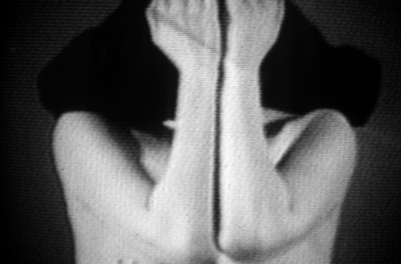

Watching Hannah Wilke’s Intercourse with… (1977), represented by [Ronald Feldman Fine Arts,](http://www.feldmangallery.com/) I started to appreciate some of the merits of video as an art form. During this black and white video we hear some of Wilke’s answerphone messages from family, friends, lovers and colleagues whilst Baroque music by Marcello then Vivaldi plays. Wilke is beautifully posed in each frame, reminding me of stills from Degas portraits, yet each image unfolds with the fluidity of a tragic dancer. Throughout the video Wilke undresses; during one moment she takes her sweater off, transforming into an amorphic blob of black, reminiscent of a nun’s headdress, but there is also a distinct sense of absence. Her clothes removed, the initials and names of the people in the messages are revealed across her torso and breasts, and she removes these until all traces have disappeared. The video evokes both sadness and sexuality. Sat in a dark alcove of the warehouse, wearing headphones and listening to private messages, whilst watching Wilke undress, gave a voyeuristic frissant to the experience of this piece. You are both distanced from and intimate with the scene. Erotic and sensual, sad and haunting, it is ambiguous and complex. A beautiful use of light and shadow and the use of the body to form fluid changing shapes made this a captivating piece to watch.

**3. Gilad Ratman’s Multipillory (2010)**

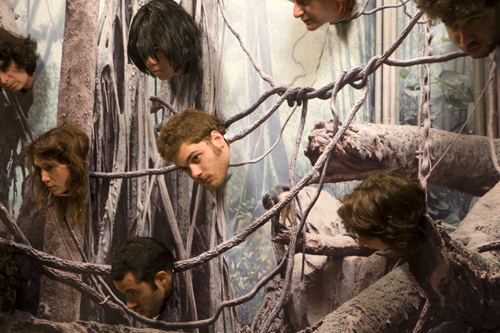

A highlight for me was Gilad Ratman’s Multipillory (2010) represented by [Braverman Gallery](http://www.bravermangallery.com/). Based on a medieval torture device, the heads of 12 people are inserted into what looks like a seaside picture board from the front. However, the holes through which the heads poke through don’t impose their faces onto a comedy figure, but rather creates the image of disembodied heads hanging in a misty and eerie forest. The camera slowly rotates around accompanied by a grinding sound simulating heavy cogs turning. The back of the image becomes visible and you see 12 figures arranged on a wooden structure. All in varying degrees of dress (some are in shorts, others have naked bottoms) the human forms arranged on the unadorned wooden stand appear very sculptural. There is something playful, reassuring and slightly comical after the eerie forest scene, yet there are still dark undertones. Heads and bodies exist on two different sides of the structure calling to attention the divide between the real and the imaginary. As the camera rotates again, accompanied by the low grinding, the image returns to the surreal forest of disembodied heads. This piece reminded me of renaissance paintings of hell. Interestingly, the structure which this single channel loop is projected on is the same from behind as the one used in the video, further blurring the boundary between the real and the imagined.

**4. Bani Abidi’s I love you (2003)**

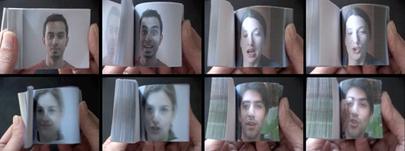

Moving away from sinister subjects, another short work at the fair was Bani Abidi’s I love you (2003) represented by [Green Cardamom](www.greencardamom.net). The film shows flick books with different people saying ‘I love you’.  It’s an interesting merge of still images brought to life by the flick book, captured on film. The sentiment is both universal and specific to each individual photographed. Evocative, yet simple, this video was short and sweet.

**5. Oliver Herring’s Little Dances of Misfortunes I-V (2002)**

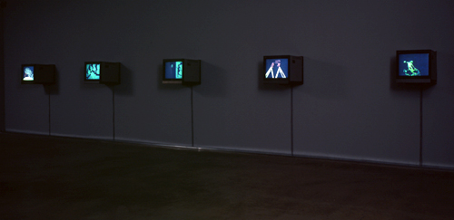

Another of my personal favourites was Oliver Herring’s Little Dances of Misfortunes I-V (2002), represented by [Meulensteen](http://www.meulensteen.com/). This piece plays with darkness and light, abstraction and representation. Standing in a darkened room, music by J.B Krumpholz plays whilst different performances are displayed across 5 TV screens. Sometimes the performers were dark figures on a phosphorescent background, other times various body parts of the performers were phosphorescent and set against a dark background. Phosphorescent shapes shift and rearrange on each screen creating a ballet of moving shapes. Alone in the darkness it made me want to dance along. This piece captivated me and I watched the 3:15 min work several times. As I moved through the fair the music followed, seeping through the rooms into some of the other works. After the fair, I was interested to discover a video of Herring discussing what he perceives to be generational shifts in our relationship to the camera, mortality and legacy, definitely well worth a watch.

**6. Micahel Smith’s Baby Ikki, Out and About (1978/2008)**

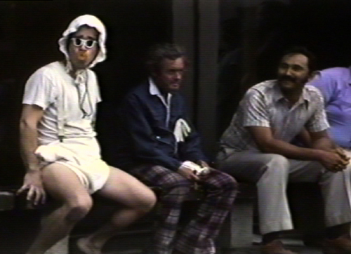

I was less enthused by Micahel Smith’s Baby Ikki, Out and About (1978/2008), represented by [Hales Gallery](www.halesgallery.com). Described as ‘direct and accessible’ Smith uses humour as a strategy for empathy and identification, which is rooted in the audience/artist relationships of performance.  In this piece he is dressed as and acts like a baby in a variety of public spaces making use of props such as bottle and balloons. Perhaps by this point I was less willing to give the 4:07 min work much of my attention, but despite the humour I didn’t find I empathised or identified.

**7. Persijn Broersen & Margit Lukàcs’ Mastering Bambi (2010)**

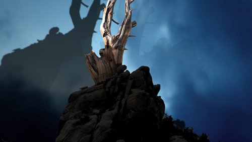

The final piece on the top floor was Persijn Broersen & Margit Lukàcs’ Mastering Bambi (2010) represented by [Akinci gallery](www.akinci.nl). With layers of depersonalization and re-mediation they demonstrate how reality, (mass)media and fiction are strongly intertwined in contemporary culture. In the virtual world of Bambi, without the animals, the stark wilderness is accompanied by creepy sounds. Watching from inside a dank building there are moments when the virtual world feels sinister, but there are also moments where sunlight shines through the leaves and the forest appears calm and safe. The artists’ statement claims that nature becomes a mirror of our own imagination. Watching it alone in a cool, dim setting was atmospheric and allowed space to reflect on the world depicted in the video.

**8. Shadi Habib Allah’s The King and the Jester (2010)**

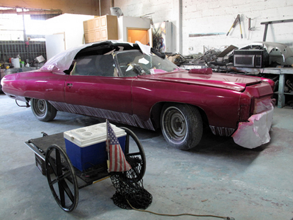

By the time I reached the second floor I was beginning to feel slightly overwhelmed and tired. My initial resolve to dutifully watch everything began to wane. The second floor made me think more about what makes a work video art as opposed to a video or a documentary? Shadi Habib Allah’s The King and the Jester (2010), represented by [Green Art Gallery](gagallery.com), was filmed in an Auto Paint and Body Shop. Themes of the piece include a consideration of human relationships to infrastructure, class, identification and hierarchies of authority. It was observational and I was interested to see a depiction of a life so utterly different to my own. Of course, making art out of ordinary lives is nothing new, but I wondered whether other people watching it would consider it to be video art or documentary. Perhaps the point was the crossing between these boundaries. To me it felt like a documentary minus the voice over commentary, but that’s not necessarily a bad thing. Unfortunately, I didn’t have the stamina to watch the full 26 minutes and moved on.

**9. Mihut Boscu’s Personal Hawking**

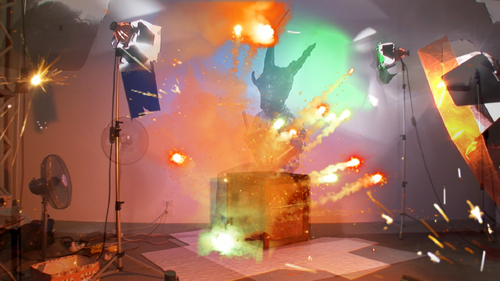

Mihut Boscu’s Personal Hawking represented by [SABOT](www.galeria-sabot.ro) gallery was an explosion of shapes and colour, not dissimilar from 80s Children’s TV programmes. Interestingly, the gallery described him as a versatile entertainer who plays tricky visual games with his audience. A combination of scientific atoms, an observation of nature and phenomenology of spirit, crazy costumes and brash colour it contained elements of the absurd. At only 7 mins I was able to watch it all, but my head had less room to process the ideas of post-utopian/kakotopian/dystopian theories that the artist pretends to be rooted in, or savour the subtle irony and conceptual cryptic nature. It begs another question about whether video art should be savoured in isolation, or whether the artist’s intention and statement need to accompany and contextualise in order to inform the work? This is of course true of all artistic forms to some extent, but being new to the medium of video art, I perhaps worried more about whether I was viewing each piece properly.

**10. Dara Birnbaum’s Six Movements Video Work from 1975**

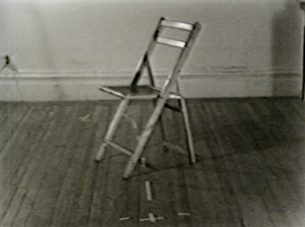

I was engaging much less with the work as I moved around the room, only briefly glancing at Dara Birnbaum’s Six Movements Video Work from 1975 (1975), represented by [Marian Goodman Gallery](http://www.mariangoodman.com/), which was a lengthy piece at 41:12 mins. An exploration of media vocabulary and representation of the female subject, I would have liked to see what this entailed, but at this point I needed a rest. The three video art works situated in this brightly lit, but cool room, would take over an hour to watch, so you definitely needed plenty of time. It became impossible to fully absorb each piece and I tried to push through the sensory overload I was feeling.

**11. William Lamson’s Action for the Paiva (2011)**

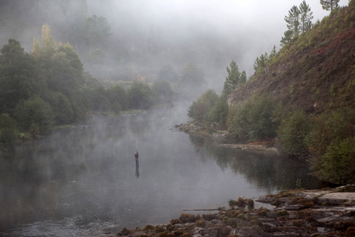

William Lamson’s Action for the Paiva (2011), represented by [Pierogi Gallery](www.pierogi2000.com) was the perfect tonic. It was calming, refreshing and gave my head space to recharge. At 24:12 mins, Lamson looks to interact with the environment in real time, creating something out of almost nothing. There is a lake in the centre with mist rising from it. Surrounding the lake are dark green trees and brown shrubs on the hillside, while a man is stood in the water. There are slight ripples moving across the lake, but the man has a clear, still reflection. You can hear the sounds of nature, birds chirrup and the sound of the water emanates. This piece was a meditative relief. I don’t know how long I sat just absorbing the scene, but it left me feeling completely relaxed. I began to worry less about what I might not see in the exhibition and feel more immersed in the present. The man in the lake turns gradually. There are sometimes ripples in the water, possibly fish. I felt as though I was looking at a landscape painting or photograph with a soundtrack. To me, this piece reflects the movement of the world, often unseen or gradual, but constant and continual. The chill of the building fitted with the sense of being outdoors amongst nature. The work seemed to cleanse my mind: Refreshed, I felt ready to embrace the next set of work. However, there was something very compelling about this piece which kept me looking back, even after I’d moved on.

**12. Yeondoo Jung’s Handmade Memories (2008)**

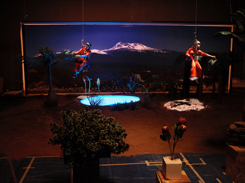

Time was a recurring theme for me throughout this exhibition. How long I should spend there? How long was each video? Did I really have time to watch everything in its entirety? At 48:45 mins Yeondoo Jung’s Handmade Memories (2008), represented by[ Kukje Gallery](www.kukjegallery.com) and [Tina Kim Gallery](http://www.tinakimgallery.com/), is a piece that I would have liked more time for. It explored the nature of memory through a series of videos which question what is real and what is imagined. The video shows people recalling a prominent memory from their youth. There are two adjacent colour screens, with sound and subtitles. On one screen you see the person recalling their memory, whilst on the other Jung recreates the scene, intending to show how memory can slip into fantasy or nostalgia. The human element is prevalent and I started to question whether or not it mattered if the memory was ‘real’? Human lives are fascinating. The correlation between the person talking and the recreated scene was seemingly abstract, yet beautiful.  Set next to Lamson’s work, the videos in this room felt more focused on the mind and the spirit than other sections of the exhibition.

**13. Suzanne Treister’s  Vesna (2006)**

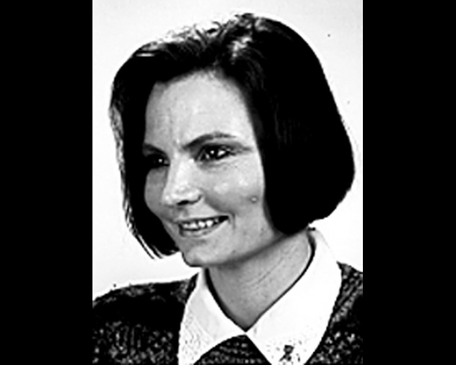

The third piece in this room was Suzanne Treister’s  Vesna (2006), represented by [PPOW](http://www.ppowgallery.com/). It showed a series of photos after the caption of ‘Vesna’, with music playing in the background. The piece was developed in the search for a childhood friend of Rosalind Brodsky’s mother. During the search Brodsky found many Vesnas in different professions all over the world, as well as places and animals also sharing the name. Although the original was never found, the video documents some of the alternatives. I really like the way in which the video acknowledges and celebrates each individual, showing that each is unique, despite all sharing the same name and highlights the arbitrary nature of language.

**14. Daisuke Nagaoka’s Road to the Other**

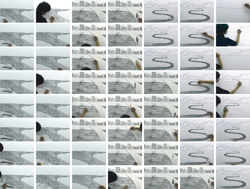

Moving across to the next room on the second floor, I was presented with a brightly lit space and some exciting works with themes including process, history and time. Daisuke Nagaoka’s Road to the Other, represented by [Galerie Yukiko Kawase](http://yukikokawase.free.fr), was one of my favourites in this set. Nagaoka produces pencils drawings on a single sheet of paper, drawing one image, erasing it and then drawing the next scene. This process is captured on camera, showing the movement of his hand and the pencil gliding across the paper.  The film is then edited into a rhythmical drawing animation. His sketches are in a continual flow which focuses as much on the process of the creation as the finished product. The paper is a palimpsest, and what I like about this piece is that although each drawing is erased from the paper, its ghostly presence still remains through film, a vital part of the bigger picture.

**15. Chen Shaoxing’s Ink History (2010)**

")

Chen Shaoxing’s Ink History (2010), represented by [Pekin Fine Arts](www.pekinfinearts.com), stood out for me in this room. Shaoxing created ink drawings of well-known scenes from history, put into a sequence of images. He states that his intention is not to reproduce history, but provide material for interpretation. Questions about both the original event, but also our representations of history are imbued in this piece. For Shaoxing, the historical images themselves are without interpretation, but of course the sequence and the music influence interpretation. On a superficial level, the superbly detailed ink images are fabulous to look at and as each image is from a moment in history it felt as though it was telling a story. On a deeper level the work serves to remind us of the impossibility of an accurate historical retelling, only the many versions and representations of the truth which create history.

**16. Eve sussman and the Rufus Corporation’s The Kiss**

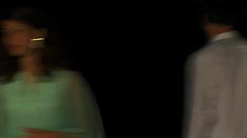

Eve sussman and the Rufus Corporation’s The Kiss is a 7 minute loop of a moment between two people in a room as they drift in and out of shot, as though captured on a surveillance camera. The scene unfolds slowly, with laughter and the sounds of a party in the background. The kiss itself is almost an anticlimax, a seemingly awkward moment after the build up. What’s more interesting is the way in which the moment is only half captured, with the scene unfolding on the periphery, or completely out of shot.

At this point, I began to give a cursory glance and pass by the rest of the works on offer, which is a shame because I missed out on the following: **Anna Baumgart’s  Fresh Cherries (2010)**, represented by LOKAL_30, a mixture between psychodrama and documentary of rape and prostitution at  Auschwitz; **Adrian Wong’s, Haak Seh Wuih Tuhhg Mau Jai, 2007/2011**, a choreographed cat dance; **Cameron Platter’s The Old Fashioned (2010); Guinara Kasmalieva & Muratbek Djumaliev,  A New Silk Road: Algorithm of Survival and Hope, (2006)**,  a work specifically about the economy and culture of the Silk Road, the ancient trade route that connects East and West.

**17. Cao Guimarães Limbo (2011)**

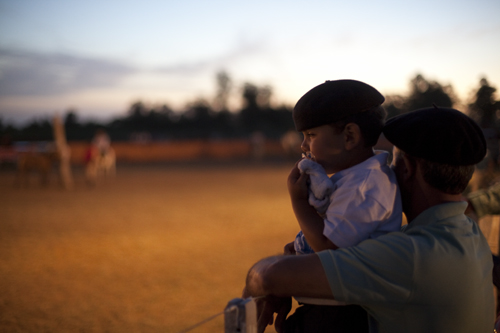

On the first floor I paused to watch some of Cao Guimarães Limbo (2011), represented by [Galeria Nara Roesler](www.nararoesler.com.br%20). The artist’s statement reads: “A place out of place / an in-between. / A hole in space and time / Playground for the ones that came before, / those who have gone early / Eternal windy Sunday.” The video showed an empty swing, swaying in the wind. This continued focus makes it seem as though it is a portal to other places in space and time, or as the title suggest it is limbo. The image fades into another scene, but with time running out, I moved on through the fair.

Other works that I missed on the first floor include: **Taro Shinod’s Reflection (2011),** represented by Taka Ishii Gallery; **Oliver Michaels’ video sculpture The Lovers (2010)**, represented by Cole; **Jonathan Ehrenberg’s  Seed (2010)**, represented by Nicelle Beauchene Gallery, and **Vincent Messen’s Vita Nova (2009)**, represented by Normal.

**18. Leslie Thornton’s Binocular Series (2010-11)**

 Web")

On the ground floor by the entrance, I stopped to look at Leslie Thornton’s Binocular Series (2010-11), represented by [Winkleman Gallery](www.winkleman.com%20%20%20).  On the left you see a creature as it was originally filmed, on the right you see the image as though through a prism which created a series of patterns. This creates a series of eye-catching abstract images which constantly shift as the subject moves. The images are like a series of stain-glass windows that effortlessly dissolve into new formations. An aesthetically pleasing piece, check out excerpts of the black parrot and ants

**19. Kenneth Tin-Kin Hung’s, *The Fast Supper* (2011) and *Fat Free Nirvana* (2011)**

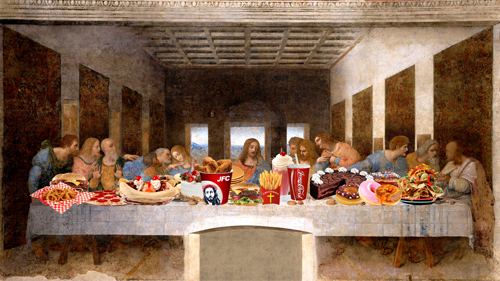

Finally, by the fair entrance / exit was Kenneth Tin-Kin Hung’s, *The Fast Supper* (2011) and *Fat Free Nirvana* (2011), represented by [Postmasters](www.postmastersart.com%20). A mixture of classical painting and popular culture’s fast food brands, Hung’s work certainly portrays a strong message about our consumption habits. These two pieces are part of an art series exploring the links between the obesity epidemic, the industrialization of our food chain, the agriculture biotechnology and its impact to our environment. As both the first and last piece you pass, **O Fortuna by Carl Orf** blaring, it’s definitely hard to miss *The Last Super* with flying cheeseburgers and an exploding deity, whilst Budha vomits and fades away on the screen opposite showing *Fat Free Nirvana*. Perhaps it’s a warning to viewers at the fair to sample in moderation.

I reached the end of the fair feeling exhausted and really rather hungry, but definitely felt it had been a morning well spent. An entire exhibition dedicated to video art is time consuming. Also, the multitude of ideas, subjects and issues covered was too vast to process in one visit. Video art probably remains under-represented as an art form, so the fair provided a good space in which to explore it, however, I was naive to think I could see it all, and I’m not convinced I will ever manage an entire exhibition of video art. Why make time for video art? I came out of the experience buzzing with thoughts, ideas and concepts. **You definitely need time in order to appreciate it, but if you’ve never experienced video art, it’s time you did.**

*Note: All Photos copyright of Moving Image and their respective galleries. Stay tuned for Rebecca’s website at [www.inkysatchel.co.uk](http://www.inkysatchel.co.uk)*
