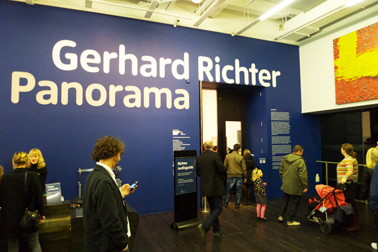

**Gerhard Richter’s latest retrospective at the Tate clearly shows that his art sits in the middle ground between abstraction and realism.** For almost 50 years of his career, Richter has not only mastered all the genres of painting but has also contributed to the major art movements of our time.  Name any contemporary style and possibly Richter has already laid the groundwork before anybody else**. And this is  why it comes as no surprise that [Panorama](http://www.tate.org.uk/modern/exhibitions/gerhardrichter/room12.shtm)** is the most eclectic collection a single artist can ever have in a lifetime.

In fact, if you didn’t know about Gerhard Richter, you’d probably think the collection at the Tate was done by several people. And yet for all its eclecticism and diversity, there is still a stamp of Richterness about all of them. Whether it be subjects about seascapes, clouds, photo-realistic blurred paintings, abstract pieces or glass constructions, they are all the result of experimentation and the artist’s exploration about the role of painting itself. **In this article, I made a list of my favourite picks from the 14 rooms of Richter’s Panorama at the Tate Modern** with a view of how the curators presented his works to the public. *(Photos not available).*

**Room 1: Photopainting in the 1960’s
My pick: [Table 1962](http://www.gerhard-richter.com/exhibitions/detail.php?exID=1048&show_per_page=32&page_selected=1&paintID=4954)**

A room dedicated to the artist’s early career, Richter created photographic based painting, in his attempt to reject abstraction. Coining his style as “Capitalist Realism,” he blurs these images by dragging a dry brush which gives the painting a kind of velocity and movement. In this room, my top pick is the iconic **Table 1962** which shows Richter’s attempt to define a new style of painting. By obscuring the image of an everyday object like a table, he creates a new language between realism and abstraction, while providing insights into the implications of his new environment, having just defected from the East to West Germany.

**Room 2: Art after Duchamp
My pick: [Toilet paper Roll CR 75-1, 1965](http://www.gerhard-richter.com/exhibitions/detail.php?exID=1048&show_per_page=32&page_selected=1&paintID=5560)**

Marcel Duchamp’s works had a huge impact on Richter’s art and even made his own version of  Duchamp’s Nude descending on a Staircase. However, I feel that there is nothing more that can embody this moment in the artist’s career as his **Toilet paper roll** painting. Indeed, while Duchamp’s works can be taken lightly in jest, Richter’s depiction of a blurred and grey toilet paper roll shows how Richter refutes the purpose and status of a still-life painting and how an arbitrary object can convey emotion. It is Richter’s answer to Duchamp’s urinal.

**Room 3: Damaged Landscapes
My pick: [Townscape Paris 1968](http://www.gerhard-richter.com/art/paintings/photo_paintings/detail.php?5902)**

This room is dedicated to Richter’s foray into landscape and aerial view painting in the beginning of the 1960s. **Townscape Paris 1968** is a re-examination of figuration and abstraction, showcasing the city of lights from an aerial point of view. Painted in heavy impasto, Richter plays with the viewer to guess what the painting is about while also conveying the catastrophic repercussions of the bombing thru an expressionistic style.  The more I take a closer-look, the more I see the rubble of a haunting past.

**Room 4: Grey Paintings and Colour Charts
My pick: [Grey Streaks, 1968](http://www.gerhard-richter.com/art/paintings/abstracts/detail.php?6028)**

In the 1960s and 70s, Richter also began to create his series of grey paintings in order to explore the role of colour in art by using grey to convey non-emotion. It’s easy for me to choose the 4096 colour chart as an obvious stand-out from the collection in this room but I really loved **Grey Streaks** because it is a painting open to any sort of interpretation. Whether Richter’s intent is to show the indifference of colour, Grey Streaks convey a maze of fluidity and movement. At the bottom, one can see the swirling traces of Richter’s brush.

**Room 5: Figuration meets abstraction
My pick: [Detail (Brown), 1970
](http://www.gerhard-richter.com/art/paintings/photo_paintings/detail.php?5749)**

The famous cloud paintings are part of the collection in this room, but I was drawn to **Detail (Brown)**, a painting based on Richter’s enlarged photos of brushstrokes. From a distance, it doesn’t seem to depict anything you can easily identify. It look as if it is liquid or either a wooden surface. Then you come into sudden realisation that the subject is paint itself. The creative process of magnifying rendered the thick paint to a smooth almost flowing surface. Here Richter attempts to seek the essence of realism from abstraction and vice versa.

**Room 6: Exploring abstraction
My pick:[ Mirror, 1981 CR 470-1](http://www.gerhard-richter.com/art/paintings/other/detail.php?6310)**

The most significant artwork which describes his departure from the blurred photo-realistic style is the **Mirror**. The Mirror is a conundrum for Richter’s preoccupation about chance and randomness. Strategically placed in front of the Yellow-Green squeegee paintings, the Mirror reminds me of Michelangelo Pistoletto’s installation Mirror of Judgment at the Serpentine early this year, where he used mirrors to invite the viewer to contemplate about contemporary issues and religious truths. In contrast to Pistoletto’s mirror works, Richter’s Mirror makes a strong statement on how perception comes into play when viewing art.

**Room 7: Genre painting and early sqeueegee abstracts
My Pick: [Candle, 1982 (CR511-3)](http://www.gerhard-richter.com/art/paintings/photo_paintings/detail.php?5033) and Skull, 1982 [(CR 548-1)](http://www.gerhard-richter.com/art/paintings/photo_paintings/detail.php?5033)**

For me, this room finally shows the artists preoccupation outside the realm of the creative process. The Candle and the Skull have a familiarity about them and both contemplate the concept of mortality. The candle burns in the dark and yet we all know that the flame will soon die down. Just like the skull which symbolises a life’s brief sojourn, the candle’s  time is limited. But rather than being eerie, both evoke a feeling of commonality and solace.

**Room 8: Landscapes and portraits
My Pick: [Abstract Painting 1990 CR 726](http://beta.tate.org.uk/art/work/T06600)**

The painting of Richter’s daughter Betty whose head is turned away from the viewer would be an obvious pick from the collection in this room but there’s an energy about  Abstract Painting CR 726 that I couldn’t ignore.  It looks like a giant film screen pulsating in blurring movement, highlighted by bursts of red and white rendered in squeegee. The scratches in the surface only add to to the dizzying visual spectacle.

<iframe allowfullscreen="" class="youtube-player" frameborder="0" height="505" src="//www.youtube.com/embed/Upk6lACjx_8?wmode=transparent&fs=1&hl=en&modestbranding=1&iv_load_policy=3&showsearch=0&rel=0&theme=dark" title="YouTube video player" type="text/html" width="640"></iframe>

<figcaption>Jonathan Jones examine Gerhard Richter’s works for the Guardian</figcaption>

**Room 9: 18 October 1977
My pick: [Hanged 1988](http://www.gerhard-richter.com/art/paintings/photo_paintings/detail.php?7690)**

This room is dedicated to the series of works that Richter made based on the horrifying deaths of the members of Baader Meinhof, a radical group in West Germany. Out of all the paintings in Room 9, I pick Hanged 1988 as the most powerful and the most disturbing. Based on a documentary photography, Richter painted Gudrun Esslin, whose silhouette is seen hanging from the bars of a prison cell from what appears to be suicide. Richter’s blurring effect only made the picture more haunting, as it gives us a notion that it was a tragic and painful death.

**Room 10: Abstraction in the 1990s
My pick:[ Abstract Painting 849-2, 1997](http://www.gerhard-richter.com/art/paintings/abstracts/detail.php?8275)**

In contrast to 18 October 1977, this room showcases Richter’s most evocative and colourful abstract compositions using the squeegee technique. I pick Abstract Painting 849-2 because it is a highly-charged painting that provides another visual spectacle like a giant screen in non-stop flickering momentum. It is made by using multi-layers of paint applied by squeegee and there are peeled-off sections that looked like floating shapes in the air.

**Room 11: Questioning Painting
My Pick:[ Halifax 1978](http://www.gerhard-richter.com/art/editions/detail.php?12789)**

Richter used different media and approaches in his painting all throughout his career. My favourite among the collection is Halifax 1978 because this is probably the only oeuvre in the whole exhibit where I saw a reversal in Richter’s creative process. Some of his paintings were based on photographs but in this case, Richter photographed the small abstract painting Halifax in different angles and distances. The result is a montage of 128 black and white photos of brushstrokes which you can mistake as an aerial view of a landscape.

**Room 12: The limits of vision
My Pick: [Self-portrait CR 836-2](http://www.gerhard-richter.com/art/search/detail.php?8185), [1996](http://www.gerhard-richter.com/art/search/detail.php?8185)**

This room shows how Richter explores the sense of perception as part of the visual and viewing process in art. My obvious choice from this room is Richter’s Self-portrait as it is the only painting of the artist himself in the retrospective. I like the idea that the artist has also rendered a blurred vision of himself.

**Room 13: 2001 and beyond
[My Pick: Abstract Painting 911-2](http://www.gerhard-richter.com/art/search/detail.php?14848)**

It is around this time when Richter experimented with monochrome paintings. The Abstract Painting 911-2 is a large white monochrome painting with hints of layers and layers dark colours underneath. The beauty of this painting is that it plays between the realm of minimalism and also abstraction.

**Room 14: Cage
None other than: [The Cage Paintings](http://www.gerhard-richter.com/videos/detail.php?vID=9&type=F)**

The six Cage paintings is a homage to avant-garde composer John Cage. In this series, Richter explores the concept of chance which resulted in a different variety of abstraction. The paintings appear monochromatic  from a distance and yet only when you peer at them one by one will you see the intensity. What appears zen-like from afar is actually pulsating with momentum attributed to the way Richter painted them, dragging the squeegee, layering the paint and blurring them.

Related Links:

- [Gerhard Richter: Panorama by Alastair Sooke for the Telegraph](http://www.telegraph.co.uk/culture/art/art-reviews/8804567/Gerhard-Richter-Panorama-Tate-Modern-review.html)
- [Blurred visionary: Gerhard Richter’s photo paintings](http://www.guardian.co.uk/artanddesign/2011/sep/22/gerhard-richter-tate-retrospective-panorama)
- [Amidst the Grey from the London Student](http://www.london-student.net/play/amidst-the-grey/)
- [Gerhard Richter sees his way among the greats by Jonathan Jones for the Guardian](http://www.guardian.co.uk/artanddesign/jonathanjonesblog/2011/dec/08/gerhard-richter-great-leonardo-degas)
