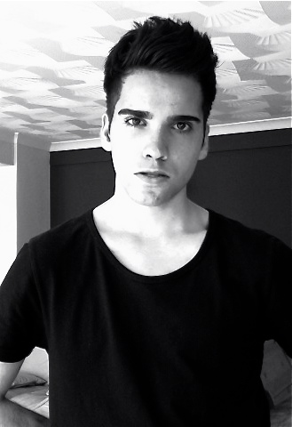
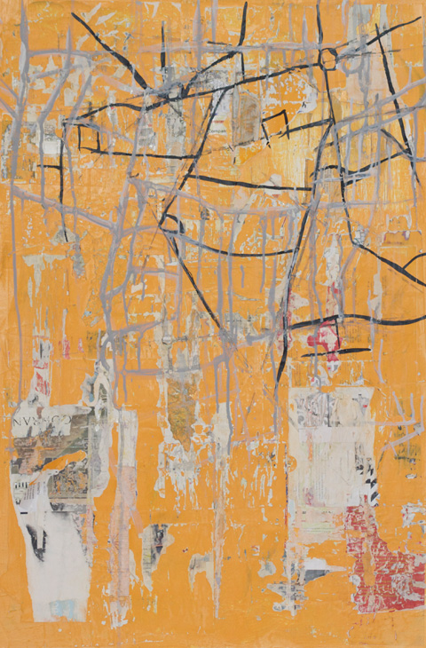
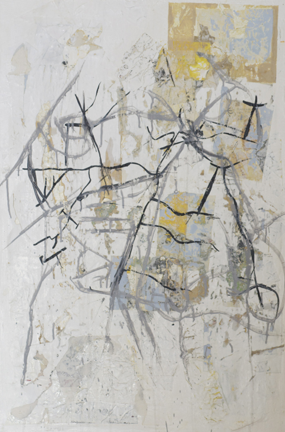
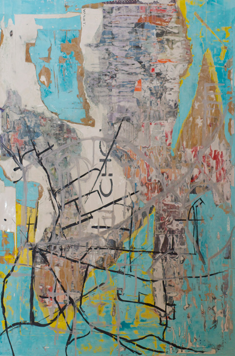
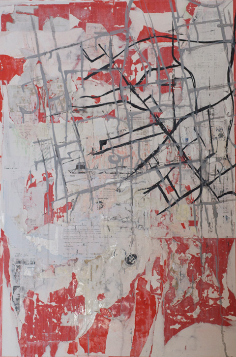

With new and exciting exhibitions coming up this 2012 as part of the [Cultural Olympiad](http://www.london2012.com/cultural-olympiad) focussing on more established and superstar artists like **David Hockney and Damien Hirst, this is also a perfect time to promote young artists to the international audience.**

I am always curious how young artists manage to break into the art scene here, having to live in such an expensive city like London. Young artist **John Bingham**, who recently had his first exhibition at the Other Art Fair last year, gives us an **over-all view of the challenges and opportunities facing young artists** like him in London and why he considers [Tracey Emin](http://www.emininternational.com/) his heroine. And to top that, he even scored a dance with her!

Below you can see the paintings he exhibited at the **Other Art Fair**. According to John, each painting focussed on two contrasting locations in London – the indrawn road maps interwove with each other and the paper itself was found from these 2 locations, collated into lots of layers and then stripped back and sanded together in an effort to merge the two places together.

**1. Can you tell us a little bit about your background and where you got your art education? What inspired you to become an artist?**

I studied at The London Nautical School in South London by the river and the Southbank. I guess the great art teachers and the location I was in inspired me. The Hayward Gallery, OXO Tower, ITV buildings, IMAX, Tate Modern and various design shops were all a stone throw away and places I would visit regularly. I went on to study at Camberwell College of Arts, part of the University of Arts London. Visiting seminars and meeting established artists is always inspirational, I always remember a seminar near Chelsea where **[Grayson Perry](http://www.britishmuseum.org/whats_on/exhibitions/grayson_perry.aspx)** was speaking in 2006, from then on I was fascinated with how artists live.

**2. Can you talk about your experience as one of the artists chosen at the [Other Art Fair](http://www.theotherartfair.com/). As a young artist, what is the significance of this exhibition to your career?**

Quite a scary experience as it was my first ever exhibition/fair. Having all my work on show for people to judge is something I need to get used to. I did well. I sold, and had a blast. I’ve been asked to come back next year so that’s always a good sign. I picked up some valuable contacts, met lots of artists and learned loads. I also had the chance to design a pair of TOMS shoes which the public bid on to raise money for a local charity. This was a great project and hope to work with TOMS more in 2012. I’ll always remember The Other Art Fair as my first every exhibition and my first sale.

**3. How would you describe your art. (I saw some samples of your paintings but it seems you also dabble in sculpture?  Which medium do you want to be identified with). What ideas do you want to express through your art?**

I would describe it as certainly contemporary. Work you would have to look at for a while before you begin to understand it. Something to unravel. I don’t want to be identified with just one medium. I want to work in a range of mediums from painting, photography, sculpture, to textiles, drawing and printmaking. I’m going to start designing some large sculptures in 2012. Stories and topics which the world is interested in are things I’d like to make work about, definitely something about the riots and wealth divide in the UK.

**4. What type of artists/art inspire you?**

Anything new inspires me, I like current and everything that pushes the world forward. Conceptual art is great, art that looks like shit but has an amazing story behind it is wonderful. Tracey Emin is a heroine, I met her at the Groucho Club in September, we danced to some bizarre Spanish music whilst eating bacon bagels and she told me it was rare for her to have time to let her hair down. She was off her face. I like following the careers of emerging artists, Barry Reigate the pop artist is doing well at the moment. Exhibiting around the world and doing work for people like Stella McCartney. I assisted Barry with his Equation solo show at [Paradise Row Gallery](http://www.paradiserow.com/).

**5. How do you juggle your role as an artist and an artist assistant?**

I can’t wake up every day in a mood to do art. I won’t do a drawing for 2 months and then I’ll do 100 in a day. Assisting artists and galleries is great for networking and keeping up to date with the art world it also inspires my own work, so both work well together.

**6. What exactly does an artist assistant do? I know you deal with other high-profile artists at the galleries, (who and) how are they encouraging you with your art?**

I’ve met buyers and collectors at some high profile events that I’ve worked at, if I get the chance I make sure I let people know that I’m an artist myself. An artist assistant does everything from placing sculptures with curators to painting large-scale works for the artist. Working with artists who tell you your work is great is always encouraging, especially when they are doing well themselves. I worked with an artist called Sol’Sax from New York in July, who was participating in a group show. It was his first trip here so I showed him around east and west London. He had some really encouraging words for me.

**7. How would you describe the current state of the art sector here in the UK? Do you think London is still the place to be for young artists? How tough is it to get into the art sector?**

I’ve met a lot of young artists here and the work is just as amazing as it was 20 years ago, so yes, London is the place to. A spotlight is being shone on younger artists more than ever in London with young artists being desirable to collectors, new galleries who focus more on emerging artists and more art fairs opening.

**8. Can you give me your opinion about the rising costs of art education nowadays? And any advice you can give to other young artists like you?**

Prices are going up everywhere, once thing we can praise is the free entry to galleries and museums. I’m hoping to go back to study at Goldsmiths in 2012 so I’ll be paying fees again. The student loan is helpful, the people it effects most are families who have big dreams but little money. In my case if I can’t get a loan I won’t be able to study for another year. But that won’t stop me doing art and looking for exhibitions.

**9. Any upcoming exhibits?**

The Other Art Fair 2012, no others confirmed as yet, I want to get involved with group shows in the UK for the next few years and some more art fairs in London. I’d also quite like to be represented by a gallery. Lots to do!

*For more details on John’s work, visit [www.johnjosephbingham.co.uk](http://www.johnjosephbingham.co.uk/)*
