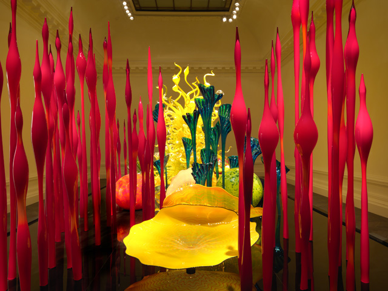

From junk, blood, hair, plastic, sharks! – name it, contemporary artists have used all kinds of alternative materials to create artworks. But anything produced in glass and ceramics are still considered second-class art. T**he glass artist Dale Chihuly, however, has defied all that preconception.**

Has glass finally become an accepted medium in contemporary art? At the newly opened [Halcyon gallery](http://www.halcyongallery.com/) (the third) in New Bond Street,  its first major exhibition is all about glass and all about Chihuly. **If you’ve been awed by  the spectacular chandelier at the V & A Museum by Chihuly, the Halcyon exhibition will glass-blow you away**. Chihuly is one of the few glass artists who have pushed the boundaries of the blowing glass discipline into the realm of sculpture.

<iframe allowfullscreen="" class="youtube-player" frameborder="0" height="505" src="//www.youtube.com/embed/ELyQEIsNSDs?wmode=transparent&fs=1&hl=en&modestbranding=1&iv_load_policy=3&showsearch=0&rel=0&theme=dark" title="YouTube video player" type="text/html" width="640"></iframe>

<figcaption>Momardi video: Chihuly exhibit at the Halcyon. Sound by[Darkside Warrior](http://soundcloud.com/darksidewarrior/sleepless)</figcaption>

Chihuly’s glass sculptures transform the Halcyon into an underwater or Avatar-like dimension where glass, light and colour abound. From swirling rose-coloured and blue chandeliers that hang from the ceiling floor down to the basement, colourful shell-shaped sculptures in walls and every corner, Chihuly’s zen-ish paintings – oh man, **I had been swimming in this aquatic delight. It also helps that the Halcyon staff are one of the friendliest bunch of people and made the experience more even special.**

")

")

The invigilator explained to me that every little piece in the chandelier has its own special box and that it took at least two weeks to install the rest of the sculpture in the show, courtesy of Chihuly’s staff. To my knowledge, Chihuly no longer creates these artworks himself and employs a handful of staff to make them for him, after a surfing accident barred him from using his shoulder for glass-blowing. **Chihuly is not just an artist but could also be called an architect of glass who has explored the medium of glass in a new contemporary aesthetic**, while also paying homage to the long-tradition of glass-blowing.

Saving the best for last, no amount of photo or film can justify the spectacular beauty of the Garden of Glass. **The Mille Fiore is an assemblage of imaginative organic flora, swirling and flickering in the brightest colours and bursting in kaleidoscope reflections and transparencies**. And that’s how I knew, that I’d never see glass the same way all over again. Chihuly has opened me to a totally new world, all in the name of glass.

<iframe allowfullscreen="" class="youtube-player" frameborder="0" height="505" src="//www.youtube.com/embed/kPDmwVQ_VWY?wmode=transparent&fs=1&hl=en&modestbranding=1&iv_load_policy=3&showsearch=0&rel=0&theme=dark&feature=related" title="YouTube video player" type="text/html" width="640"></iframe>

<figcaption>How Chihuly’s chandeliers are installed (Video: Columbia Museum of Art in Columbia, 2010 by CBS)</figcaption>

<iframe frameborder="0" height="480" src="http://player.vimeo.com/video/33972926?title=0&byline=0&portrait=0" width="640"></iframe>

<figcaption>[Dale Chihuly Opens New Halcyon Gallery](http://vimeo.com/33972926) from [Halcyon Gallery](http://vimeo.com/halcyongallery) on [Vimeo](http://vimeo.com)</figcaption>

Related Links:

- [Dale Chihuly show Launches New Halcyon Gallery on New Bond Street](http://www.fadwebsite.com/2011/11/28/dale-chihuly-show-launches-new-halcyon-gallery-on-new-bond-street/)
- [Dale Chihuly at Halcyon Gallery by ArtInsight](http://artistsinsight.co.uk/reviews/dale-chihuly-at-halcyon-gallery/)
- [New Halcyon Gallery Debuts with a Chihuly Exhibit by Robb Report](http://robbreport.com/Art-Collectibles/New-Halcyon-Gallery-Debuts-with-a-Chihuly-Exhibit)
- [Chihuly at Halcyon by Vogue India](http://www.vogue.in/content/chihuly-halcyon)
