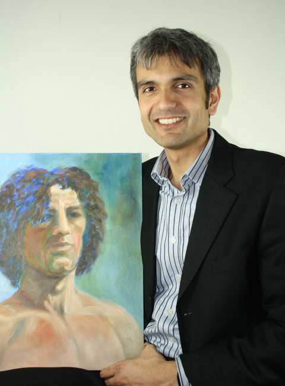
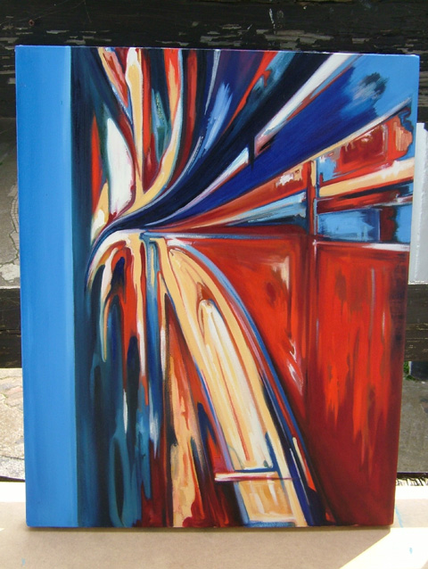
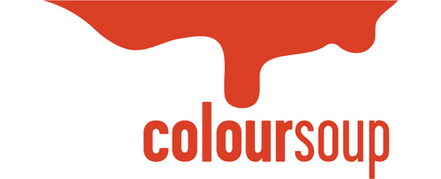

We can pretty much buy everything online these days and the reliability of online channels like [Amazon](http://www.amazon.co.uk) and its collaborative filtering recommendation tools helps customers find exactly what they are looking for. **If shopping online has indeed reached its peak of maturity, the online art market is still unfortunately flagging behind.** We have the [Saatchi online gallery](http://www.saatchionline.com/) and the [Picassomio](http://www.picassomio.com/) that are selling art online but for some reason, it just appears to be a platform (more like an online gallery) to showcase artist’s works. What is fairly lacking is a form of curatorship that will help  collectors find the best artworks possible.

In recent news, [Paddle 8](http://www.paddle8.com), the Larry Gagosian-backed online sales art venture has secured a 4 million investment possibly signalling the new age of buying art. I checked the Paddle 8 website and has noticed that it boasts of collaborating with the world’s best and aspiring curators. **My worry is it might be the same cup of tea, and that Paddle 8 will simply reflect what’s happening in the real world** where established and emerging artists take the bite of the apple. **Going online means there is a possibility of reaching a new market and with that comes tapping into a new breed of collectors**. In fact, in this social age, it might be that both the audience and the curator have a shared responsibility to dictate which art is important and which art can sell. Other than that, online art channels should also cater to young artists who are having a hard time getting their artworks exhibited.

**INTERVIEW WITH COLOURSOUP’S SHOOMON PERRY**

I spoke to former-banker now online curator Shoomon Perry over a cup of coffee who talked about his new online art venture [Coloursoup](http://www.coloursoup.com/) which will bridge the gap in the art market. We had a great time discussing how young and emerging artists need this kind of online platform to exhibit their works and why it is important to offer a form of curatorship in online art ventures. As outsiders in the industry, I as an art blogger and he as an online curator, we both felt we are needed to become the new voice of the industry. High art may still be the domain of rich collectors and powerful curators but in the age of the internet, the public dictates.  In some way, Shoomon and I recognised this and we share the same mission to help under-represented artists promote their works online. Our true objective is perhaps to bring art back to where it truly belongs, to the public.

**I met you over coffee and had a quick chat but for the purpose of our readers, can you tell us a little bit about yourself?**

I grew up in London and have lived in Berlin and Paris. I originally trained as an economist, and have spent a lot of the last 10 years advising and running internet-related businesses.

**Your background is in ecommerce (banking) and you weren’t really trained as a curator, where did your interest in art come from?**

At school I was crap at art – but have always loved paintings. I spent many weekends as a kid wandering around the big galleries in London just taking in the works. My interest in art was re-ignited by my wife – she’s a fairly serious artist.

**Have you completely left that sector or are you going full-time in the art business? What made you leave?**

I had been thinking about striking out and setting up my own business for a while. It’s very different to working for a big bank!

**What is Coloursoup and what do you hope to achieve thru this start-up venture?**

We believe there is an opportunity to sell high quality art at affordable prices through the web. The concept of “affordable art” has taken off over the last ten years – however there is a large group of potential buyers that don’t have time to make it to the fairs, and don’t have easy access to good local galleries. We also want to give a fairer deal to artists that we work with – because we don’t carry the overhead of running a physical premise we can charge a lower commission.

**The financial sector and the business of art – they seem to be run under the same mechanics, money. Any thoughts on that?**

My sense is that the top end of the art market is very much a class of investment product – like shares, bonds or property. The average Russian oligarch is not going to write a cheque for £1m without thinking about the investment potential of the artwork. I’ve even seen private banks offer “art consulting” services to their wealthy clients. The really interesting question is how some artists reach this status of becoming an investment commodity. My own personal view is that some artists reach this status through sheer force of nature – talent, persistence and only a little luck; whereas others are in the right place and the right time to be spotted early in their career and have their work championed by tastemakers like Saatchi.

**Saatchi has a website where artists can showcase their works, what sets Coloursoup apart?**

Saatchionline is an interesting service for new artists – however it is not curated. We think that curation is important for most potential art buyers. At Coloursoup we are very picky about the artists that we bring on – our selection panel includes two current members of the Royal Portrait society. 

**Physical gallery vs online gallery, why do artists and collectors need to go digital?**

Digital is a fantastic way of enabling people to discover artists they didn’t know they’d love. Nothing can replace seeing the work in the flesh – but over the last 10 years improvements in digital imaging and screen technology mean that you can get quite close. Quite simply if you are an artist this is where your customers will discover you in the future.

**What type of artists are you featuring now – How do you choose artists?**

Most of the artists on Coloursoup right now are painters. We have a small selection of photography and original prints as well. We consider both established or emerging artists. We choose artists based on three things: technical excellence, aesthetic beauty, and our view on whether the work will stand the test of time.  

**What sort of challenges/exciting prospects are you facing now with this venture?**

The thing that really excites me about Coloursoup is that we are showcasing fantastic artists who have been ignored by the London gallery system. If it works we’ll grow the market for high quality “Affordable Art”.

**Will you be reaching to get investors or do you want to run it independently?**

No, we are not after investors at this stage. We want to keep our commercial and artistic freedom!

**When was the last time you visited a gallery/museum?**

Last week – went to see Hockney (along with half the population of London)

**You’ve been reaching out to art bloggers like me to get the word out about Coloursoup, how are they responding to you?**

Pretty good so far – you tell me!

For more information, visit [www.coloursoup.com](http://www.coloursoup.com/)
