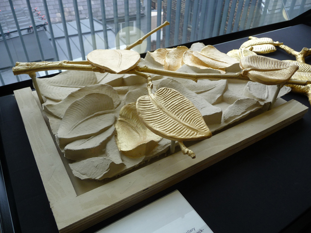
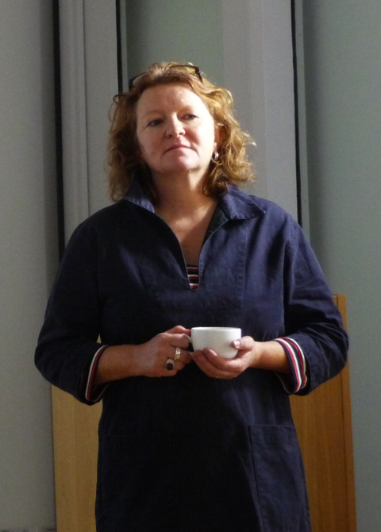
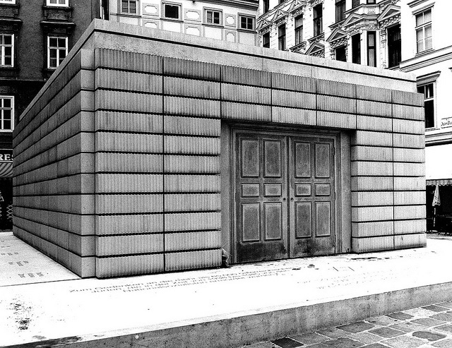

**Starstruck is a word which would always be a part of my psyche especially when I meet artists**. Believe me, it’s something I would like to overcome because it doesn’t really serve me well. It doesn’t help that my cheeks get red and my tongue gets tied in front of a famous artist. Do you say ‘I’m your biggest fan’ as your opening line? How would anyone react to that? Instead of embarrassing myself, I just smile, stare and get red in one corner.

In fact, I recognise that this is a result of **being blinded by the newly celebrity status of artists today**. It should be a conscious effort on my part to separate the ‘celebrity’ out of the artist and focus on how their art is speaking to me. Would I still like their art if they were not famous? The answer might be very different.

That tells me in some way that I and other human being have been conditioned by society to put a lot of emphasis on celebrities and perhaps as a result, undermine our own capabilities and worth. It should be a personal goal from now on to be un-starstruck. But believe me it is not so easy to get it undone.

**Meeting Rachel Whiteread** three weeks ago on the unveiling of her latest project to revamp the facade of the Whitechapel, I found my usual self with rosy cheeks. **Knowing her work in ‘House’ where she transformed the interior of a house into a concrete sculpture**, this Whitechapel project is her first public commission which will transform the gallery’s outdoor frieze with a golden ‘tree of life’ motiff. 

<iframe allowfullscreen="" class="youtube-player" frameborder="0" height="505" src="//www.youtube.com/embed/n3g-1jcpMNQ?wmode=transparent&fs=1&hl=en&modestbranding=1&iv_load_policy=3&showsearch=0&rel=0&theme=dark&feature=related" title="YouTube video player" type="text/html" width="640"></iframe>

<figcaption>Rachel Whiteread at the MFA (interview)</figcaption>

It was a small affair but some of the top ponchos in the art industry were there together with journalists who wanted to ask her about her latest project. Rachel has a string of loyal fans around the world and should be very familiar with her celebrity status right now. **But what I discovered was that there was a quietness about her,** which exudes through her work, which mostly explore the concept of domesticity and the familiar embedded into the context of art. But please do not mistake her quietness with her convictions as an artist. 

When she said **‘I specialise in making the noticed unnoticed**,’ referring not only to how the planned golden frieze at the Whitechapel gallery would capture the attention of the passers-by, I felt she was speaking primarily on her goal with her art.

Thinking about Rachel’s past works where she turned almost forgettable objects into sculptures, it is, on a personal level, quite **life-changing when you think that something mundane could be suddenly thrust into a higher level of importance and purpose**. I know how the pop genre has overused this concept in the past but with Rachel Whiteread and her art, the unseen, the underlying, those that we almost always ignore are suddenly put into the forefront, and that’s when we begin to see them in a different light.

I think the very process of giving importance to something comes from a personal decision. **Rachel for example has rendered the space of the interior of the house important. It is the act of deciding which gives that object a value**. The interior of the house for example is something all of us have ignored just because it is there but Rachel decided it is as important as the house itself.

It is the same case when somebody consciously decides to give value to a work of art or a person. What does this tell me? Well, it tells me that I am in charge of choosing which one is important for me. **And I can choose who I want to be starstruck with. For now, my cheeks are still rosy.**
