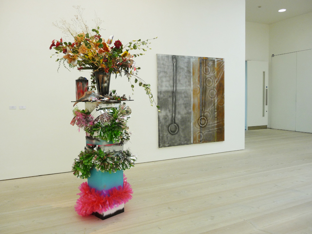
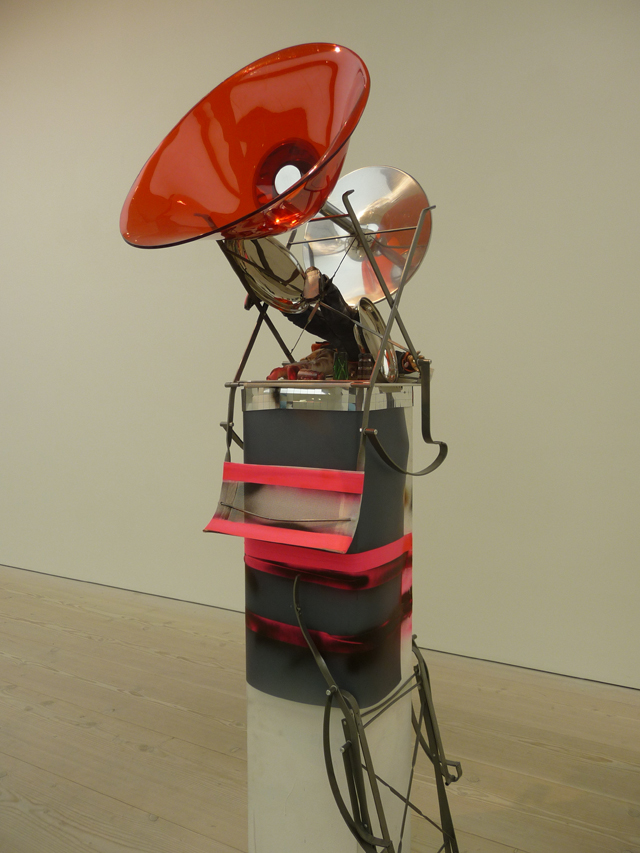
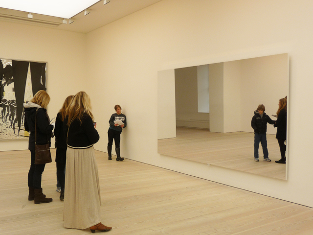
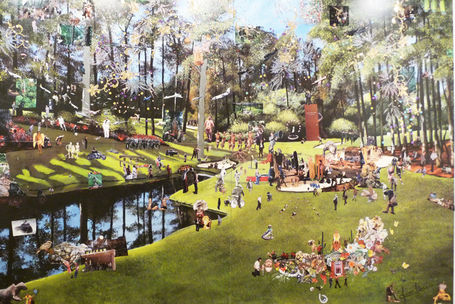
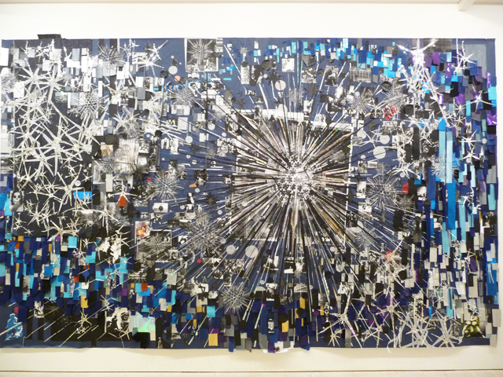
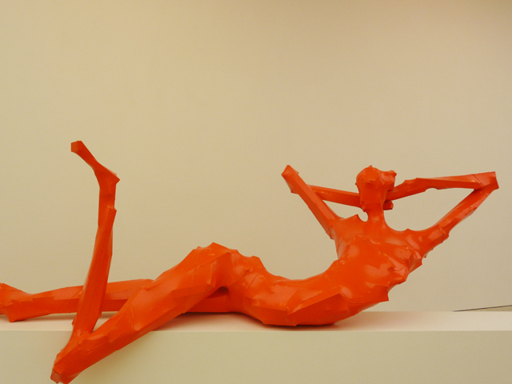
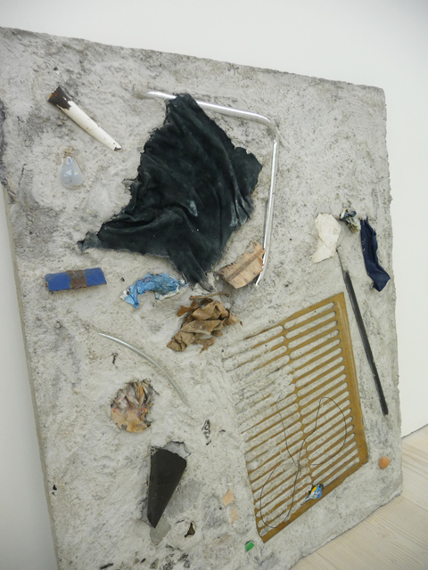

**It’s  intriguing to see the Gesamkunswert especially for someone like me who has been seeing contemporary art in London for over a year.** Before I moved to London, I was contemplating on moving to Berlin. I heard someone say in one of those TV art programs that if you can’t make it in Berlin, you can’t make it anywhere. If that still stands true today, I’m curious to know if this exhibit would reflect the **clear sense of ambition of  where German art wants to be – it surely demonstrates that it wants to be the leader of the pack.**

**Some of these German artists show a special devotion in the use of junk**. What’s very curious though is how they manipulated these materials to create artworks that have a sense of order and colour and most of all, engaging to the viewer. In contrast, I’ve seen the Paul McCarthy show at the Hauser and Wirth last December using junk and discarded materials as part of the installation, but that was meant to affect chaos and decadence. **Here in Gesamtkunswert, everything seems clock-work precise and planned.**

## Here are my top five picks of the exhibit

**1. Geshwister and Bouquet by Isa Genzken**

Not exactly new in the field of contemporary art, Isa is known for her totemic sculptures and her use of found objects sourced from  industrial materials. It appears as if she has fused them without an agenda in mind, but I discover that there is an architectural structure and conscious use of vibrant colours in her works. Strangely, this mishmash invites the viewer to create his or her own poetic meaning behind this piece of art. I don’t know what I could make out of Geshwister and Bouquet at all, but I sense a  commentary about the artifical versus the natural and how humanity has been caught up in between.

**2. Mirror Wall by Jepp Hein**

Jepp Hein’s Mirror Wall isn’t  just your typical normal Mirror. It vibrates in a dizzying speed, trembles and shakes. I’ve never seen anything like it. I’ve been to the Tate Modern to see Gerhard Richter’s Mirror piece but I must say, Jepp Hein’s artwork is just out of this world and technically it’s brilliant. I saw a reflection of myself disappear before my very eyes and what was left was a haze of myself, sort of in the process of disintegrating and it’s scary and fascinating.  The funny part is that it encourages the viewer to move and dance while watching their disintegrating reflection and you look at the other viewers around you and they are doing the same. Nobody really cared about acting like a fool.

**3. Kirstine Roepstorff’s ‘You are being lied to’ and her ‘All Possible Experiences (From the series “The Inner Sound that Kills the Outer”)**

These are both outstanding manipulation of the genre of collage. From afar, ‘You are being lied to’ appears as if it’s just a blown-up landscape photo but then once up close, you realise this is anything goes type of tea party where quirky characters from footballers to nudists all come to have the fun. ‘All possible experiences’ is much more flamboyant and explodes right in your face with all that glitter and jazz. It seems that each piece was carefully considered but there is also an evident intuitive and rawness in her work.

**4. George  Herold ‘Untitled’**

One of the most exciting sculptural pieces in the collection, George Herold’s ‘Untitled’ series seem to pay both to figurative sculpture, Arte Povera and German expressionism all at the same time. These are sculptures made out of wood laid out with canvasss and lacquer sewn together and stretched out. The effect is unsettling and humorous.

**5. Ida Ekbald’s ‘Night Ocean Return Without and Without Hesitate’**

This is an interesting piece not for its over-all appearance but the creative process behind the work. Watching this piece, I can imagine Ida scavenging for scraps of materials in her meditative walks in the beach.
