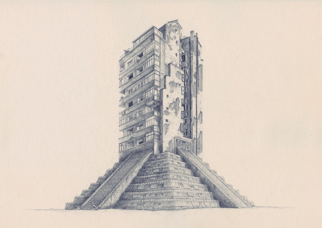
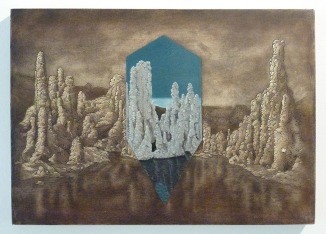
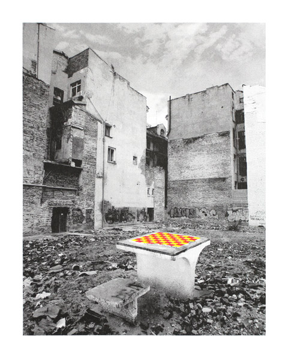
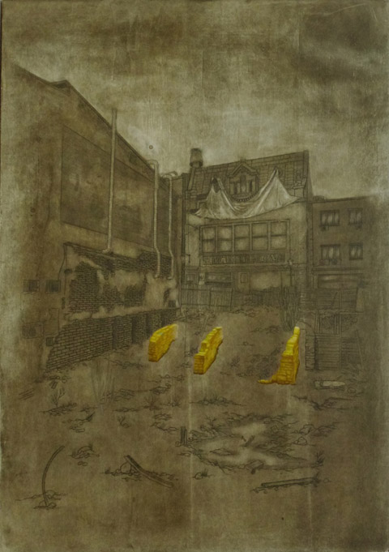

Young artist [Chris Agnew](http://www.chrisagnew.co.uk/#/about-chris-agnew/4540711144) is someone to watch out for. Although I’ve only managed to see his works in pictures, I was really intrigued by the depth and the technical complexity of the artworks from his recent exhibition The Pomp of Circumstances which was shown at the **Nancy Gallery** in London last July.

A product of both the University of Leeds and the Wimbledon College of Art, Chris Agnew explores  the roles of both accidents and reasoning in the evolution of belief systems. Using pencil and etchings as a genre, his artworks range from landscapes to skyscrapers systematically drawn as if to conceive and offer a window of how a freethinking society should be – despite how grim and gritty some of his artworks come across. He has has the technical ability which some of the contemporary artists lack these days and I am happy he has chosen pencil and etched panels as his medium – the nakedness and the straight-forwardness of these two mediums meant he wasn’t obliged to resort to cheap trickery and create junk installations.

Here’s my Q&A with the artist:

**1. Nancy Victor Gallery is, from what I heard, one of cutting edge art galleries here in London, known for discovering talent way before anyone does. How does it feel to have your first show there? How did your collaboration with them come about?**

I had been discussing opportunities with a few galleries since finishing my masters degree in 2010, but I didn’t want to force a show that didn’t feel like the right time or place, either for my work or for the gallery. Nancy Victor got in touch with me at the start of 2012 about putting on an exhibition, and after taking a look at their previous exhibitions and their general gallery ethos, I gladly accepted. They let me have free reign over the direction of the exhibition and the works, and they weren’t perturbed at all by the fact that I was working from Bucharest; we kept a consistent dialogue about the development of the works going via email, and I played the same role in terms of promoting the show as if I was in London. The gallery itself was a perfect Goldilocks situation; not too big, not too small, but just right. I’ve been working on some ideas for larger multi-media installations for a while, but for my first solo show in London, I really wanted to keep the show concentrated on the core values of my practice.

- 2011")

**2. Tell me about your work – why do you choose to make them in etchings and pencil?**

When I was studying etching at Leeds I was looking at printmakers like Frank Brangwyn and Gustav Dore, paying particular attention to their use of line and contrast, however I found that when I was actually making a print, the ink on the plate had a stronger presence as an object than the impression that it left on the paper. I guess you could say that in the Platonic sense, it was closer to the essence of the image rather than the mere reflection it produced, and this naturally felt important to me. There is an inherent permanence in the process of carving out an image or text into a surface that just doesn’t exist when making marks on a surface. For me it automatically conjures memories of seeing people’s initials carved in trees near where I grew up; they had this enchanting presence that I was fascinated by, as if they existed outside of our conventional understanding of time. I wanted to embody this sensation in my works, as if ironically doffing the cap towards the objecthood of Moses’ commandment stones or Joseph Smith’s gold tablets. I couldn’t help but think that the sentiments embedded in those sacred objects would have had less gravitas if they were only jotted down on a piece of parchment.

The use of the icon panels was quite an important development in my practice, and one that might not have happened if I hadn’t moved to Romania. I had previously been using resin to etch into due to its significance in the Mayan creationist text the Popul Voh, and although I’d had numerous successes with the medium – Jerwood Drawing Prize, Saatchi’s New Sensations and Clifford Chance Postgraduate Printmaking for example – I wanted to align my medium with my subject in a less esoteric fashion. Most families I have visited in Romania, regardless of how religious they are, have icons of saints in their homes. Whether bought by relatives or painted in an art class, it wasn’t important to me how they came to be there, but rather how their nature defined them as cherished objects. As my work focuses on the construction and deconstruction of belief systems, the relevance of this medium became even more evident. The modern Byzantine iconographer Photios Kontoglou wrote that:
 
“The art of the icon painter is above all a sacred activity…Its style is entirely different from that of all the schools of secular painting. It does not have its aim to reproduce a saint or an incident from the Gospels, but to express them mystically, to impart to them a spiritual character….”
 
With the recent works depicting specific locations and scenarios of religious, historical or scientific significance, I wanted to exploit the spiritual character and subvert the mysticism of the tradition. With regards to the works in pencil, I’ve always tried to harness the potential that drawings have as a visual reference for something that exists outside of itself, like in the witness testimony of The road we took to avoid it, the architectural plan of The State of Affairs triptych, or as a technical design such as in the pseudo-religious satellite of Phobos Grunts.

")
 
**3. I like the fact that your work shows some sort of duality – chaos and then order. Is that how you see the world?**

Its not so much the fact that I see the world in terms of chaos and order – which I think everyone does – its more the fact that I refuse to accept at face-value, the association of rationality with order, and irrationality with chaos; the lines are never as clear as that. It was from this standpoint that the dichotomy in the latest works originated.

One of the works from The Pomp of Circumstances, Pic de Bugurach (etching and oil paint on icon panel, 2012) features the mountain of the same name in France where thousands of new-age spiritualists have congregated. They believe that the world will end on 21st December 2012, and that the aliens who reside within the mountain will emerge and leave Earth bound for a new world, saving those who are either on or near the mountain. The painted triangular section of the piece makes reference to the ‘magic triangle’ of towns situated around the mountain that have inflated accommodation and living costs in order to cash-in on the visitors.

Another piece from the series called The Ark, Ahora Gorge features Mount Ararat in Turkey, where in accordance with the location mentioned in the Book of Genesis, people have been searching for the remains of Noah’s Ark for decades. No conclusive evidence has ever been found to support this theory, and the numerous samples of petrified woods that have allegedly been found there have been disproved by carbon dating; the section of the panel painted in the shape of a diamond makes an esoteric reference to this.

I employ shapes and tessellation in my works in order to illustrate the fact that our brains are wired to see logical patterns and intentions in chaotic or random compositions, such as Satan’s face seen in the smoke of 9/11. I often quote what Douglas Adam’s said;
 
‘Isn’t it enough to see that a garden is beautiful without having to believe that there are fairies at the bottom of it too?’

**4. Forgive my ignorance, but what does polemical hindsight and sceptical foresight really mean?**

Scepticism is a word that I use cautiously when it comes to describing the concerns of my practice, because the term is all too often confused with fundamentalist naysaying rather than only a refusal to accept things at face value. The world is rich with mistakes, co-incidences and blind spots, and civilization would be unrecognisable without them. The crack that runs between what we think we know and think we don’t know is always bigger than we expect, and the situations that I draw from in my work seek to manipulate these arsenals of potential. Take for example, that the Virgin Mary was originally described using the Hebrew word ‘almah’ meaning ‘young woman’, however her status as a virgin is actually a result of a pre-Christian Greek mistranslation of this word. It is not even that controversial to say this as the vast majority of biblical scholars agree on this point and have discussed the topic at length.
 
One of the drawings I made for the show – Birds of Bell Labs, New Jersey – is intended to pay homage to this great black hole of information. In 1964, scientists Arno Penzias and Robert Wilson were testing the antenna horn (which is featured in the work), and they heard radio noise that they weren’t expecting. After ruling out a number of hypotheses, the pair found pigeon droppings inside the horn and they believed that this was the cause of the fuzzy sound they couldn’t get rid of. They cleaned out the ‘white dielectric material’ as they called it but were surprised to find that the noise persisted. They published their results, and it took another physicist – Robert H. Dicke – to identify this noise as the cosmic microwave background radiation leftover from the Big Bang, thus allowing astronomers to confirm the relatively new theory. This concept features heavily in the decisions I make on how to approach a work: The pigeon shit is always masquerading as the truth.

")

**5. A lot of artists have forgotten the technique of drawing for the sake of ‘conceptual art’,  What i also love about your work is that it is both conceptual but at the same time it shows that you have reverence for the art of drawing. This isn’t a question really but I’d like to know if it’s a conscious decision to veer away from what art has become these days**.

I wouldn’t say that it was a conscious decision to veer away from what art has become, no more so than it was a conscious decision to choose the path that I have done. I made works in the past by holding ideas at gunpoint and forcing them to work for me, but after a while I realised that this was no way to go about it. I enjoyed the challenge but it wasn’t a process that naturally yielded any consistency: Just because an idea is strong and coherent doesn’t mean that the product of it will be. That’s not to say that I am not interested in concept art – I really respect the work of Tom Friedman and Michael Landy for example – it’s just that this is a vehicle that my work isn’t suited to drive. The value of concept art should always be the concept itself rather than the material object and this seems to have become misunderstood since the rise of the YBA’s and works like Hirst’s A Thousand Years. Sol Lewitt wrote instructions of how to make a work of art so that anyone could make it, and this highlighted the fact that the value was in the idea, not in the material object that illustrated the idea. When I see so-called concept art being valued at blue-chip prices, I can’t help but think that the artist, the gallery, the collector or the whole lot of them are missing the point. This is why Michael Landy’s Break Down was a seminal work; it hits the nail directly on the head. I aim for what I guess you could call a holistic working method, where the process and the subject have a kind of symbiotic co-existence; the work would be flawed if one explicitly dominated the other.

**6. Just like a lot of people, I’d like to draw but don’t know where to start – where is the best place to learn how to make art? How was your art education – do you think, given our economic challenges, its still practical to go to school and learn art. Do you think your art education helped shape you as an artist?**

I wouldn’t say that anyone particularly taught me to make art in the practical sense, not to the detriment of any of my tutors or teachers, but I simply didn’t have that type of education. I spent more time being taught how to draw and paint in my first years of secondary school than I did on my BA and MA degrees, instead I pretty much taught myself by just carrying a notebook with me everywhere and drawing anything and everything I wanted.

It’s quite difficult to give an honest and balanced opinion about the pros and cons of an art education because there is no linear trajectory towards a clear goal like training to be an accountant or an engineer. My education without a doubt helped shaped me as an artist, but then again I have nothing to compare my experience with, so if I spent five years studying literature, philosophy, history or theology these would have all shaped me as an artist also. Duchamp for example played chess for large periods of his life whilst his contemporaries were cashing in, and if you read about the impact this had on him you can understand that an artist is not necessarily shaped by conventional methods of education. Whilst I was studying for my masters degree, I forced myself every now and again to take a step back and consider the conversations we were having, and works I was making: The majority of the time, I accepted that they were valid and important steps to be taking, however sometimes they looked like they had been ripped straight out of a sit-com. I’ve always thought it would be great to write a sit-com about a group of artists sharing a studio, sharing really esoteric jokes like welcoming each guest with the question “do you Badiou?”, or holding relational aesthetic drinking games…but then I think that would be pretty niche to say the least. This all sounds like I have a cynical view of art education, which is not the case, my point is that it is not by any means, the be all and end all, and won’t make an artist out of someone that isn’t suited to be one.
 
With regards to the financial climate, I honestly don’t think that the current economic challenges should feature in the decision of whether or not to study art, and I want to emphasise that this opinion comes from the point of view of someone who worked in supermarkets, pubs and galleries to fund their education, without the guarantee of a prosperous career after it. I think that if you do find yourself basing your decision on these concerns, then art is probably not for you; an art education is not a pathway to any kind of security.
 

**7. What’s next for you?**

I’m in conversation with a few galleries in London and elsewhere in Europe about future projects, but at the moment I’m spending my time in my studio in Bucharest working on some larger etchings and pushing the boundaries of the technique. One of the main reasons that I was happy to leave London when I did, was that I didn’t have enough time to dedicate to the works, however now I can take a bit more time to research and read around the subject before embarking on a new piece. I will however be making a move back to London at some point; being away from the place has given me some perspective, and allowed be to really appreciate what a culturally rich and important city it is and I can’t think of many better places in the world to exhibit my work. I’m just waiting for the right time.
